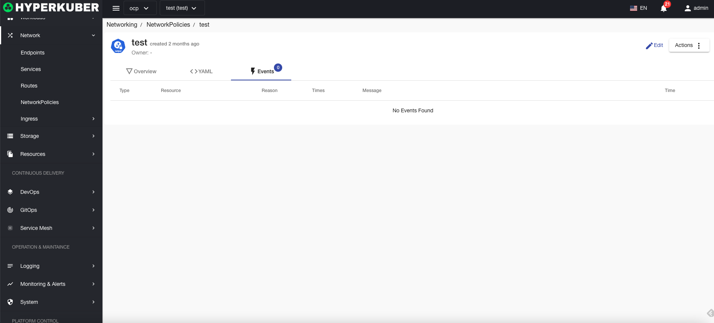
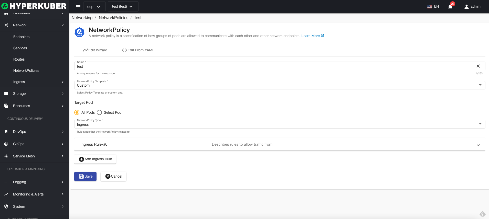

# network policy

Network policies are specifications on how groups of pods are allowed to communicate with each other and with other network endpoints

## Network Policy Actions

The following interface graphical operations are supported:

* Label
* Notes
* Yaml/Json editing

### Create
Create a network policy, click the "Create Network Policy" button, enter the Create Network Policy page, and fill in the necessary parameters

parameter
Name: Network Policy Name
Network Policy Template:
* Allow all ingress traffic
* Deny all ingress traffic
* Allow all egress traffic
* Deny all egress traffic
* Deny all ingress and egress traffic
* Custom: Users can customize the network traffic limit

### Yaml create
Network policies can be created directly from Yaml files

### Network Policy Details
Click the link of the network policy name to enter the details page of the network policy
Overview information

Yaml information

event information

### edit
Select the network policy to be edited, click the "Edit" button, enter the edit network policy page, and modify the necessary parameters to complete the deletion operation.
* Support graphical modification of network policy parameters

* Support Yaml modification

### delete
Select the network policy to be deleted, click the multi-select box to select, click the "Delete button", and enter "yes" in the confirmation input box to complete the deletion operation.
### refresh
Click "Refresh" to complete the refresh of the network policy list.