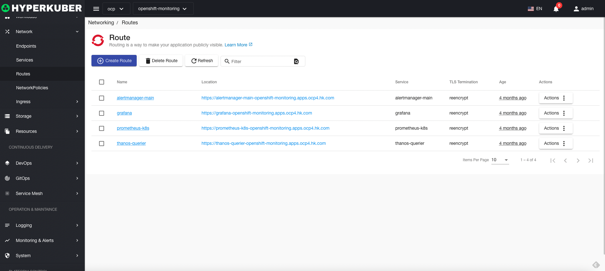
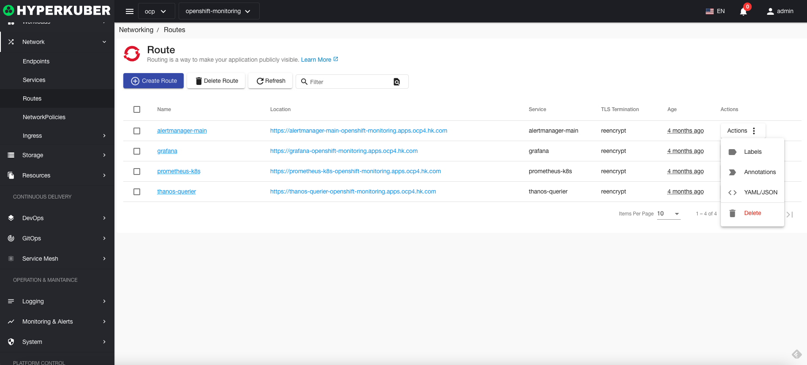
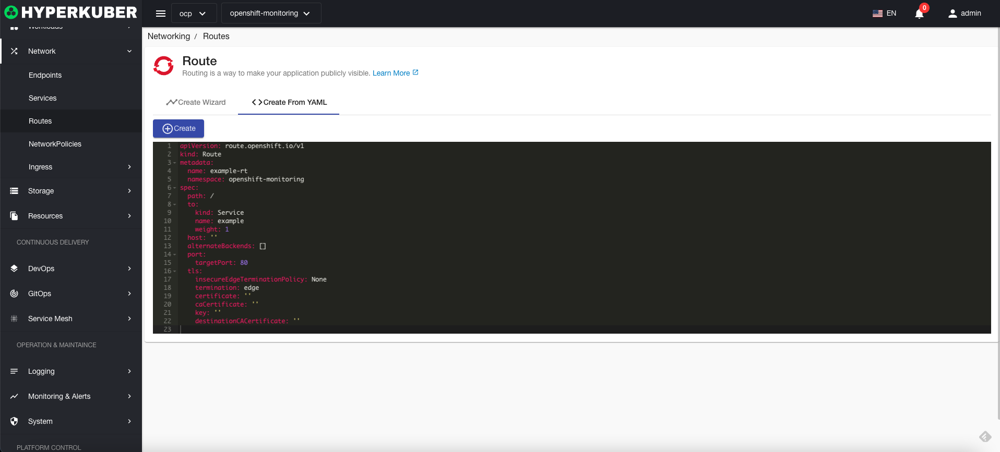
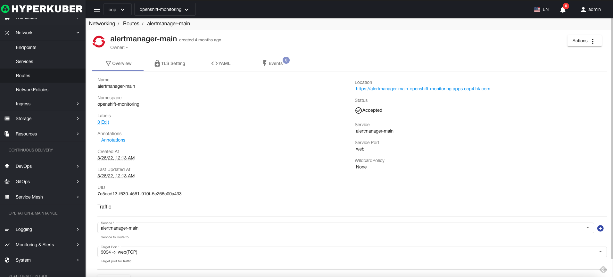
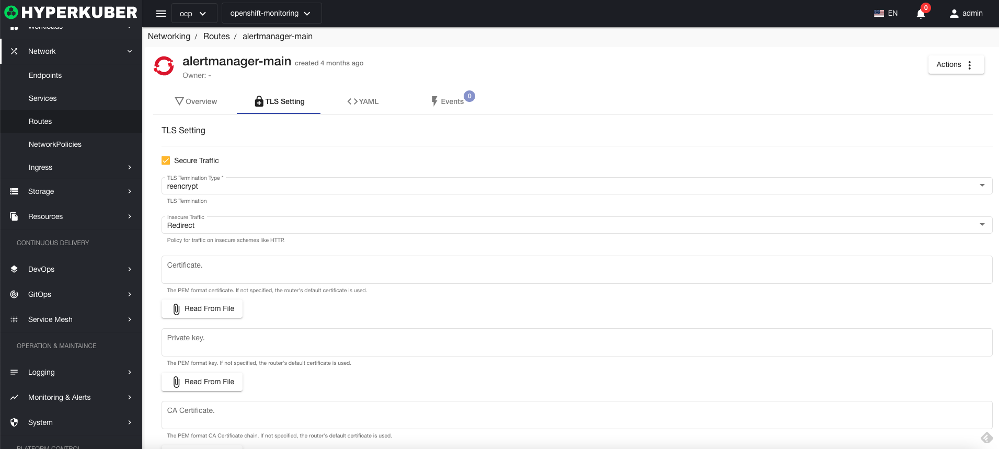
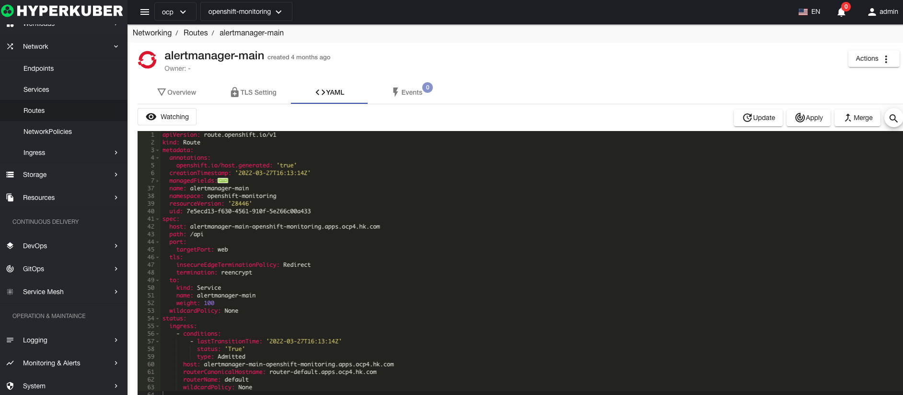

# route

A router is an instance that provides network routing in and out of the cluster

## Routing operations

The following interface graphical operations are supported:

* Label
* Notes
* Yaml/Json editing

### Create
Create a route, click the "Create route" button, enter the create route page, fill in the necessary parameters

parameter
name: route name
route hostname: hostname
Routing beat path: routing path, default "/"
Service selection: Service name for routing forwarding
Destination Port: The destination port of the selected service

Whether to enable TLS

### Yaml create
Routes can be created directly from Yaml files

### Routing Details
Click the link of the route name to enter the details page of the route
Overview information

Yaml information

event information

### delete
Select the route to be deleted, click the multi-select box to select, click the "Delete button", and enter "yes" in the confirmation input box to complete the deletion operation.
### refresh
Click "Refresh" to complete the refresh of the routing list.