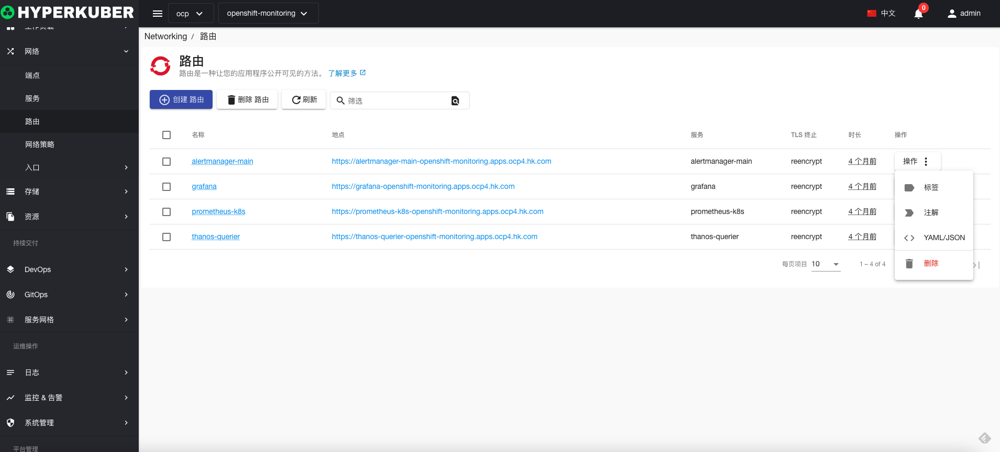

# 路由

路由是一个在集群内外提供网络路由的实例

## 路由操作

支持以下界面图形化操作：

* 标签
* 注解
* Yaml/Json编辑

### 创建
创建路由，点击“创建路由”按钮，进入创建路由页面，填写必要参数

参数
名称：路由名称
路由主机名： 主机名称
路由拍路径：路由路径，默认“/”
服务选择：路由转发的服务名称
目标端口： 所选服务的目标端口

是否开启TLS

### Yaml创建
路由可通过Yaml文件直接创建

### 路由详情
点击路由名称的链接，即可进入路由的详情页面
概览信息

Yaml信息

事件信息

### 编辑
选择需要编辑的路由，点击”编辑“按钮，进入编辑路由页面，修改必要参数，即可完成删除操作。
* 支持图形化修改路由参数

* 支持Yaml修改

### 删除
选择需要删除的路由，点击多选框选择，点击“删除按钮”，在确定输入框输入“yes”，即可完成删除操作。
### 刷新
点击“刷新”，即可完成路由列表的刷新。