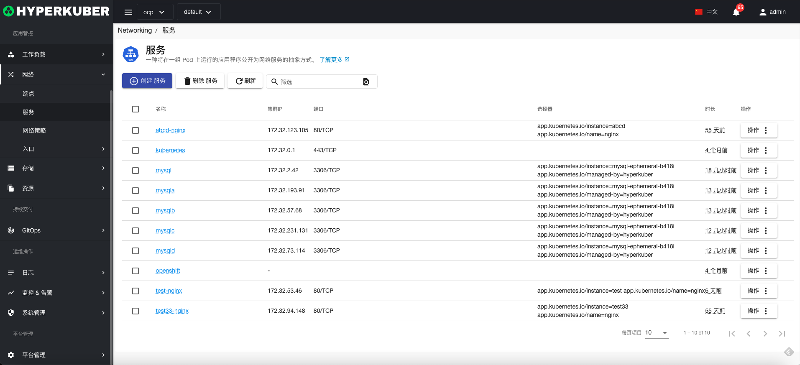
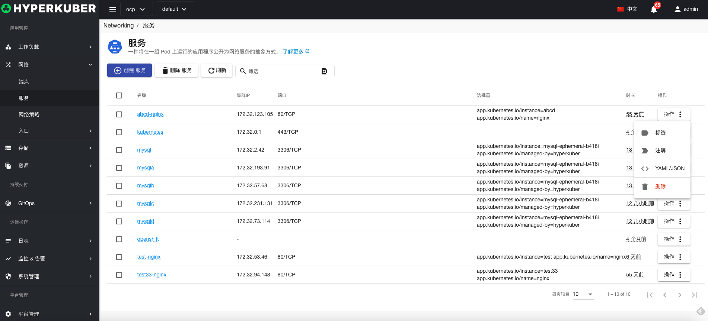
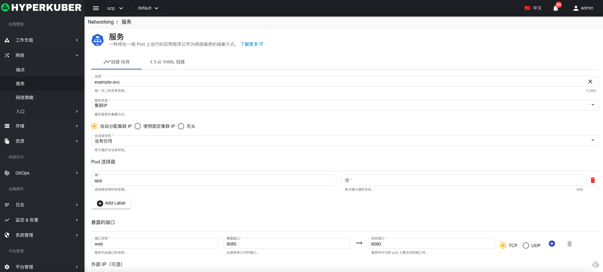
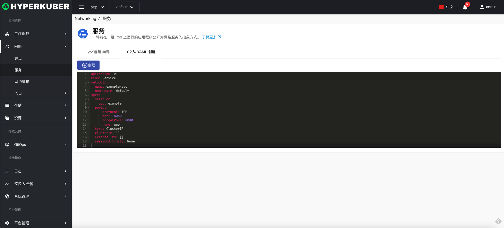
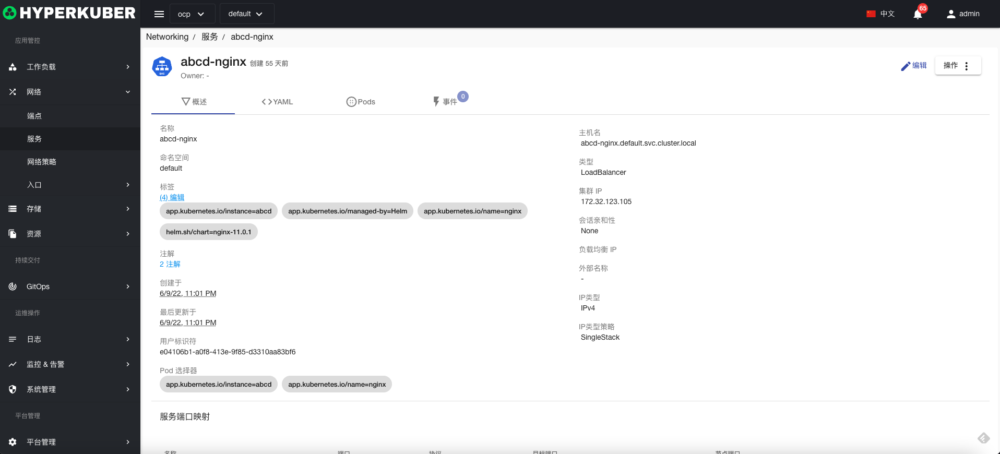
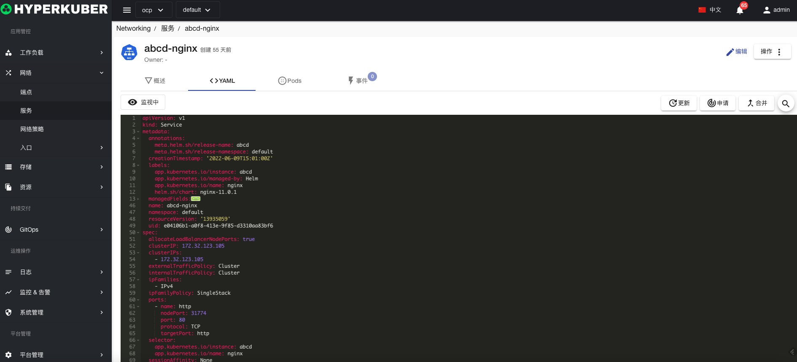
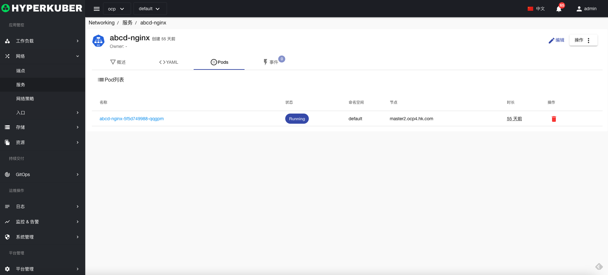
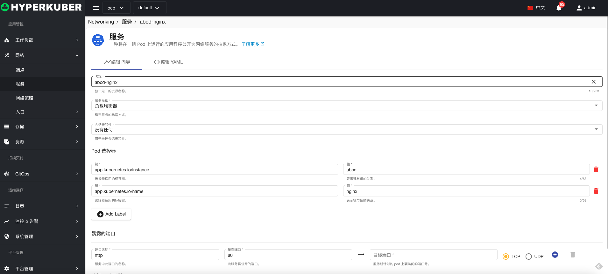
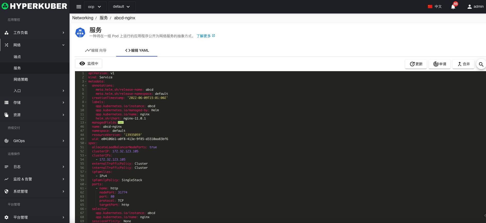

# 服务

服务是一个在集群内外提供网络服务的实例

## 服务操作

支持以下界面图形化操作：

* 标签
* 注解
* Yaml/Json编辑

### 创建
创建服务，点击“创建服务”按钮，进入创建服务页面，填写必要参数

参数
名称：服务名称
服务类型： 支持集群IP，节点端口，负载均衡器，外部名称
会话亲和性：是否保持会话
Pod选择器：选择服务转发的Pod
暴露端口： 服务的端口号

### Yaml创建
服务可通过Yaml文件直接创建

### 服务详情
点击服务名称的链接，即可进入服务的详情页面
概览信息

Yaml信息

事件信息

### 编辑
选择需要编辑的服务，点击”编辑“按钮，进入编辑服务页面，修改必要参数，即可完成删除操作。
* 支持图形化修改服务参数

* 支持Yaml修改

### 删除
选择需要删除的服务，点击多选框选择，点击“删除按钮”，在确定输入框输入“yes”，即可完成删除操作。
### 刷新
点击“刷新”，即可完成服务列表的刷新。