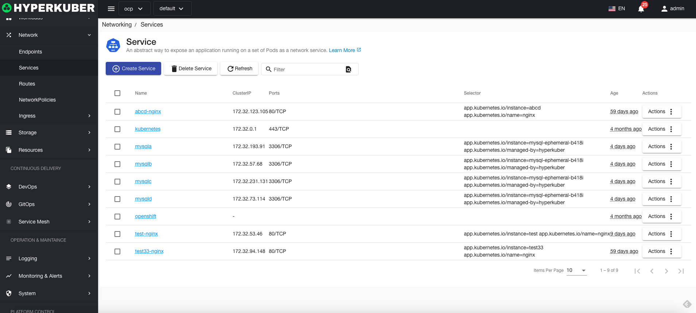
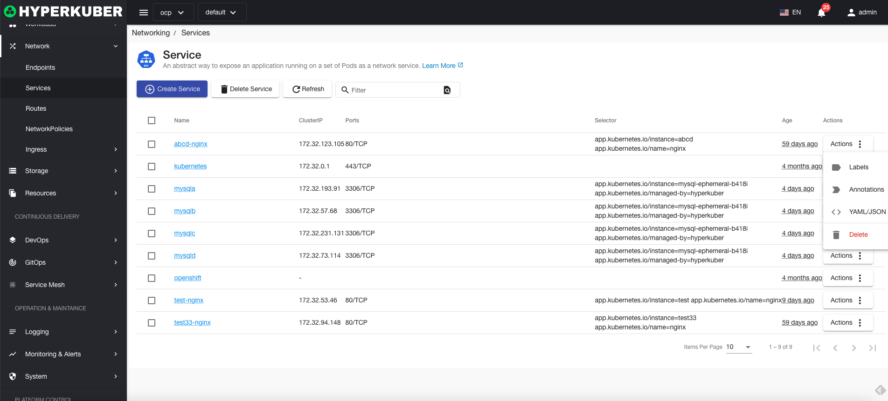
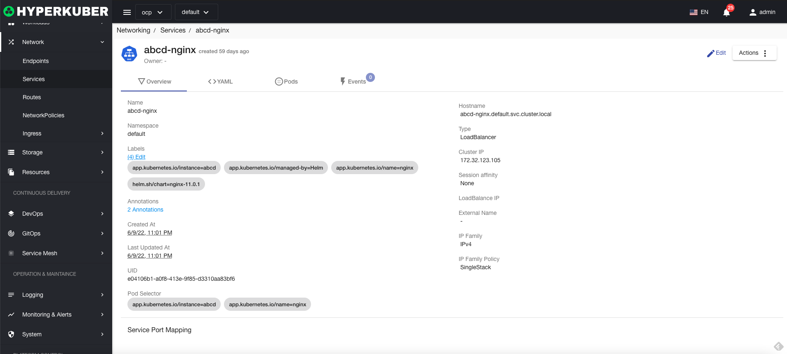
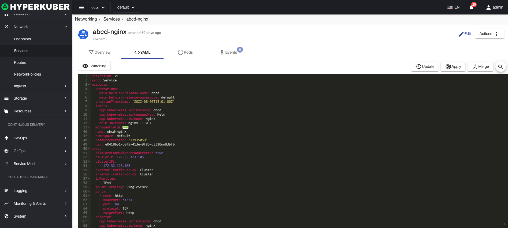
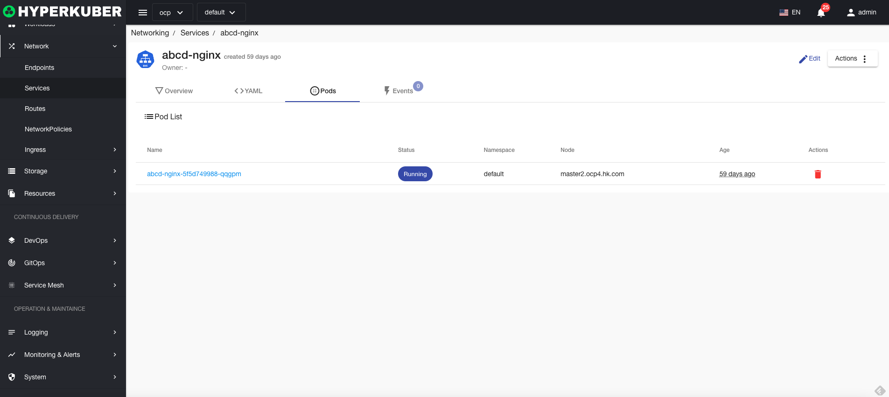
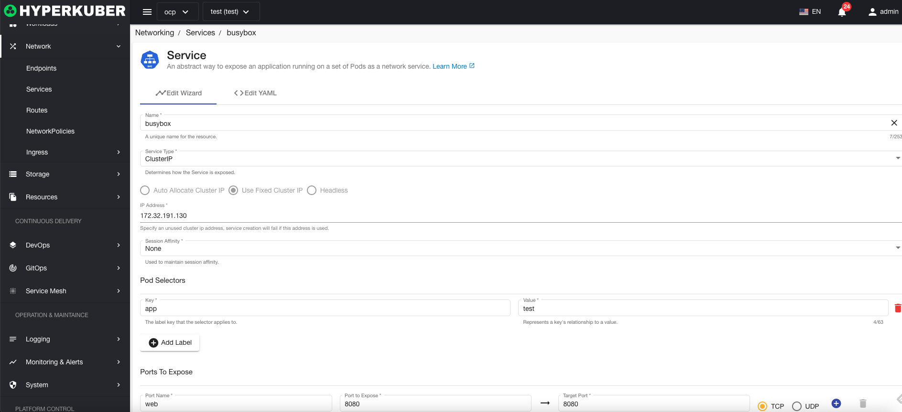
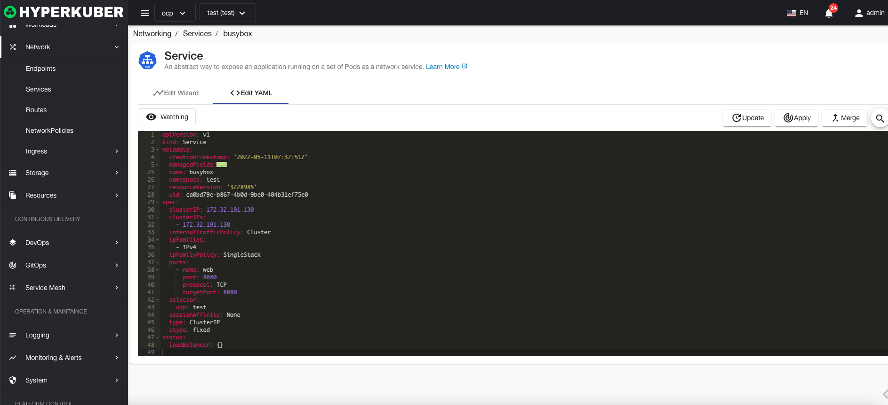

# Serve

A service is an instance that provides network services inside and outside the cluster

## service operation

The following interface graphical operations are supported:

* Label
* Notes
* Yaml/Json editing

### Create
To create a service, click the "Create Service" button to enter the create service page and fill in the necessary parameters

parameter
name: service name
Service Type: Supports Cluster IP, Node Port, Load Balancer, External Name
Session affinity: whether to keep the session
Pod selector: Select the Pods forwarded by the service
Exposed port: The port number of the service

### Yaml create
Services can be created directly from Yaml files

### Service Details
Click the link of the service name to enter the service details page
Overview information

Yaml information

event information

### edit
Select the service to be edited, click the "Edit" button, enter the edit service page, and modify the necessary parameters to complete the deletion operation.
* Support graphical modification of service parameters

* Support Yaml modification

### delete
Select the service to be deleted, click the multi-select box to select, click the "Delete button", and enter "yes" in the confirmation input box to complete the deletion operation.
### refresh
Click "Refresh" to complete the refresh of the service list.