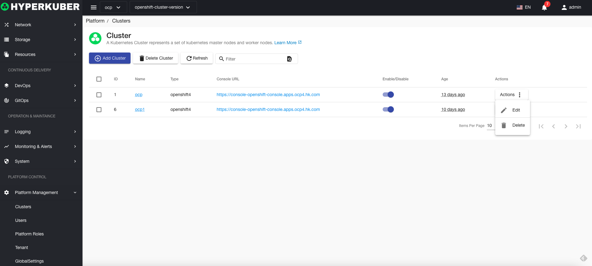
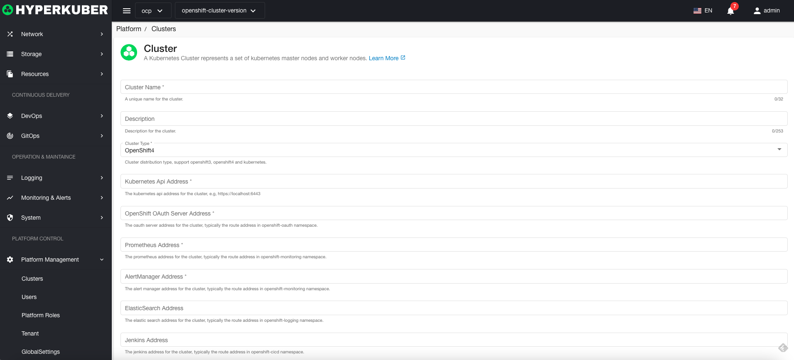
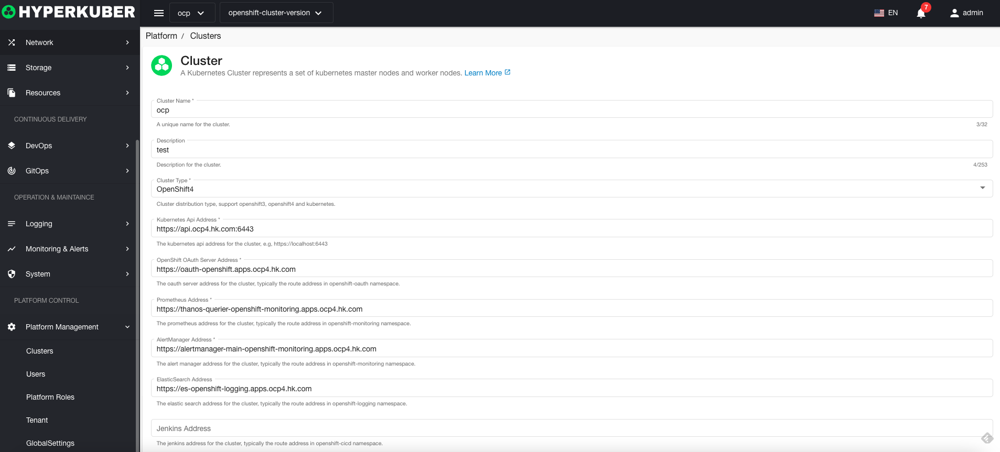
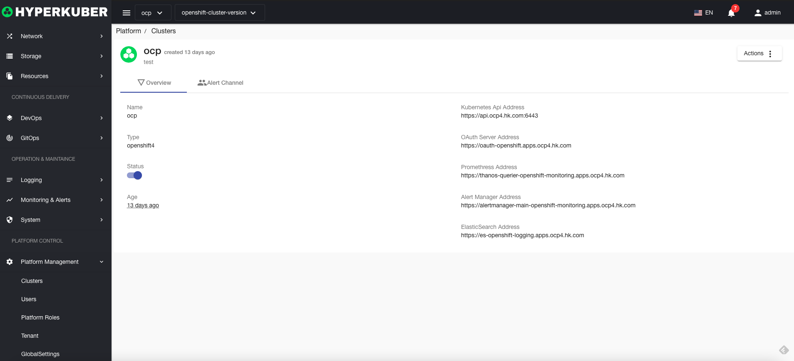
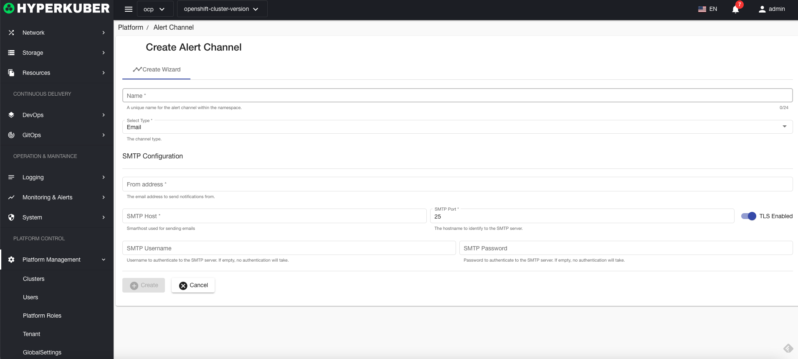

# Cluster management

HyperKuber supports multi-cluster management. Users can register Kubernetes or Openshift clusters and implement multi-cluster management through Hyperkuber.

## Cluster management operations

### Register the cluster
1. When logging in to the Hyperkuber management console interface for the first time, please use the system default username/password to log in. After successful login, the cluster registration page will be displayed.

Click the "Register New Cluster" button to enter the cluster registration page

2. Log in to Hyperkuber's management console interface, and click "Platform Management" - "Cluster" on the left menu to perform cluster management operations.

Fill in the required parameters for registering a cluster

Parameter Description:
Note: The addresses in the following parameters are Kubernetes Ingress or Openshift Route. Hyperkuber's multi-cluster management is to access the cluster and monitoring, logs, alarms and other services in the cluster through external access.
* cluster name: the name of the user's cluster
* description: the description of the user cluster
* Cluster type: Currently supports Kubernetes, Openshift4, Openshift3
* ApiServer address: ApiServer address of Kubernetes, Openshift4, Openshift3 clusters, note: Fill in the complete ApiServer address: for example: https://localhost:6443
* Oauth server: If the user cluster selection is Openshift4, Openshift3 cluster type, this item is required. Openshift users log in to obtain Tokens, log in to Hyperkuber products and Openshift systems
* Prometheus address: rometheus address or Thanos Query address, used for monitoring data query, it is recommended to install Prometheus-Operator, address: https://github.com/prometheus-operator/prometheus-operator, Helm Chart address: https:// github.com/prometheus-community/helm-charts/tree/main/charts/kube-prometheus-stack
* AlertManager address: The AlertManager Api address in the cluster, similar to the Prometheus address. Used for alarm-related display and processing
* ElasticSearch address: ElasticSearch Api address in the cluster
* Jenkins address: Jenkins Server address in the cluster
* Istio Prometheus address: The address where Istio installs Prometheus in the cluster
* Kiali address: The address where Istio installs Kiali in the cluster
* Jaeger address: The address where Istio installs Jaeger in the cluster
* Enable cluster: Whether the cluster is enabled
* Cluster Token: The cluster type is Kubernetes type, you need to obtain the Token of the ServiceAccount with ClusterAdmin permissions, for example:
````
## Create hyperkuber's serviceaccount under the kube-system namespace (not kube-system)
kubectl -n kube-system create serviceaccount hyperkuber

## Create ClusterRoleBinding
kubectl create clusterrolebinding hyperkuber-cluster-admin --clusterrole=cluster-admin --serviceaccount=kube-system:hyperkuber

## Get TokenName
TOKENNAME=`kubectl -n kube-system get serviceaccount/hyperkuber -o jsonpath='{.secrets[0].name}'`

## Get Token
kubectl -n kube-system get secret $TOKENNAME -o jsonpath='{.data.token}' | base64 --decode
##
Copy and paste the token result output from the above command line into the input box of ClusterToken
````

### Enable/disable cluster

Enable: Select the cluster that needs to be disabled, drag it to "Enable", and then the cluster is enabled
Disable: Select the cluster that needs to be enabled, drag it to "Disable", and the cluster can be disabled
### Edit cluster


Select the cluster to be edited, click the "Edit button", and modify the relevant cluster parameters. Refer to the parameter description of "Register a cluster" to modify the parameter description. After the modification is completed, click "Save".

### Cluster details
Cluster overview information

Cluster alarm channel for sending alarm information

#### Create cluster alert channel

SMTP mail configuration:


### delete cluster

Select the cluster to be deleted, click the multi-select box to select, click the "Delete button", and enter "yes" in the confirmation input box to complete the deletion operation.