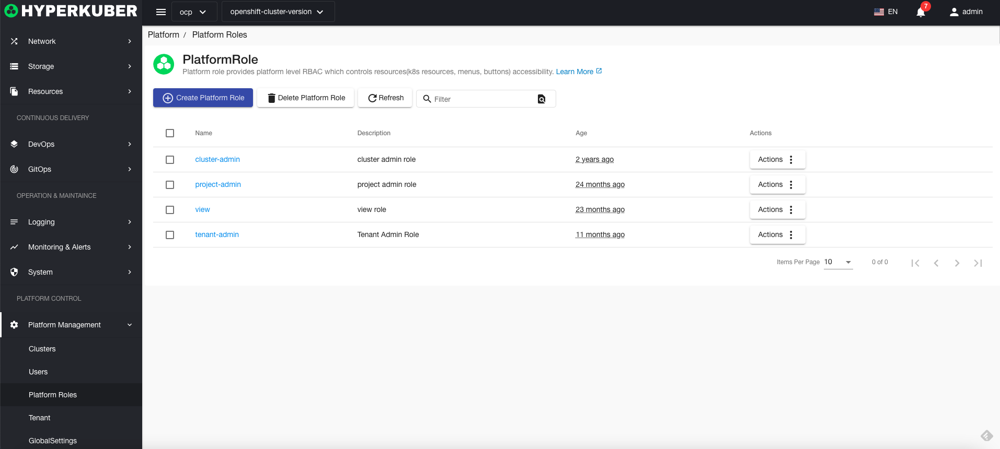
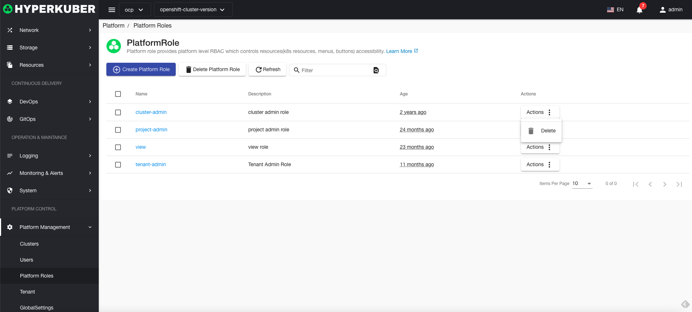
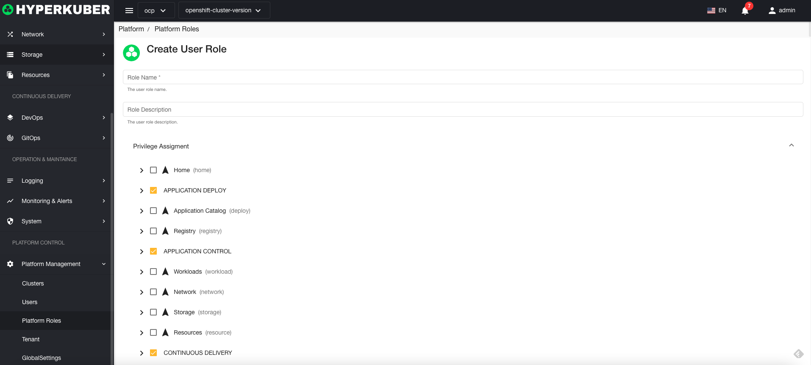
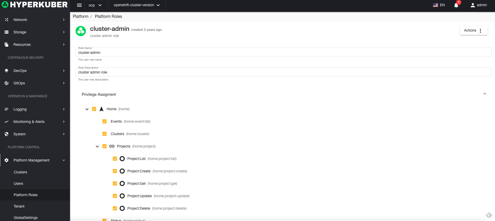

# Platform role management

Hyperkuber creates 4 platform roles by default, and users can modify them according to business needs
* cluster-admin super administrator role
* project-admin project administrator role
* view read-only role
* tenant-admin tenant administrator role

## Platform role operations

### Create platform role
1. Click "Platform Management" - "Platform Role" - "Create Platform Role"
2. Fill in the required parameters:

* Role name: The unique identifier of the role in the system
* Role description: The description of the platform role
* Role permission selection: The user selects the permissions that this role has according to the definition of the role.

3. Click "Save"

### Platform Role Details
Platform role details

### Remove platform role
Select the user role to be deleted, click the multi-select box to select, click the "Delete button", and enter "yes" in the confirmation input box to complete the deletion operation.