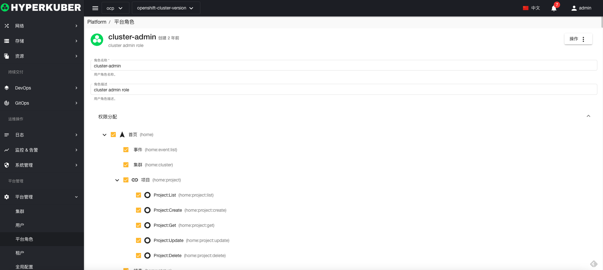

# 平台角色管理

Hyperkuber默认创建4种平台角色，用户可以根据业务需求进行修改
* cluster-admin 超级管理员角色
* project-admin 项目管理员角色
* view 只读角色
* tenant-admin 租户管理员角色

## 平台角色操作

### 创建平台角色
1，点击“平台管理”-“平台角色”-“创建平台角色”
2，填写必填参数：

* 角色名称： 角色在系统中的唯一标识
* 角色描述： 平台角色的描述信息
* 角色权限选择： 用户根据角色的定义选择此角色拥有的权限。

3，点击“保存”

### 平台角色详情
平台角色详情信息

### 删除平台角色
选择需要删除的用户角色，点击多选框选择，点击“删除按钮”，在确定输入框输入“yes”，即可完成删除操作。