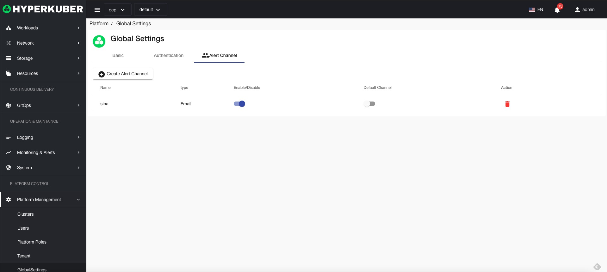
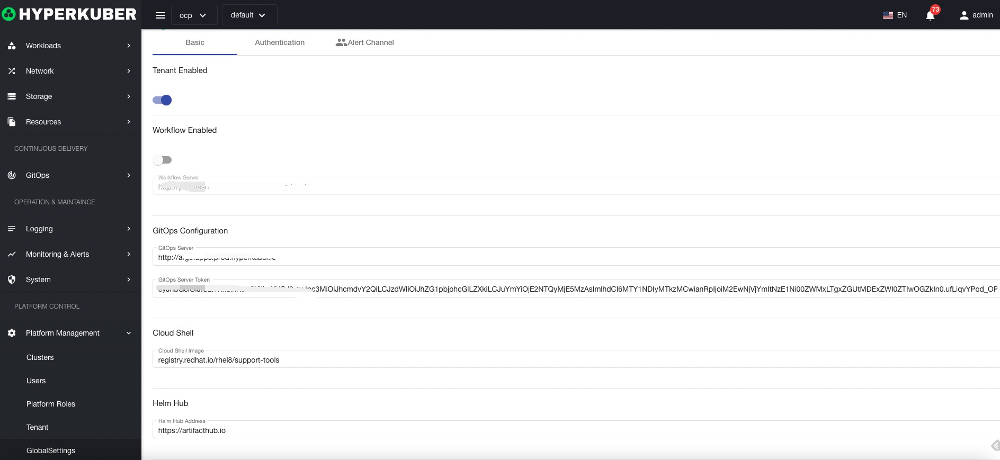
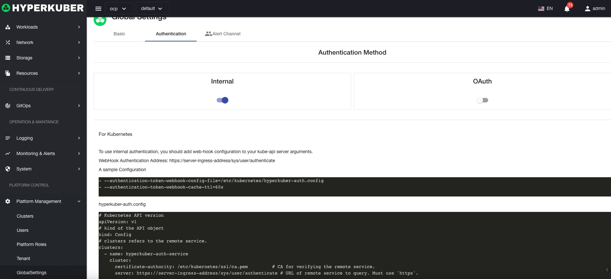

# Global Settings

Global settings are global variables that configure Hyperkuber products

## Basic Settings

Tenant enable/disable

Workflow enable/disable

## Authentication configuration

## Alarm notification settings
