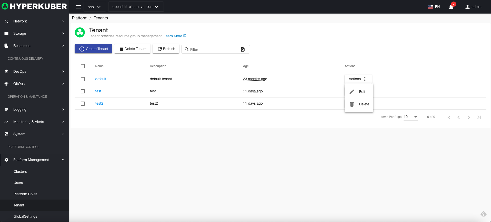
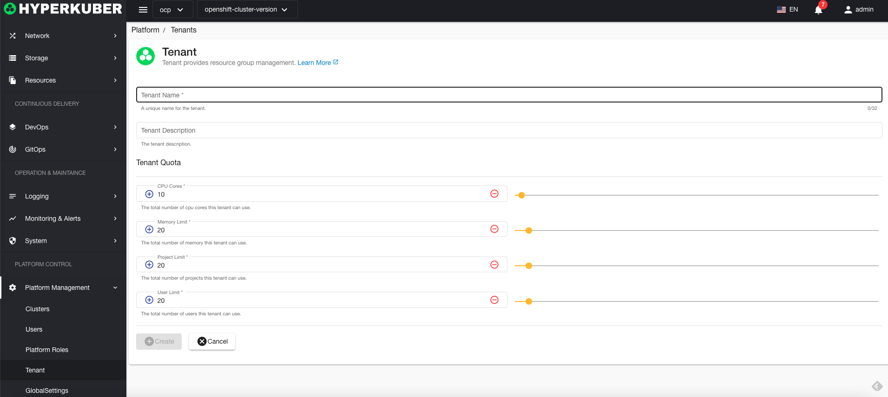
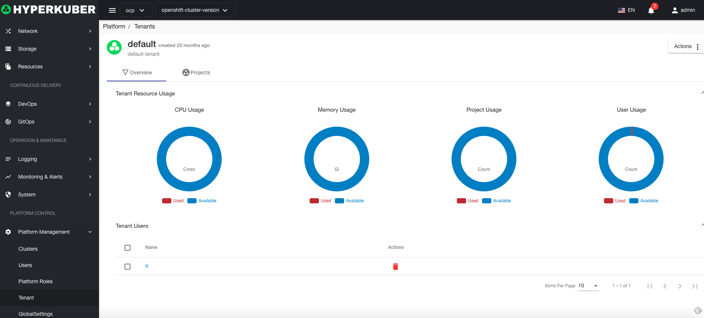
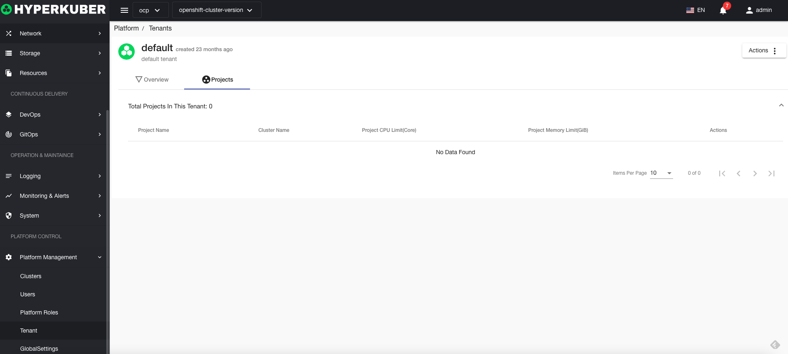

# Tenant management

Hyperkuber supports multi-tenant management

## Tenant operations

### Create tenant
1. Click "Platform Management" - "Tenant" - "Create Tenant"
2. Fill in the required parameters:

* Tenant name: the unique identifier of the tenant in the system
* Tenant Description: The description of the tenant
To set a limit:
* CPU: The maximum number of CPU cores used by the tenant
* Memory: the maximum memory size used by the tenant
* Projects: The maximum number of projects created by the tenant
* Users: The maximum number of users that a tenant can create

### Tenant Details
Tenant Resource Limit Details

Tenant Project Information

### delete tenant
Select the tenant to be deleted, click the multi-select box to select, click the "Delete button", and enter "yes" in the confirmation input box to complete the deletion operation.