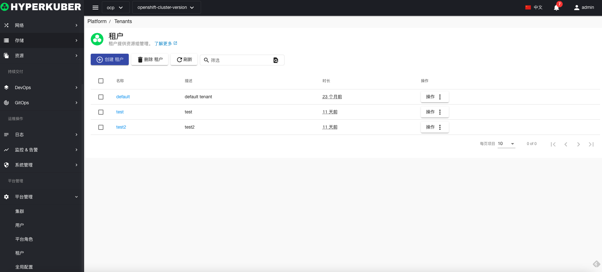
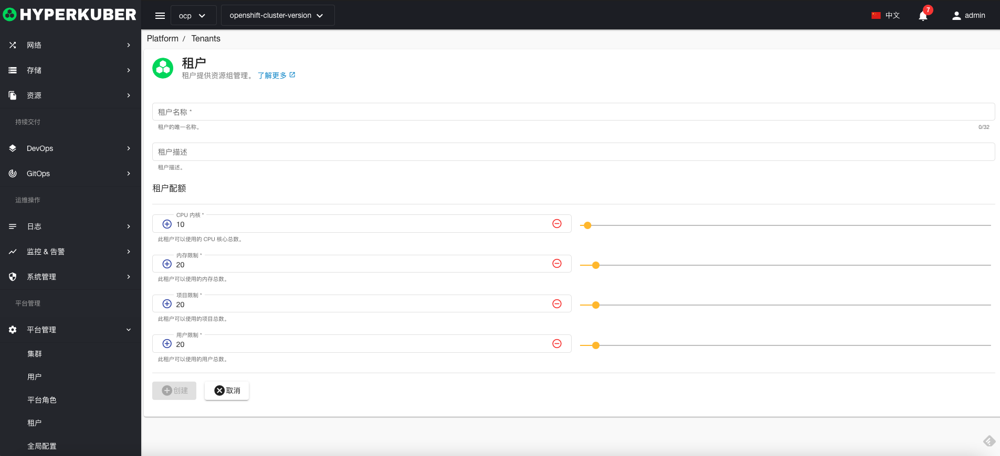
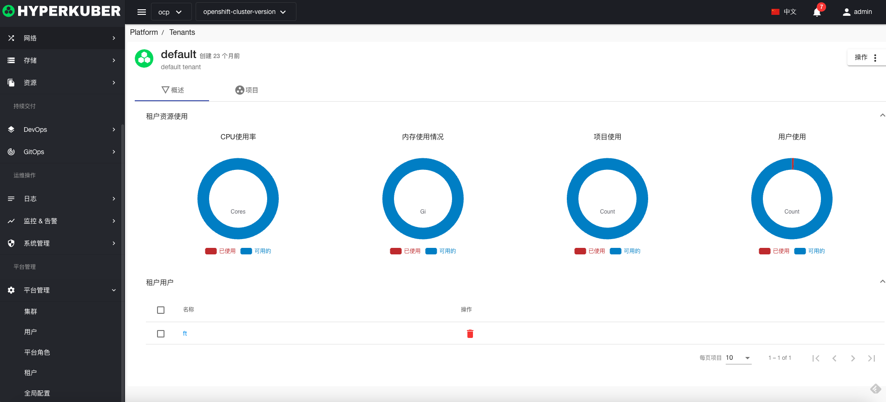
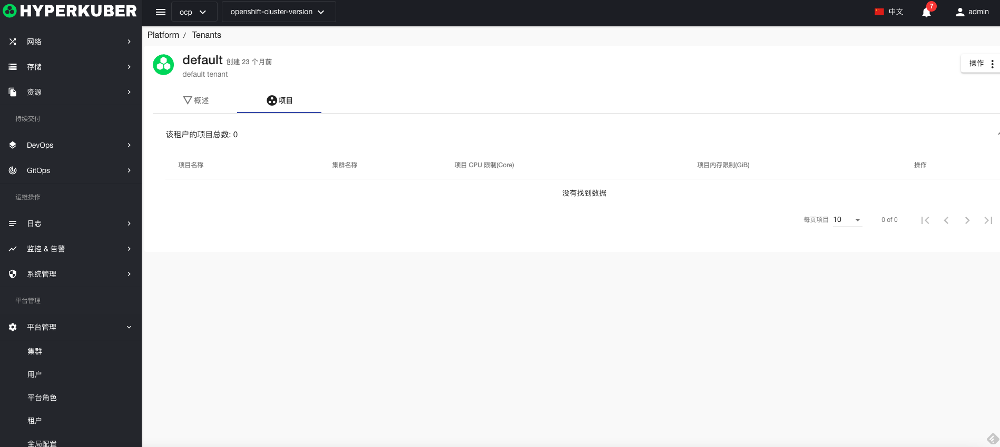

# 租户管理

Hyperkuber支持多租户管理

## 租户操作

### 创建租户
1，点击“平台管理”-“租户”-“创建租户”
2，填写必填参数：

* 租户名称： 租户在系统中的唯一标识
* 租户描述： 租户的描述信息
设置限额：
* CPU：租户最大使用cpu核数
* 内存：租户最大使用内存大小
* 项目：租户最大创建项目数量
* 用户：租户最大可创建用户数量

### 租户详情
租户资源限制详细信息

租户项目信息

### 删除租户
选择需要删除的租户，点击多选框选择，点击“删除按钮”，在确定输入框输入“yes”，即可完成删除操作。