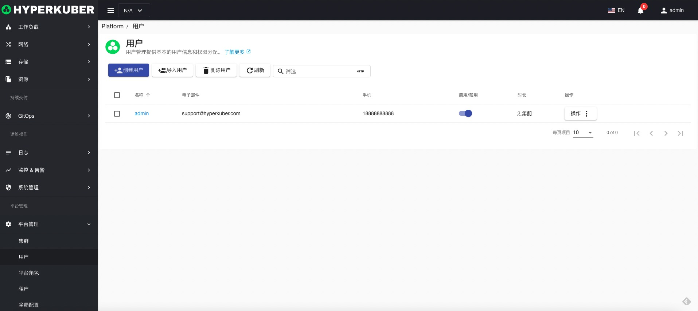
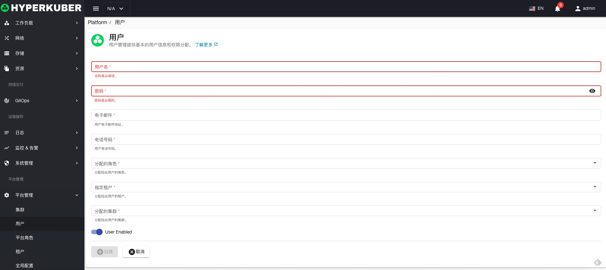
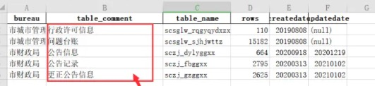

# 用户管理

HyperKuber用户管理包括Hyperkuber用户，存入Hyperkuber DB，同时支持SSO用户。SSO配置参照“平台管理”-“全局配置”-“验证”

## 用户操作

用户操作文档用于Hyperkuber平台用户，如果配置SSO，用户操作需操作SSO。
### 新建用户
1，点击“平台管理”-“用户”-“创建用户”
2，填写必填参数：

* 用户名： 用户唯一标识
* 密码：用户登陆系统的密码
* 电子邮件：用户电子邮件
* 电话号码：用户电话号码
* 角色：用户的系统角色
* 租户：用户所属租户
* 分配集群：用户的权限范围内的集群显示
* 启用/禁用：用户状态，用户在禁用状态下不能登陆系统。

### 导入用户
用户批量导入，参照“新建用户”的数据格式，批量写入excel，点击“导入用户”-“选择文件”
excel格式如下：

### 删除用户
选择需要删除的用户，点击多选框选择，点击“删除按钮”，在确定输入框输入“yes”，即可完成删除操作。

### 刷新
点击“刷新”，即可完成用户列表的刷新。
