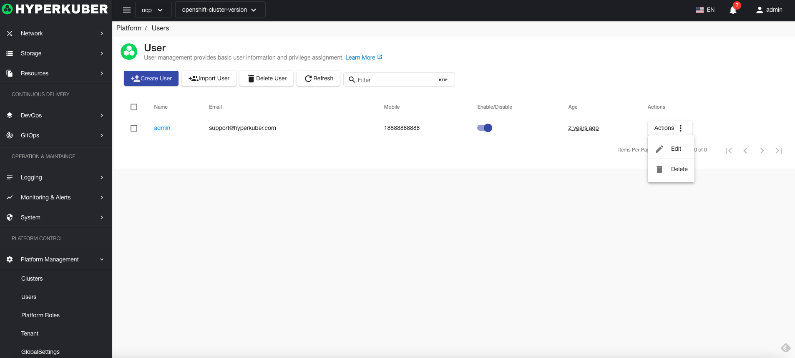
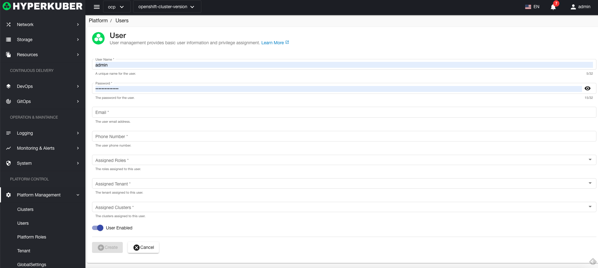
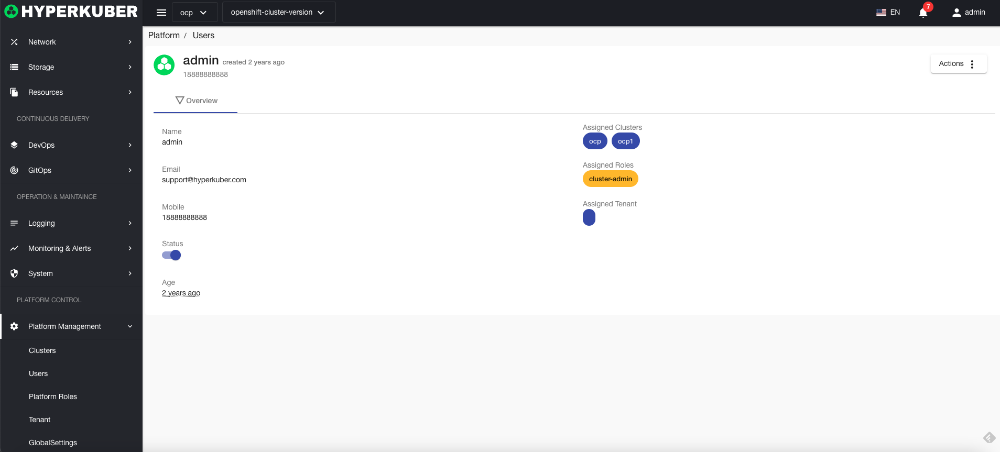

# User Management

HyperKuber user management includes Hyperkuber users, stored in Hyperkuber DB, and supports SSO users. For SSO configuration, refer to "Platform Management" - "Global Configuration" - "Authentication"

## user action

User operation documents are used for Hyperkuber platform users. If SSO is configured, user operations need to operate SSO.
### Create new user
1. Click "Platform Management" - "Users" - "Create User"
2. Fill in the required parameters:

* Username: User unique identifier
* Password: the password of the user to log in to the system
* Email: User email
* Phone number: User phone number
* role: the user's system role
* Tenant: the tenant to which the user belongs
* Assign clusters: Display clusters within the scope of the user's authority
* Enable/Disable: User status, the user cannot log in to the system in the disabled status.

### Import users
To import users in batches, refer to the data format of "New User", write them into excel in batches, and click "Import Users" - "Select File"
The excel format is as follows:
<!--  -->

### User Details
User overview information

### delete users
Select the user to be deleted, click the multi-select box to select, click the "Delete button", and enter "yes" in the confirmation input box to complete the deletion operation.

### refresh
Click "Refresh" to complete the refresh of the user list.