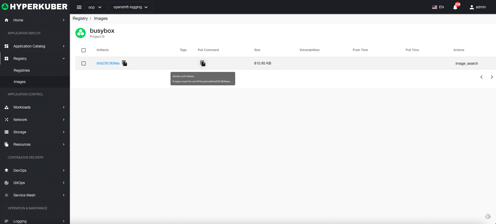

# mirror

The mirror default is to display the mirror list in the Harbor repository

## Mirror operation
Click the mirror repository menu on the left to enter the mirror repository page.
### Mirror details
Click the "Mirror Name" link to enter the details page of the mirror.

### delete mirror
Select the image to be deleted, click the multi-select box to select, click the "Delete button", and enter "yes" in the confirmation input box to complete the deletion operation.