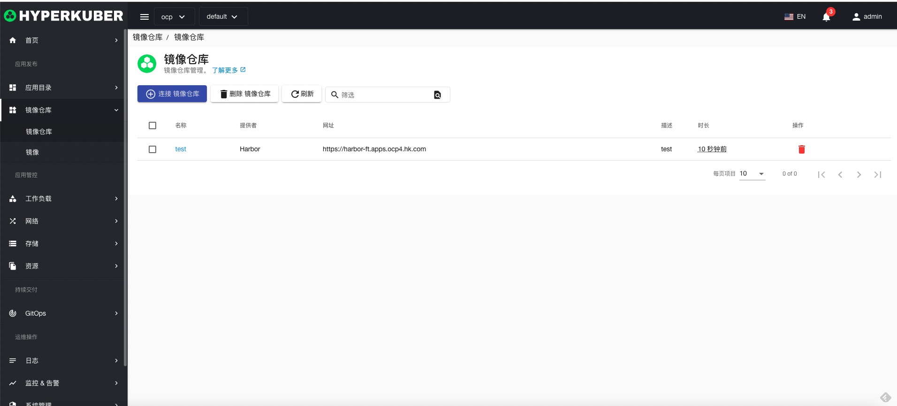
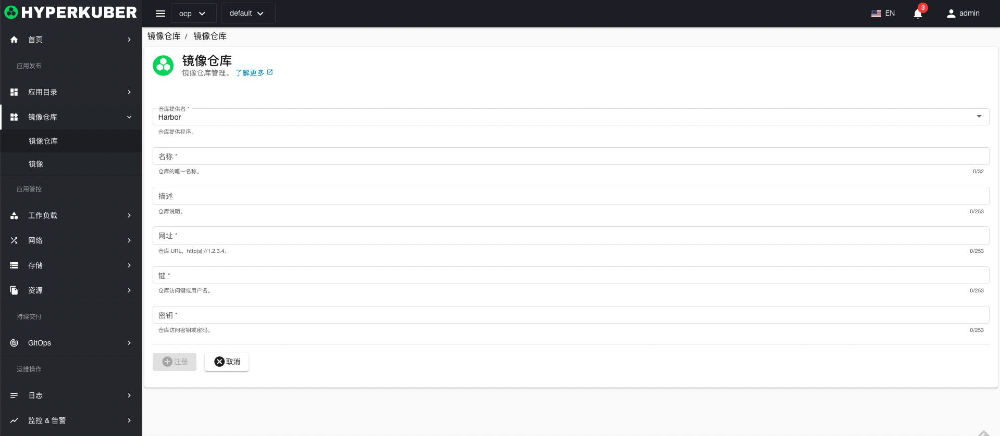

# 镜像仓库

hyperkuber产品目前支持Harbor仓库，Docker Registry以及RedHat Quay在规划支持中

## 仓库操作
点击左侧镜像仓库菜单，进入镜像仓库页面。
### 连接仓库
点击“连接镜像仓库”按钮，填写相关的连接镜像仓库的参数，参数说明如下，填写完成后，点击“注册”即可。

* 提供者： 目前支持Harbor
* 名称： 仓库在系统中的标识
* 描述： 仓库的描述信息
* 网址：仓库的网络地址，例如：https://harbor-ft.apps.ocp4.hk.com
* 仓库访问键或用户名： 访问Harbor时需要的用户名或键
* 仓库访问密钥或密码： 访问Harbor时需要的密码或密钥

### 删除仓库
选择需要删除的仓库，点击多选框选择，点击“删除按钮”，在确定输入框输入“yes”，即可完成删除操作。
### 刷新
点击“刷新”，即可完成仓库列表的刷新。