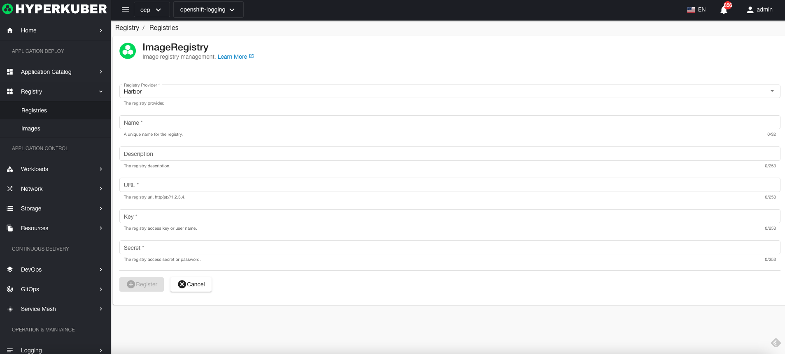

# mirror repository

Hyperkuber products currently support Harbor repository, Docker Registry and RedHat Quay are in planning support

## warehouse operations
Click the mirror repository menu on the left to enter the mirror repository page.
### Connect to repository
Click the "Connect Mirror Warehouse" button, and fill in the relevant parameters for connecting to the mirror warehouse. The parameters are explained as follows. After filling in, click "Register".

* Provider: Currently supports Harbor
* Name: The identity of the warehouse in the system
* Description: Description of the warehouse
* URL: The network address of the warehouse, for example: https://harbor-ft.apps.ocp4.hk.com
* Warehouse access key or username: The username or key required to access Harbor
* Repository access key or password: The password or key required to access Harbor

### delete repository
Select the warehouse to be deleted, click the multi-select box to select, click the "Delete button", and enter "yes" in the confirmation input box to complete the deletion operation.
### refresh
Click "Refresh" to complete the refresh of the warehouse list.