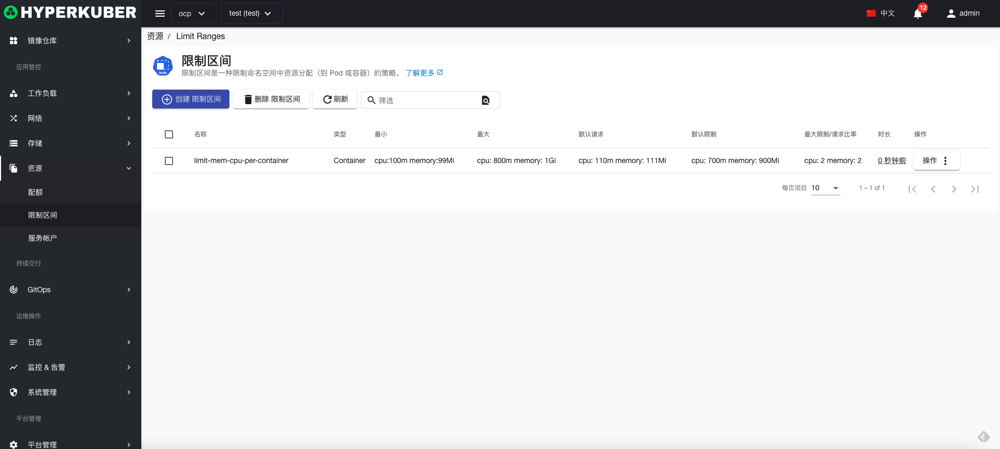
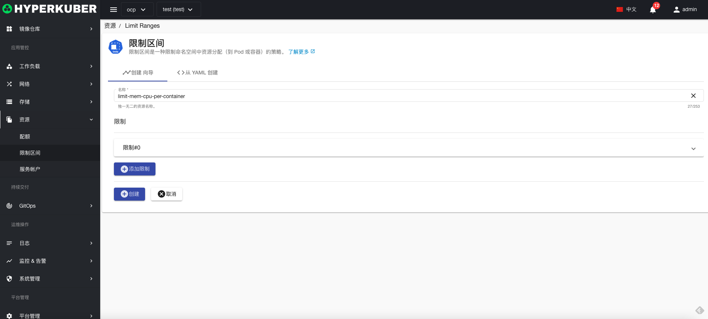
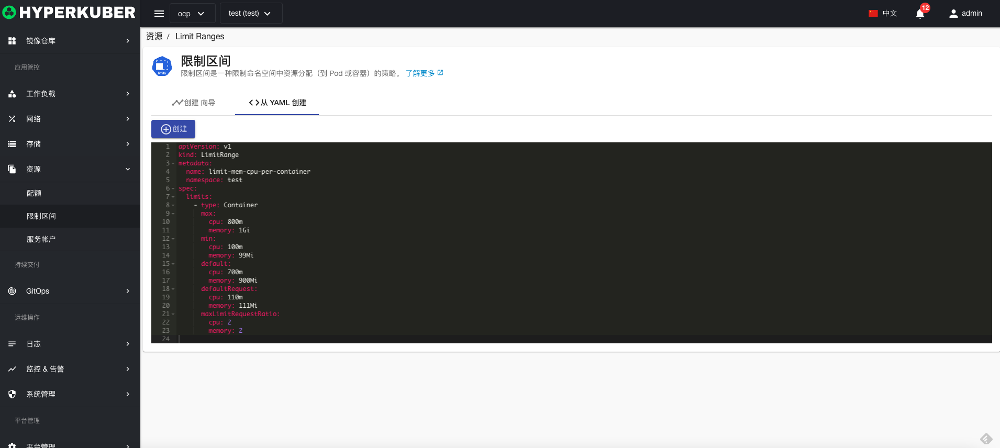

# 限制区间

限制区间是一种限制命名空间中资源分配（到 Pod 或容器）的策略

## 限制区间操作

支持以下界面图形化操作：

* 标签
* 注解
* Yaml/Json编辑

### 创建
创建限制区间，点击“创建限制区间”按钮，进入创建限制区间页面，填写必要参数

参数
名称：限制区间名称
限制：将Pod或者容器进行cpu和内存限制

点击“创建”即可。

### Yaml创建
限制区间可通过Yaml文件直接创建

### 删除
选择需要删除的限制区间，点击多选框选择，点击“删除按钮”，在确定输入框输入“yes”，即可完成删除操作。
### 刷新
点击“刷新”，即可完成限制区间列表的刷新。

