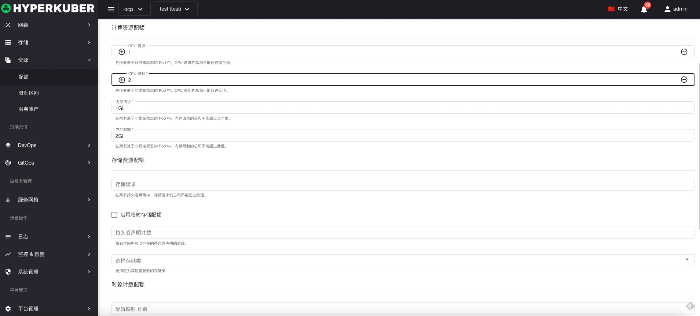

# 配额

资源配额提供了限制每个命名空间的聚合资源消耗的约束。

## 配额操作

支持以下界面图形化操作：

* 标签
* 注解
* Yaml/Json编辑

### 创建
创建配额，点击“创建配额”按钮，进入创建配额页面，填写必要参数

参数
名称：配额名称

计算资源：设置使用计算资源大小
存储资源：设置使用存储大小
对象资源：设置使用对象总数

点击“创建”即可。

### Yaml创建
配额可通过Yaml文件直接创建

### 配额详情
点击配额名称的链接，即可进入配额的详情页面
概览信息

### 删除
选择需要删除的配额，点击多选框选择，点击“删除按钮”，在确定输入框输入“yes”，即可完成删除操作。
### 刷新
点击“刷新”，即可完成配额列表的刷新。
