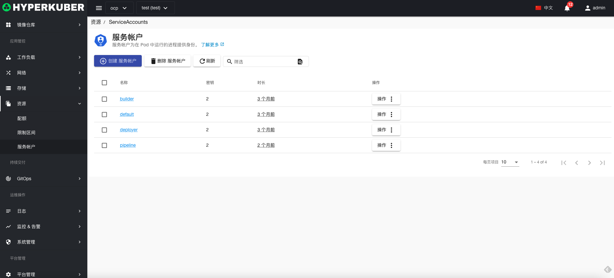
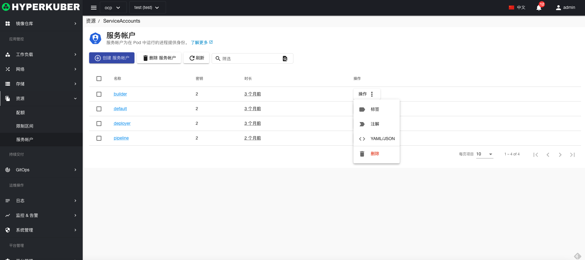
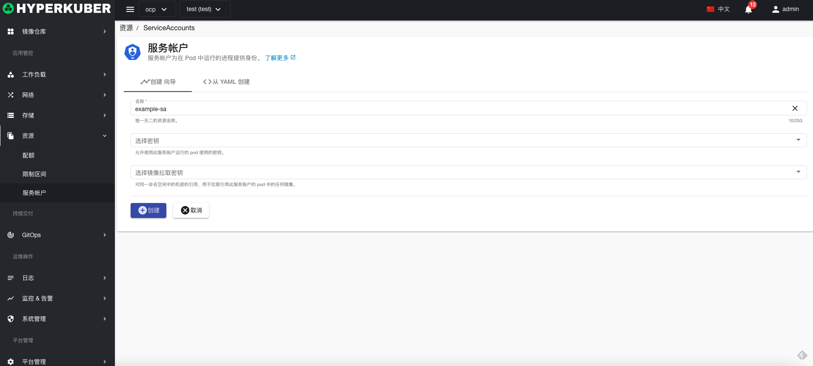
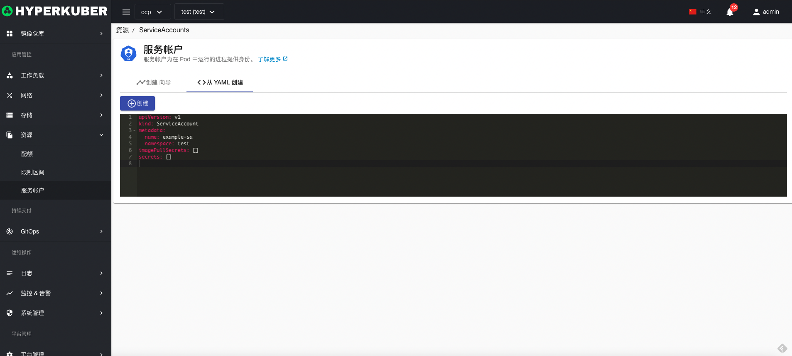
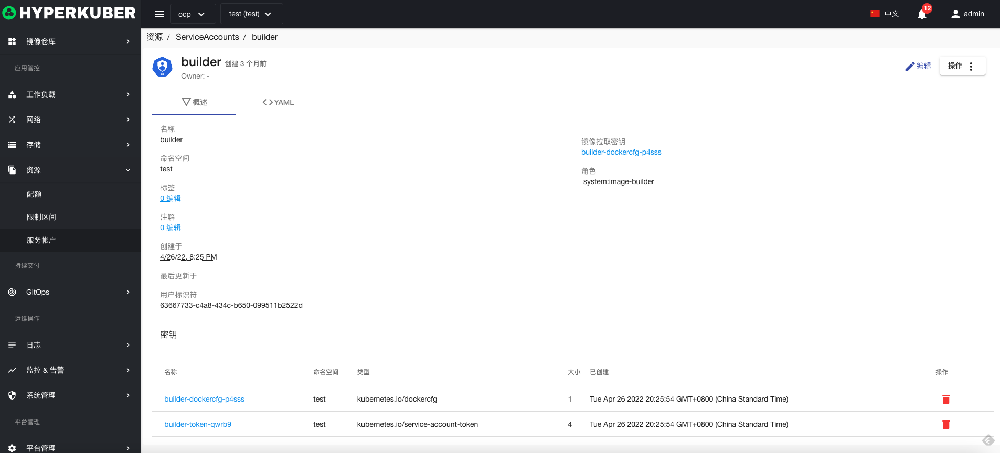
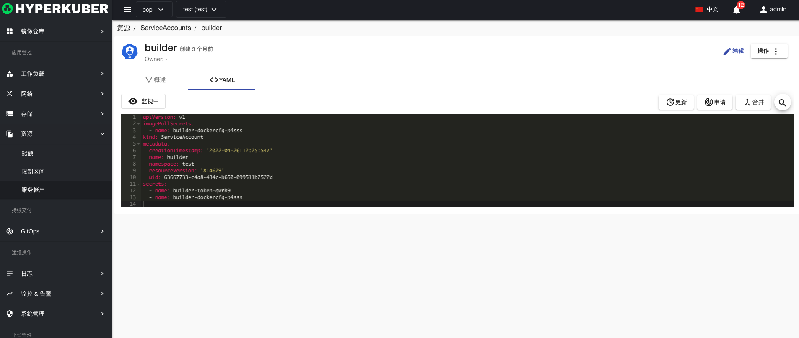

# 服务账户

服务帐户为在 Pod 中运行的进程提供身份。

## 服务账户操作

支持以下界面图形化操作：

* 标签
* 注解
* Yaml/Json编辑

### 创建
创建服务账户，点击“创建服务账户”按钮，进入创建服务账户页面，填写必要参数

参数
名称：服务账户名称
选择密钥：允许使用此服务账户运行的 pod 使用的密钥。
选择：对同一命名空间中的机密的引用，用于拉取引用此服务账户的 pod 中的任何镜像。

点击“创建”即可。

### Yaml创建
服务账户可通过Yaml文件直接创建

### 服务账户详情
点击服务账户名称的链接，即可进入服务账户的详情页面
概览信息

Yaml信息

### 删除
选择需要删除的服务账户，点击多选框选择，点击“删除按钮”，在确定输入框输入“yes”，即可完成删除操作。
### 刷新
点击“刷新”，即可完成服务账户列表的刷新。