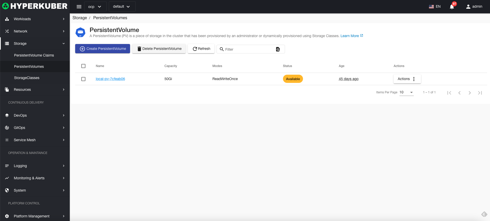
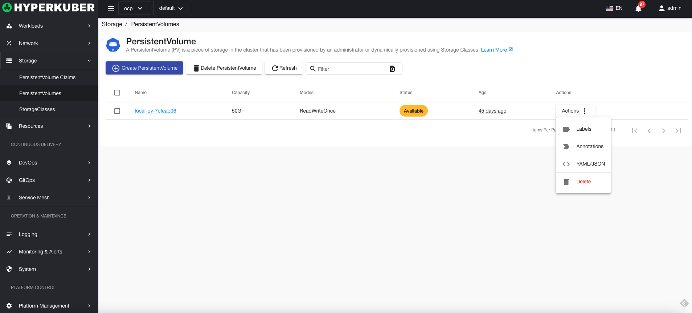
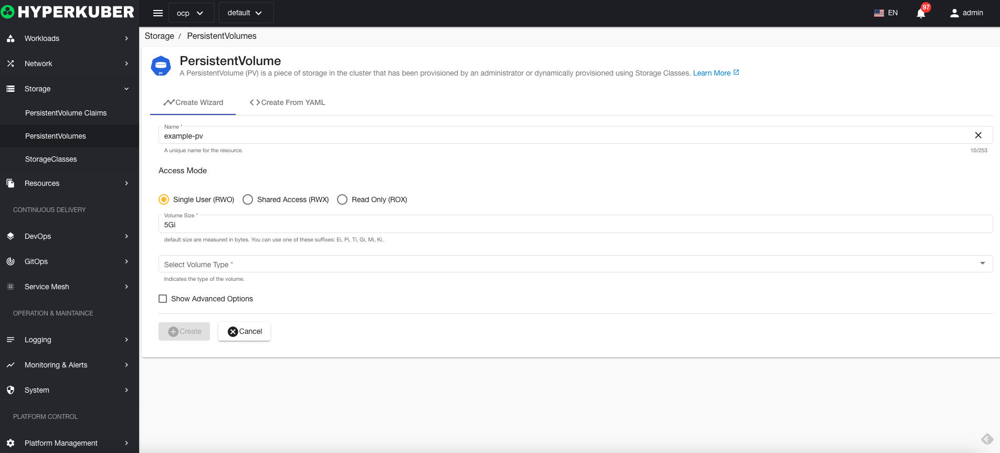
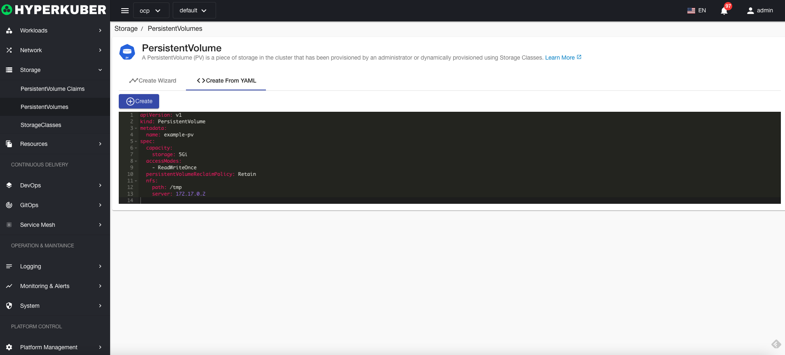
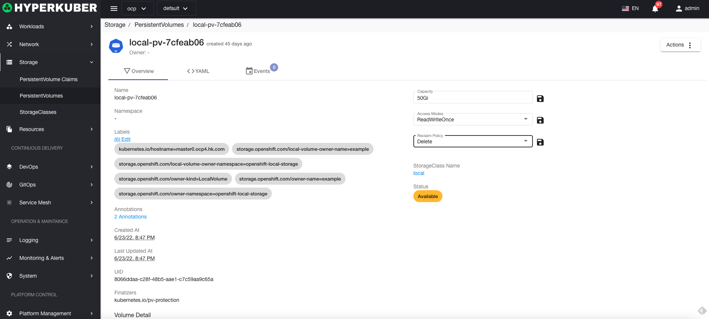
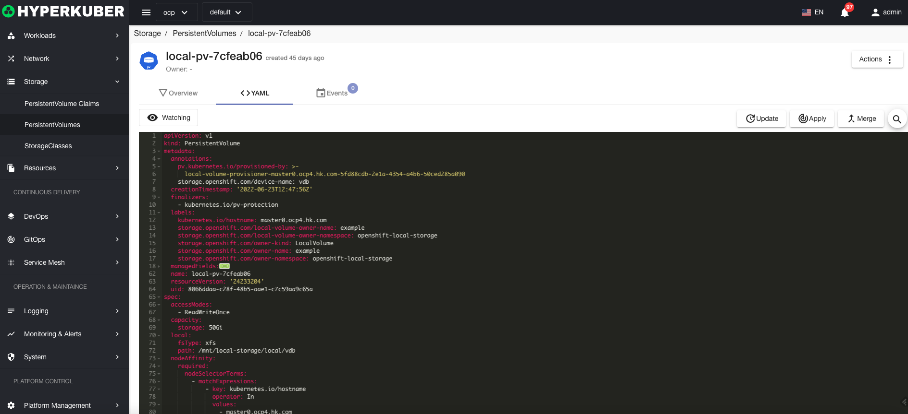
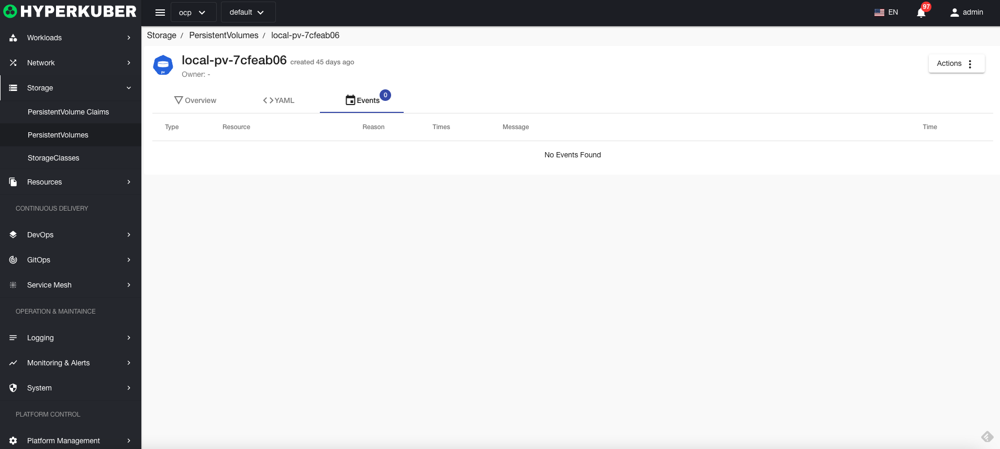

# persistent storage

A persistent store (PV) is a piece of storage in a cluster that is configured by an administrator or dynamically using storage classes.

## Persistent storage operations

The following interface graphical operations are supported:

* Label
* Notes
* Yaml/Json editing

### Create
Create persistent storage, click the "Create Persistent Storage" button, enter the Create Persistent Storage page, and fill in the necessary parameters

parameter
name: persistent store name
Persistent storage access mode:
* Multiple reading and writing
* Single read and write
* read only
Persistent storage size: storage capacity size
Storage volume type: All interfaces support K8s storage volume type

### Yaml create
Persistent storage can be created directly from a Yaml file

### Persistent Storage Details
Click the link of the persistent storage name to enter the persistent storage details page
Overview information

Yaml information

event information

### delete
Select the persistent storage to be deleted, click the multi-select box to select, click the "Delete button", and enter "yes" in the confirmation input box to complete the deletion operation.
### refresh
Click "Refresh" to refresh the persistent storage list.