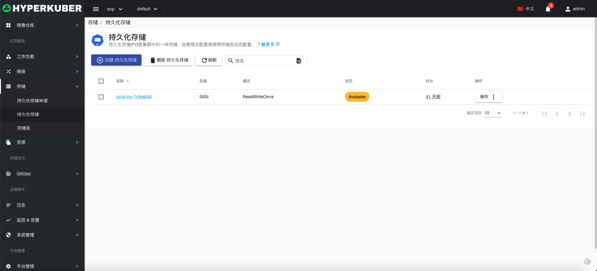
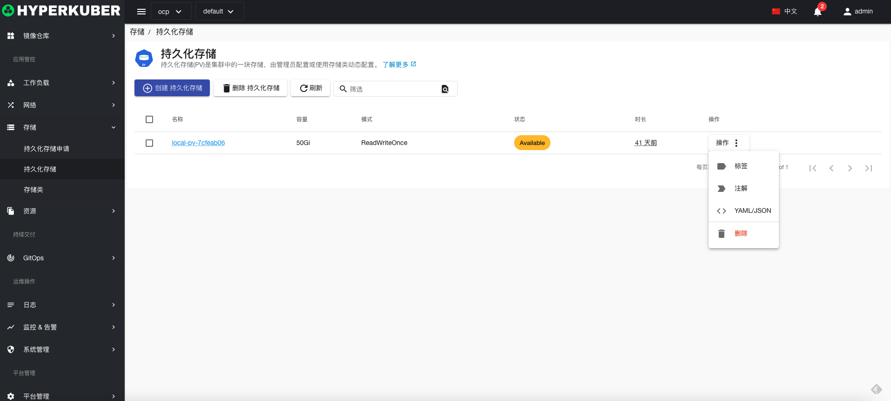
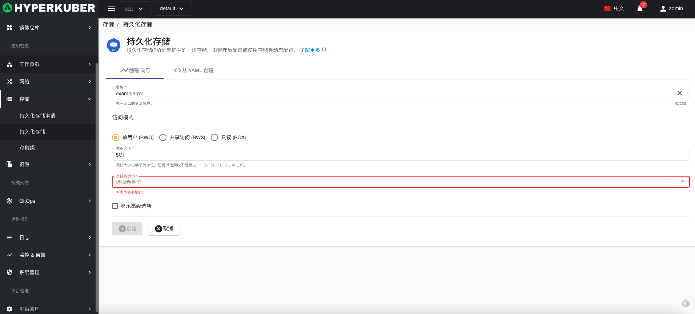
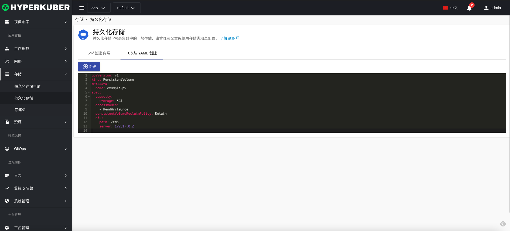
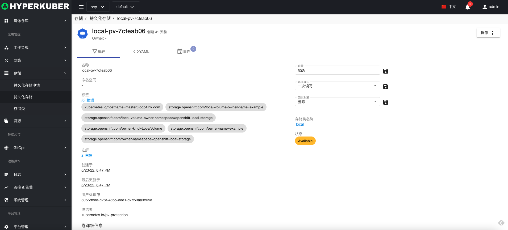
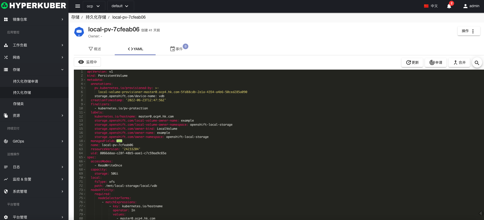
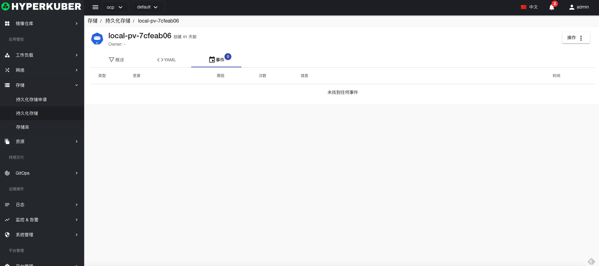

# 持久化存储

持久化存储(PV)是集群中的一块存储，由管理员配置或使用存储类动态配置.

## 持久化存储操作

支持以下界面图形化操作：

* 标签
* 注解
* Yaml/Json编辑

### 创建
创建持久化存储，点击“创建持久化存储”按钮，进入创建持久化存储页面，填写必要参数

参数
名称：持久化存储名称
持久化存储访问模式：
* 多读写
* 单读写
* 只读 
持久化存储大小：存储容量大小
存储卷类型：接口全部支持K8s存储卷类型

### Yaml创建
持久化存储可通过Yaml文件直接创建

### 持久化存储详情
点击持久化存储名称的链接，即可进入持久化存储的详情页面
概览信息

Yaml信息

事件信息

### 删除
选择需要删除的持久化存储，点击多选框选择，点击“删除按钮”，在确定输入框输入“yes”，即可完成删除操作。
### 刷新
点击“刷新”，即可完成持久化存储列表的刷新。