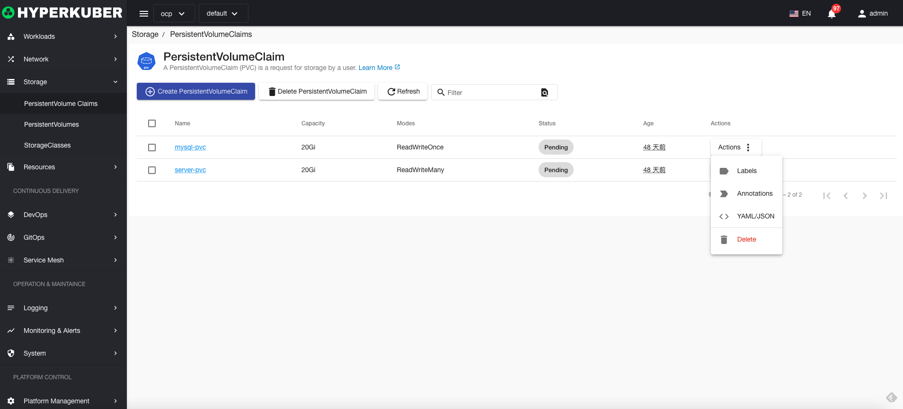
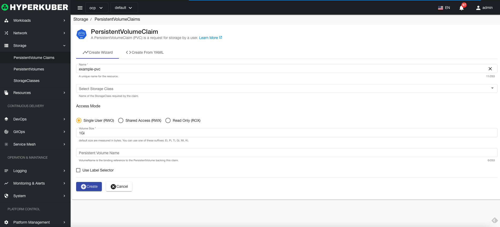
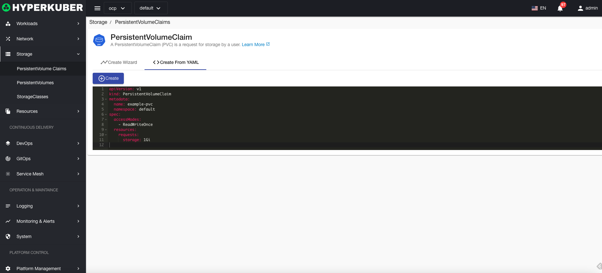
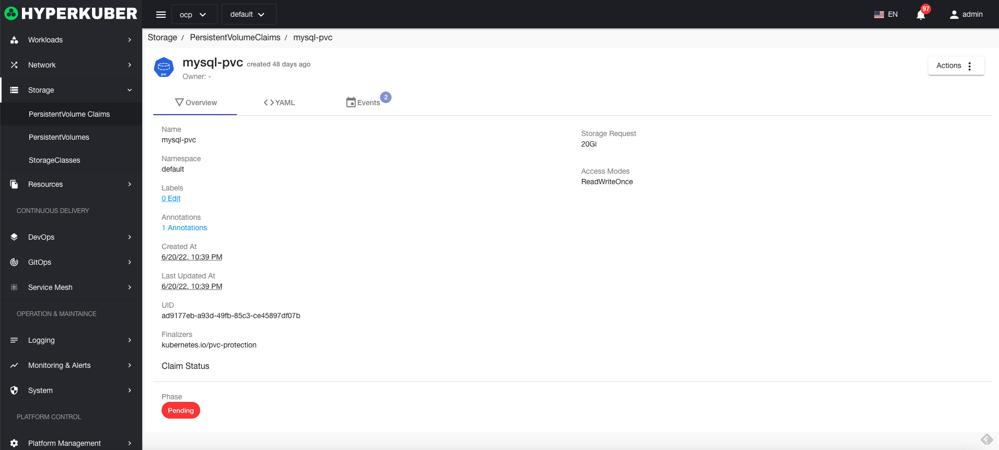
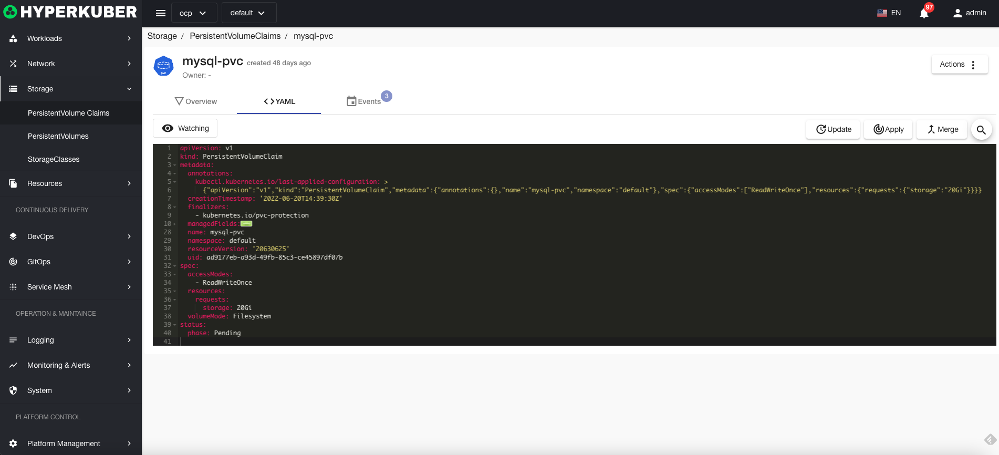
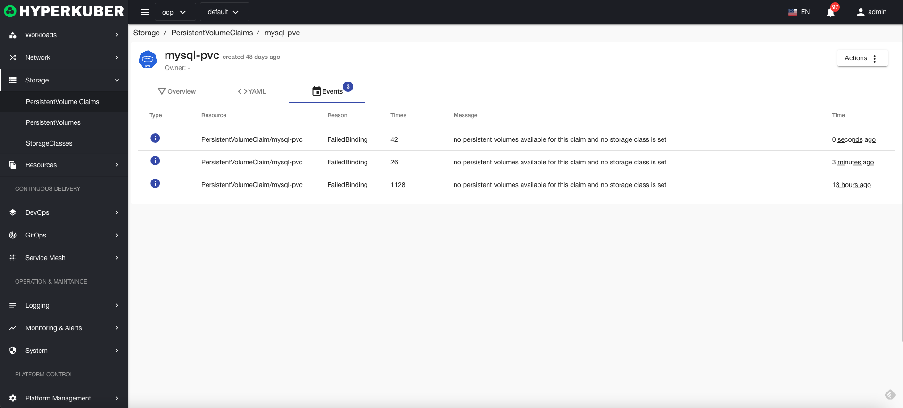

# persistent storage application

A persistent storage request (pvcC) is a user's storage request.

## Persistent storage request operation

The following interface graphical operations are supported:

* Label
* Notes
* Yaml/Json editing

### Create
Create a persistent storage application, click the "Create persistent storage application" button, enter the create persistent storage application page, and fill in the necessary parameters

parameter
Name: persistent storage application name
Select storage class: Specify the storage class to create
Persistent storage application access mode:
* Multiple reading and writing
* Single read and write
* read only
Persistent storage application size: storage capacity size
Storage volume name: Specify the storage volume to create

### Yaml create
Persistent storage applications can be created directly through Yaml files

### Persistent storage application details
Click the link of the persistent storage application name to enter the details page of the persistent storage application
Overview information

Yaml information

event information

### delete
Select the persistent storage application to be deleted, click the multi-select box to select, click the "Delete button", and enter "yes" in the confirmation input box to complete the deletion operation.
### refresh
Click "Refresh" to refresh the persistent storage application list.