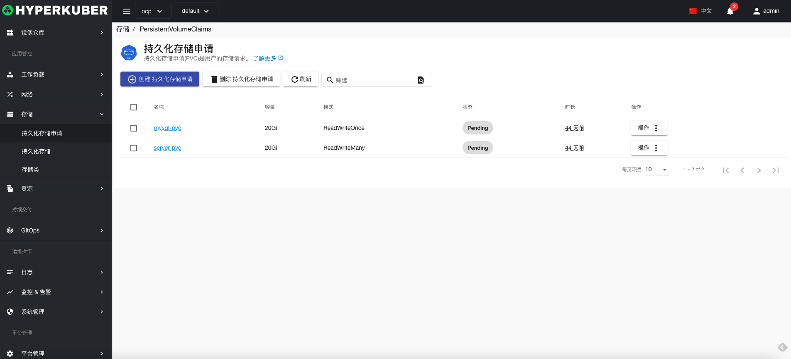
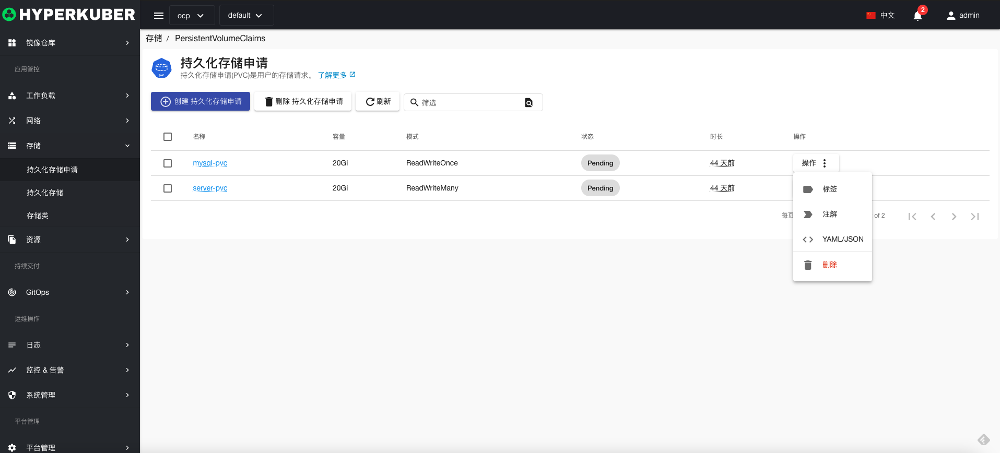
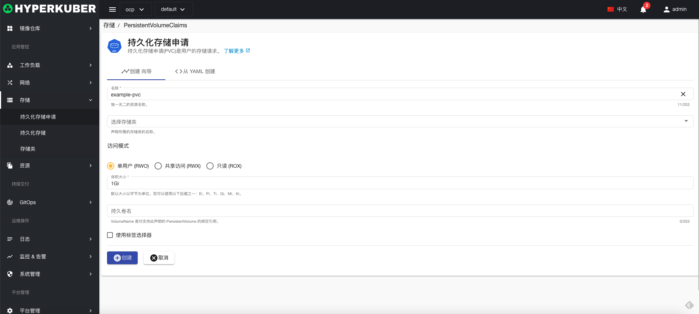
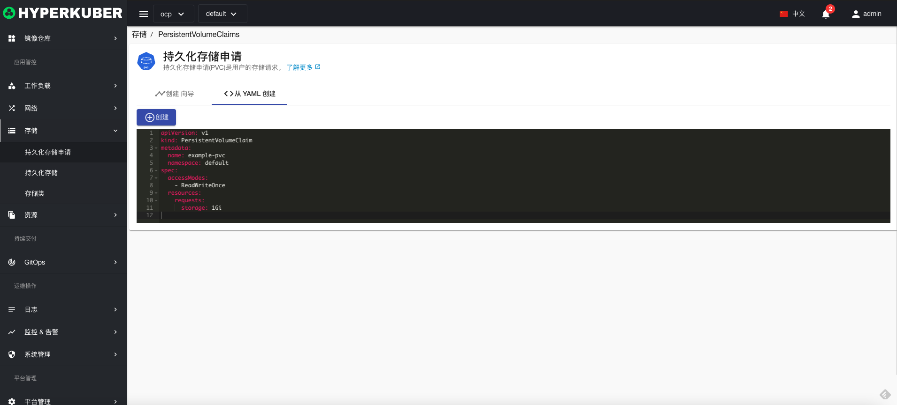
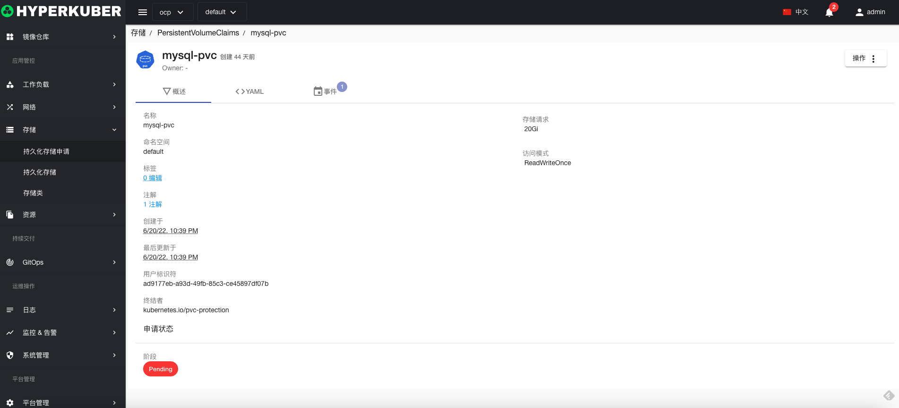
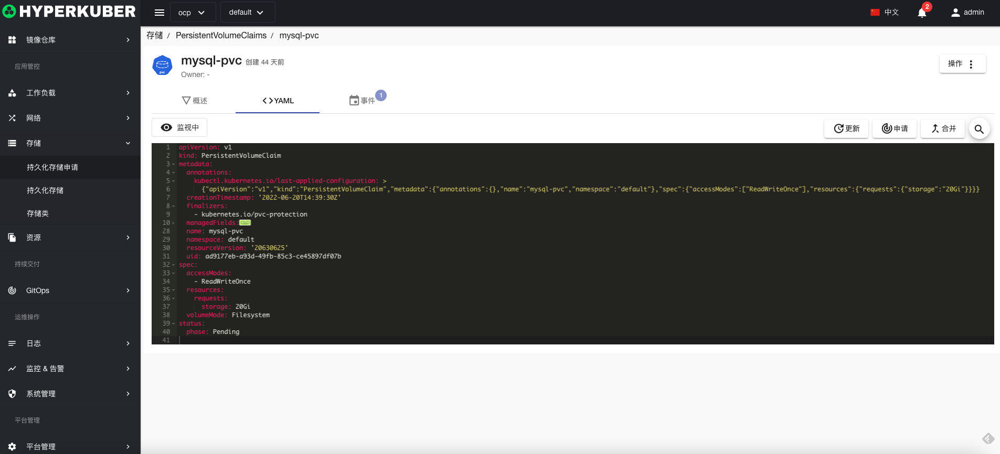
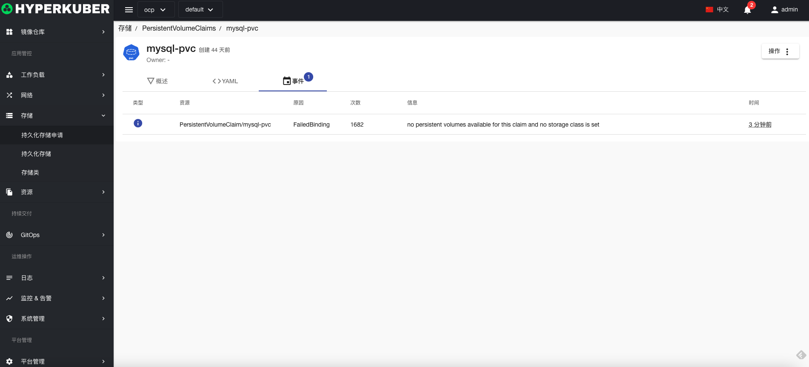

# 持久化存储申请

持久化存储申请(pvcC)是用户的存储请求。

## 持久化存储申请操作

支持以下界面图形化操作：

* 标签
* 注解
* Yaml/Json编辑

### 创建
创建持久化存储申请，点击“创建持久化存储申请”按钮，进入创建持久化存储申请页面，填写必要参数

参数
名称：持久化存储申请名称
选择存储类：指定存储类创建
持久化存储申请访问模式：
* 多读写
* 单读写
* 只读 
持久化存储申请大小：存储容量大小
存储卷名称：指定存储卷创建

### Yaml创建
持久化存储申请可通过Yaml文件直接创建

### 持久化存储申请详情
点击持久化存储申请名称的链接，即可进入持久化存储申请的详情页面
概览信息

Yaml信息

事件信息

### 删除
选择需要删除的持久化存储申请，点击多选框选择，点击“删除按钮”，在确定输入框输入“yes”，即可完成删除操作。
### 刷新
点击“刷新”，即可完成持久化存储申请列表的刷新。