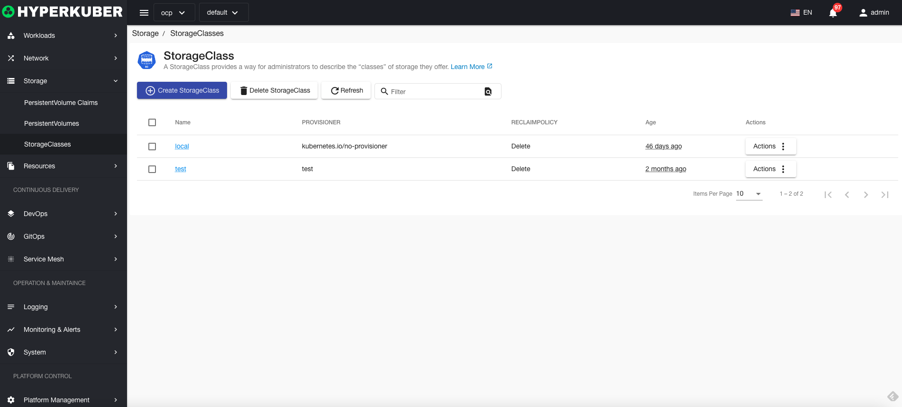
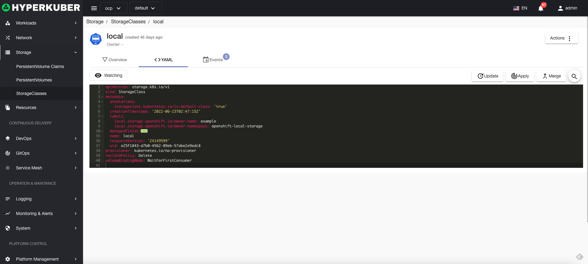

# storage class

Storage classes provide a way for administrators to describe the "classes" of storage they offer.

## Storage class operations

The following interface graphical operations are supported:

* Label
* Notes
* Yaml/Json editing

### Create
Create a storage class, click the "Create Storage Class" button, enter the Create Storage Class page, and fill in the necessary parameters

parameter
name: storage class name
Select the creator: specify the manufacturer to create
Storage class size: storage capacity size
Storage volume name: Specify the storage volume to create

### Yaml create
Storage classes can be created directly from Yaml files

### Storage class details
Click the link of the storage class name to enter the details page of the storage class
Overview information

Yaml information

event information

### delete
Select the storage class to be deleted, click the multi-select box to select, click the "Delete button", and enter "yes" in the confirmation input box to complete the deletion operation.
### refresh
Click "Refresh" to complete the refresh of the storage class list.