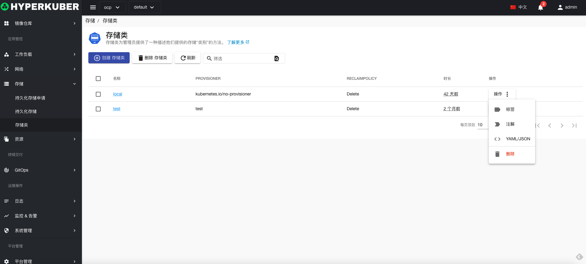
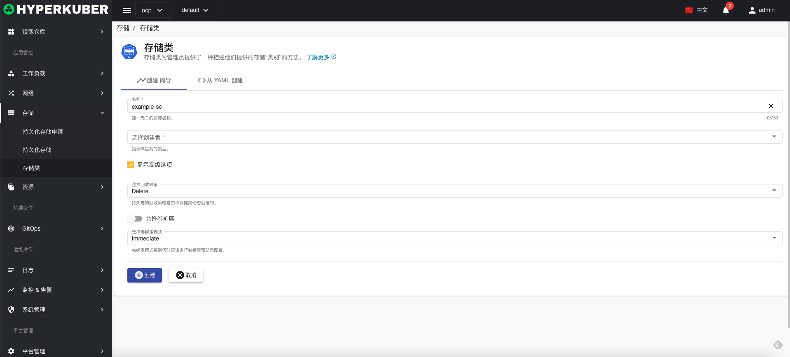
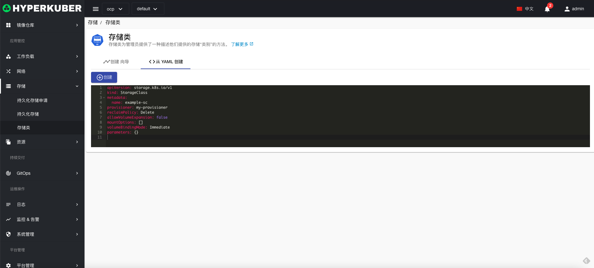
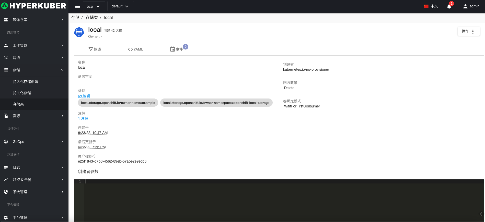
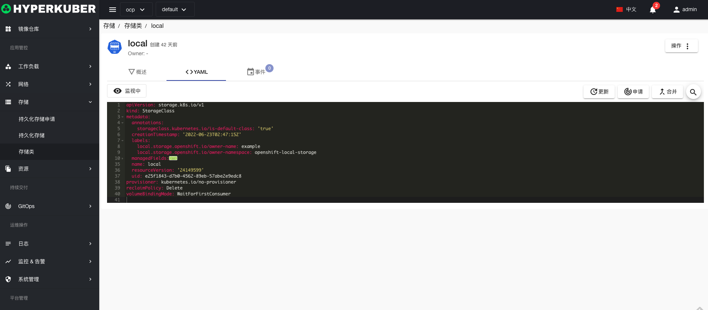
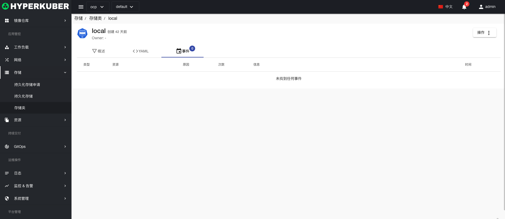

# 存储类

存储类为管理员提供了一种描述他们提供的存储“类别”的方法。

## 存储类操作

支持以下界面图形化操作：

* 标签
* 注解
* Yaml/Json编辑

### 创建
创建存储类，点击“创建存储类”按钮，进入创建存储类页面，填写必要参数

参数
名称：存储类名称
选择创建者：指定厂商创建
存储类大小：存储容量大小
存储卷名称：指定存储卷创建

### Yaml创建
存储类可通过Yaml文件直接创建

### 存储类详情
点击存储类名称的链接，即可进入存储类的详情页面
概览信息

Yaml信息

事件信息

### 删除
选择需要删除的存储类，点击多选框选择，点击“删除按钮”，在确定输入框输入“yes”，即可完成删除操作。
### 刷新
点击“刷新”，即可完成存储类列表的刷新。