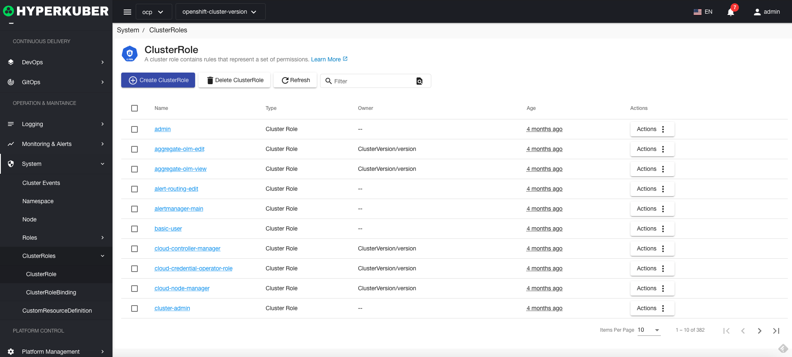
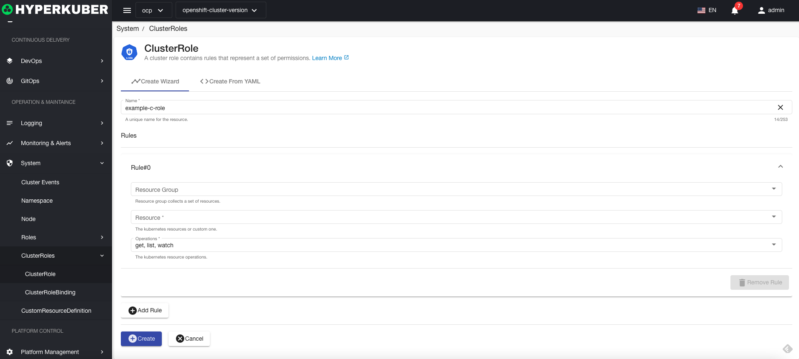
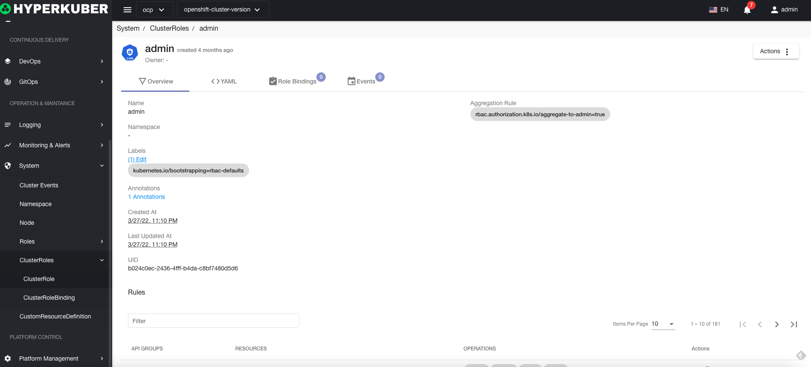

# cluster roles

Cluster roles contain rules that represent a set of permissions. The scope is across namespaces.

## Cluster role operations

The following interface graphical operations are supported:

* Label
* Notes
* Yaml/Json editing

### Create
Create a cluster role, click the "Create Cluster Role" button, enter the Create Cluster Role page, and fill in the necessary parameters

parameter
Name: Cluster role name
rule:
* resource
* Resource group
* Operation: list get create and other operations
### Cluster role details
Click the link of the cluster role name to enter the details page of the cluster role
Overview information

Yaml information

Cluster role binding information

event information

### delete
Select the cluster role to be deleted, click the multi-select box to select, click the "Delete button", and enter "yes" in the confirmation input box to complete the deletion operation.
### refresh
Click Refresh to complete the refresh of the cluster role list.