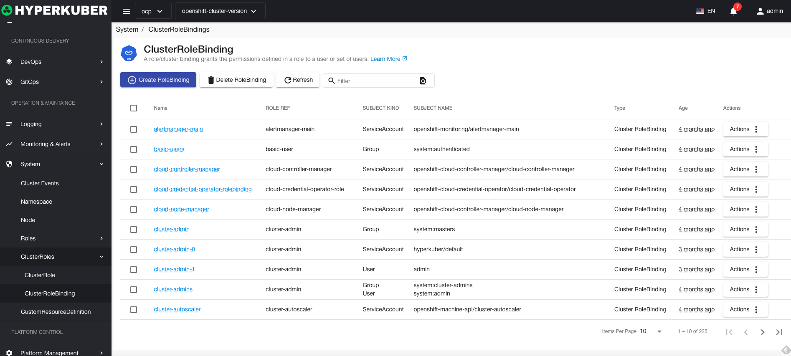
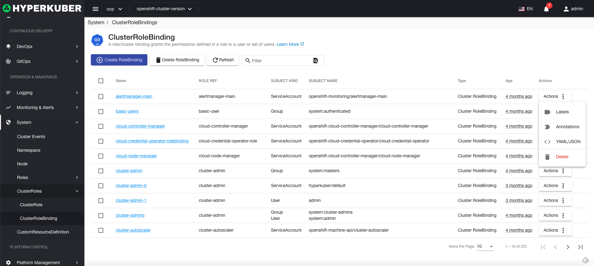
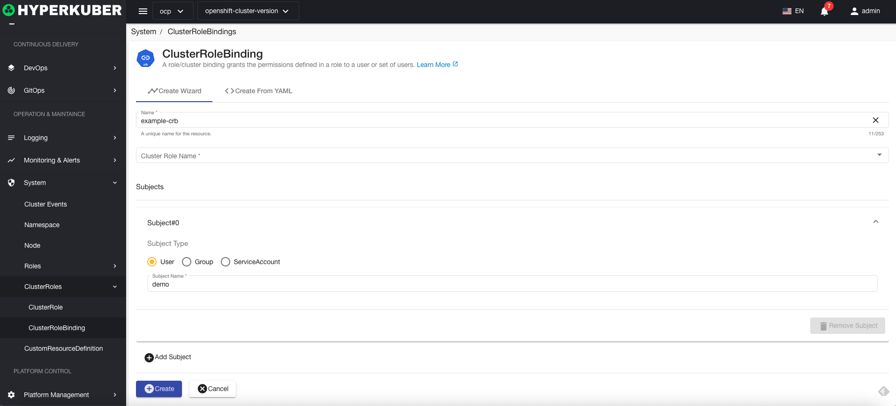
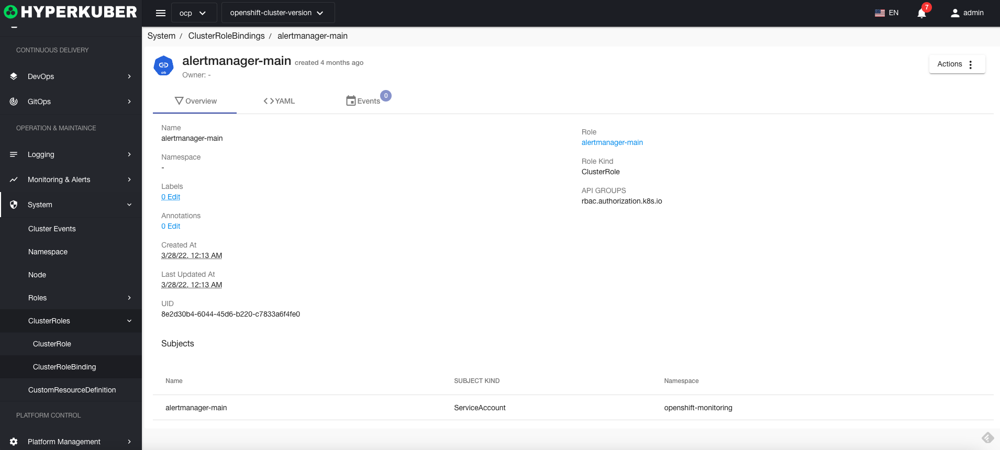
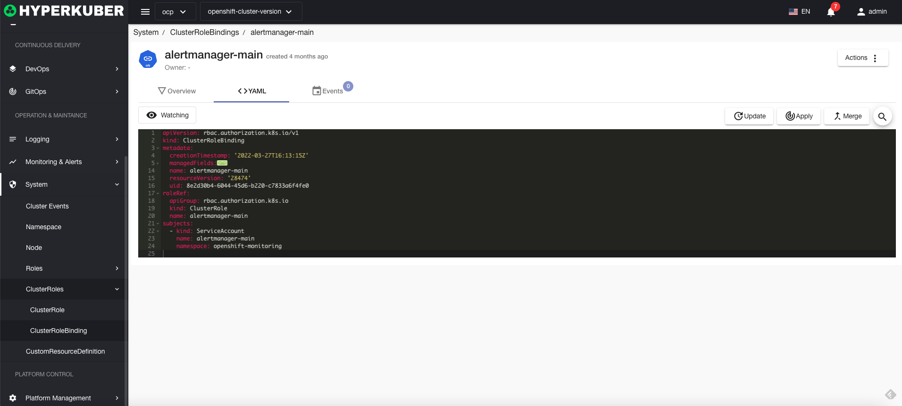
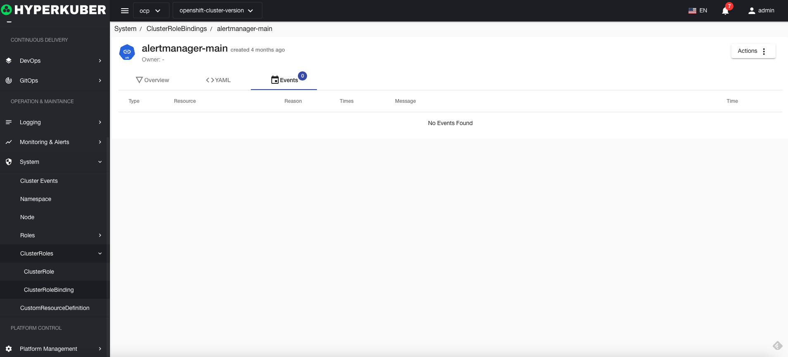

# Cluster role binding

Cluster role binding/cluster binding grants the permissions defined in the cluster role binding to a user or a group of users

## Cluster role binding operation

The following interface graphical operations are supported:

* Label
* Notes
* Yaml/Json editing

### Create
Create a cluster role binding, click the "Create Cluster Role Binding" button, enter the Create Cluster Role Binding page, and fill in the necessary parameters

parameter
name: Cluster role binding binding name
Cluster role binding name: The binding cluster role binding name
Cluster role binding binding topic:
* user
* Group
* Service Account
### Cluster role binding details
Click the link of the cluster role binding name to enter the details page of the cluster role binding
Overview information

Yaml information

event information

### delete
Select the cluster role binding to be deleted, click the multi-select box to select, click the "Delete button", and enter "yes" in the confirmation input box to complete the deletion operation.
### refresh
Click Refresh to complete the refresh of the cluster role binding list.