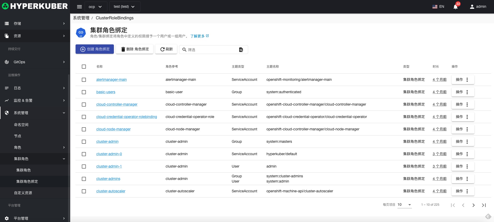
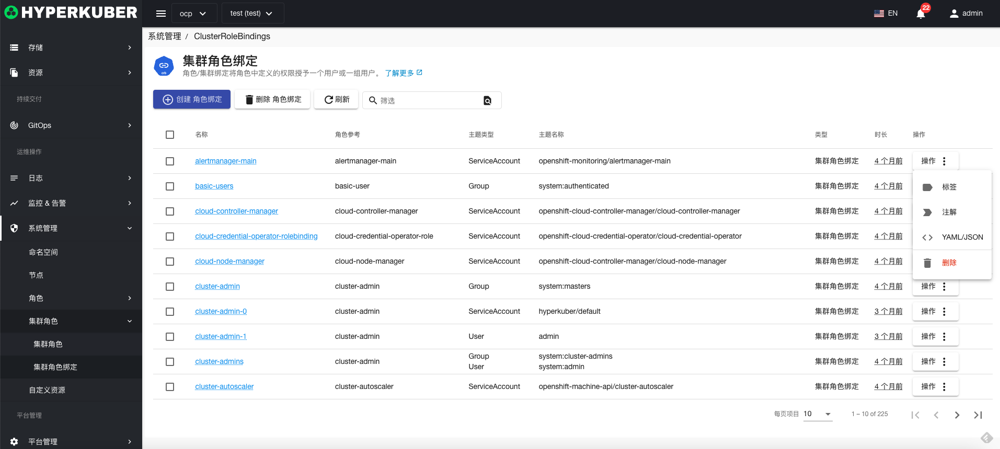
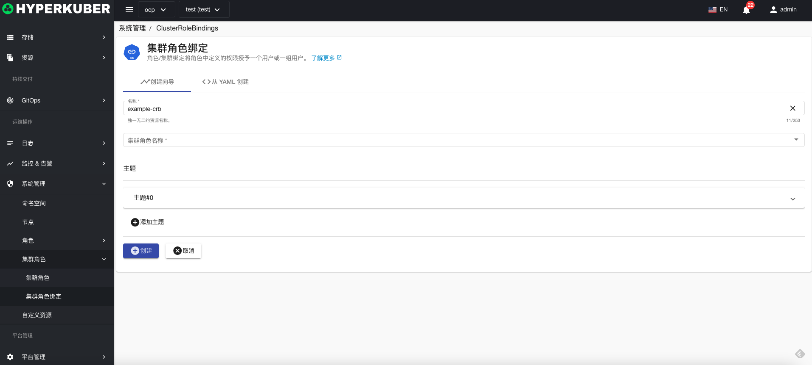
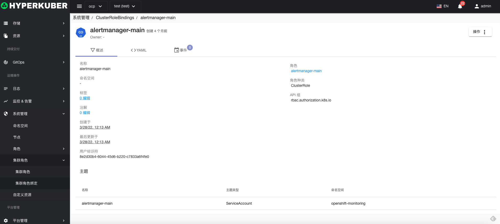
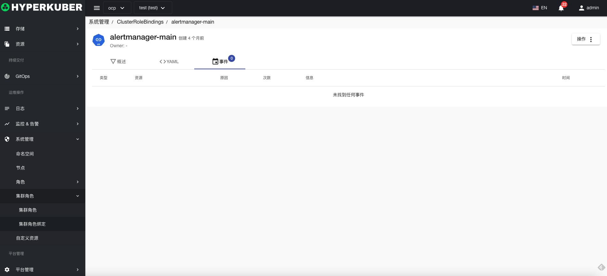

# 集群角色绑定

集群角色绑定/集群绑定将集群角色绑定中定义的权限授予一个用户或一组用户

## 集群角色绑定操作

支持以下界面图形化操作：

* 标签
* 注解
* Yaml/Json编辑

### 创建
创建集群角色绑定，点击“创建集群角色绑定”按钮，进入创建集群角色绑定页面，填写必要参数

参数
名称：集群角色绑定绑定名称
集群角色绑定名称：绑定的集群角色绑定名称
集群角色绑定绑定主题：
* 用户
* 组
* 服务账户
### 集群角色绑定详情
点击集群角色绑定名称的链接，即可进入集群角色绑定的详情页面
概览信息

Yaml信息

事件信息

### 删除
选择需要删除的集群角色绑定，点击多选框选择，点击“删除按钮”，在确定输入框输入“yes”，即可完成删除操作。
### 刷新
点击“刷新”，即可完成集群角色绑定列表的刷新。