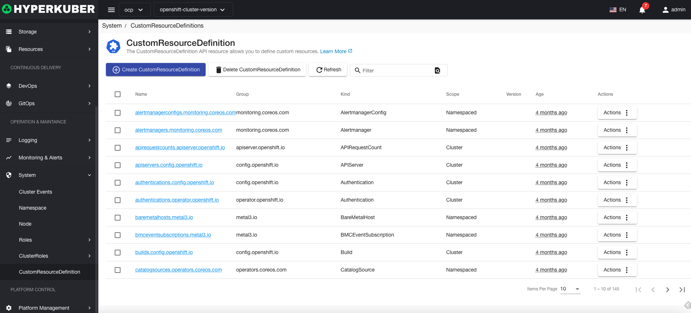
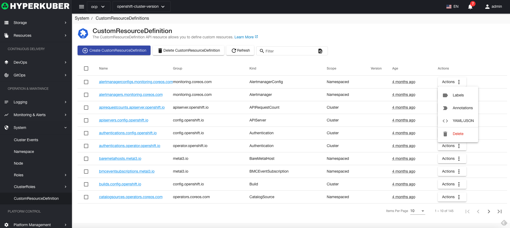

# custom resource

Custom Resource API allows you to define custom resources

## custom resource operations

The following interface graphical operations are supported:

* Label
* Notes
* Yaml/Json editing

### Create
Create a custom resource, click the "Create custom resource" button, enter the create custom resource page, fill in the necessary parameters

parameter
name: custom resource name
rule:
* resource
* Resource group
* Operation: list get create and other operations
### Custom resource details
Click the link of the custom resource name to enter the details page of the custom resource
Overview information

custom resource information

event information

### delete
Select the custom resource to be deleted, click the multi-select box to select, click the "Delete button", and enter "yes" in the confirmation input box to complete the deletion operation.
### refresh
Click "Refresh" to complete the refresh of the custom resource list.