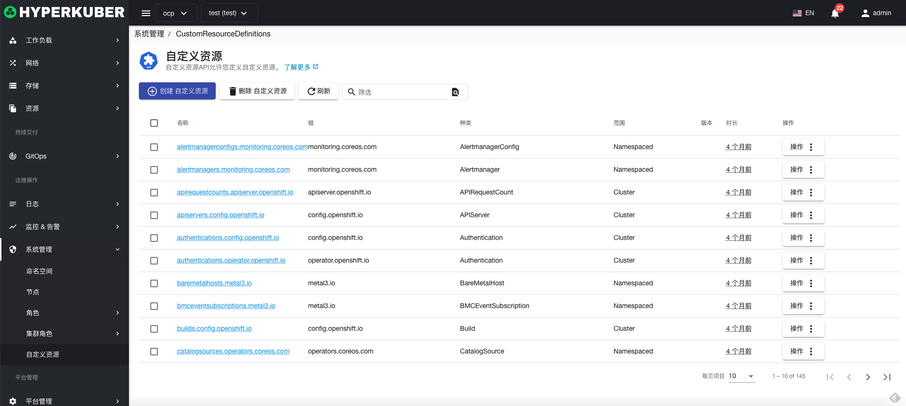

# 自定义资源

自定义资源API允许您定义自定义资源

## 自定义资源操作

支持以下界面图形化操作：

* 标签
* 注解
* Yaml/Json编辑

### 创建
创建自定义资源，点击“创建自定义资源”按钮，进入创建自定义资源页面，填写必要参数

参数
名称：自定义资源名称
规则：
* 资源
* 资源组
* 操作： list get create等操作
### 自定义资源详情
点击自定义资源名称的链接，即可进入自定义资源的详情页面
概览信息

自定义资源信息

事件信息

### 删除
选择需要删除的自定义资源，点击多选框选择，点击“删除按钮”，在确定输入框输入“yes”，即可完成删除操作。
### 刷新
点击“刷新”，即可完成自定义资源列表的刷新。