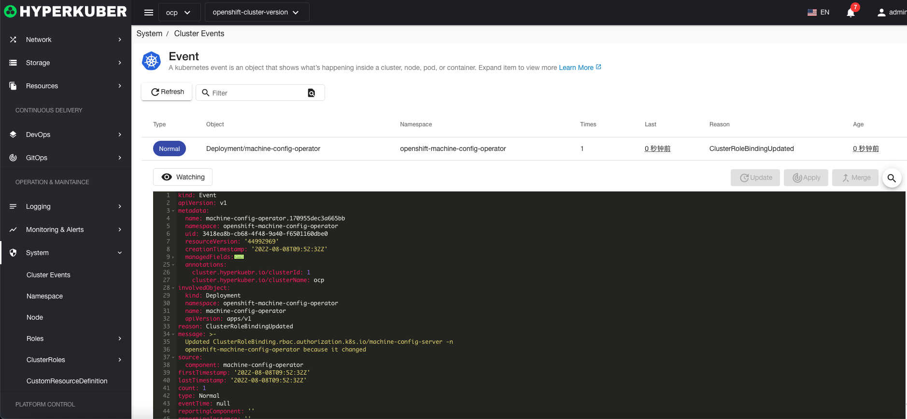

# event

The life cycle of cluster resources can be displayed in the cluster event, providing a data source for the objectivity of services.

## event action

### search
event supports metadata.name keyword for search
### Event Details
Click the link of the event name to display the event details

### refresh
Click "Refresh" to complete the refresh of the event list.