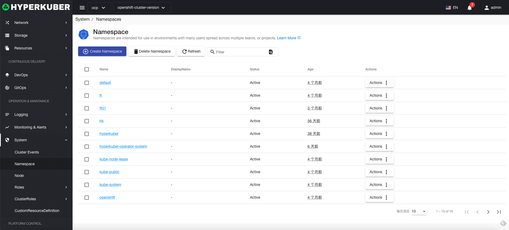
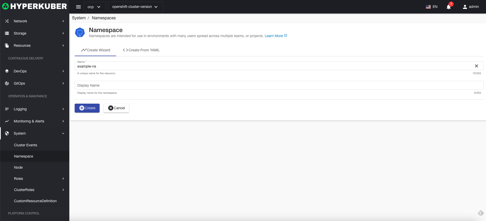
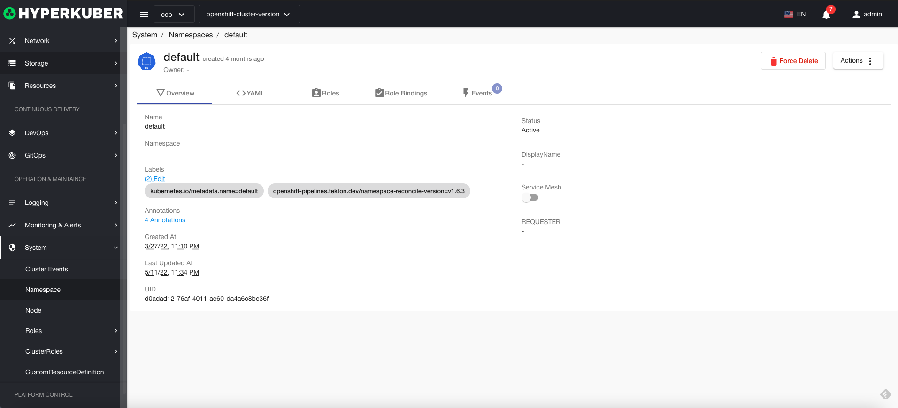
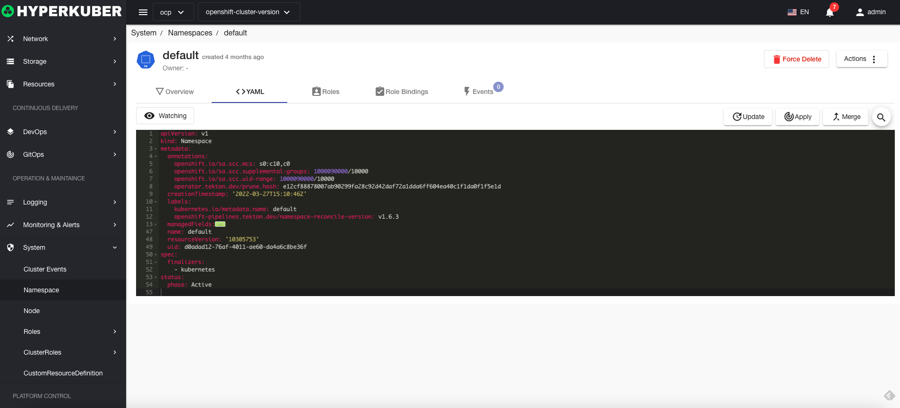
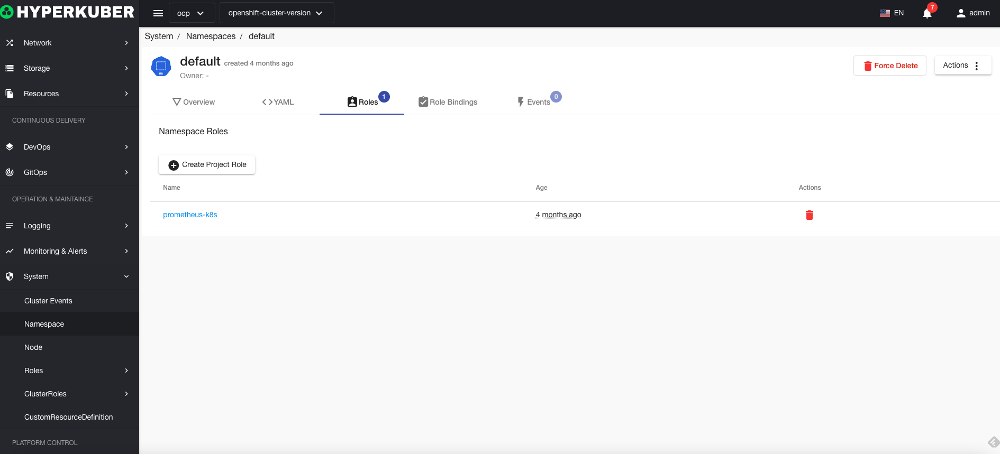
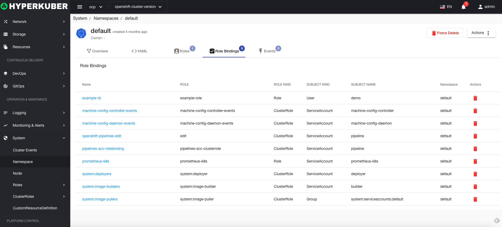
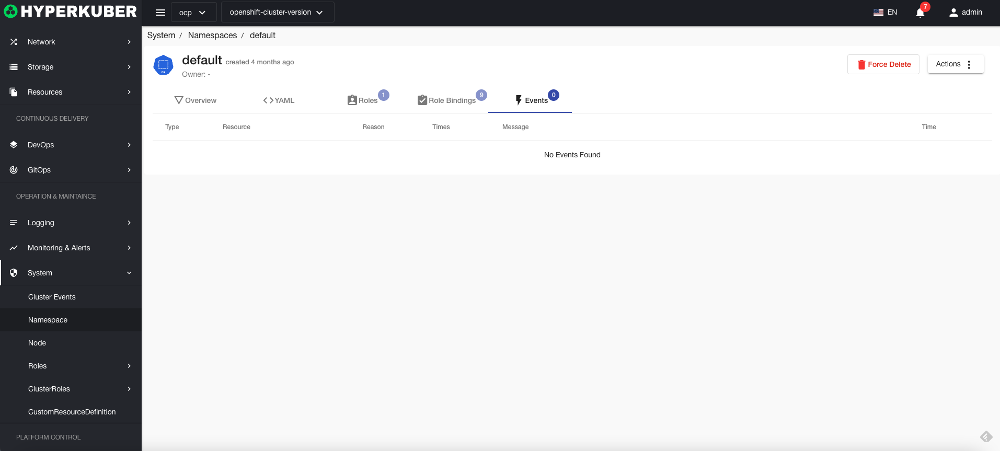

# Namespaces

## Namespaces
Namespaces are intended for use in environments where many users are spread across multiple teams or namespaces

## namespace operations

### Create
Click the "Create Namespace" button to enter the Create Namespace page, fill in the necessary parameters, and save.

Parameter Description:
Name: Unique identifier in the cluster
Display Name: The display name of the namespace

### Details
Click the "Namespace" name link to enter the namespace details page.

Namespace Yaml display

Namespace Role role information

Namespace RoleBinding role binding information

Namespace event information

### delete
Select the namespace to be deleted, click the multi-select box to select, click the "Delete" button, and enter "yes" in the confirmation input box to complete the deletion operation. There may be uncleaned resources in the namespace, and deletion may occur. fail. If you need to force delete, please click the "Force Delete" button.
### Force delete
Select the namespace to be deleted, click the multi-select box to select, click the "Delete" button, and enter "yes" in the confirmation input box to complete the forced deletion operation.
### refresh
Click "Refresh" to complete the refresh of the namespace list.