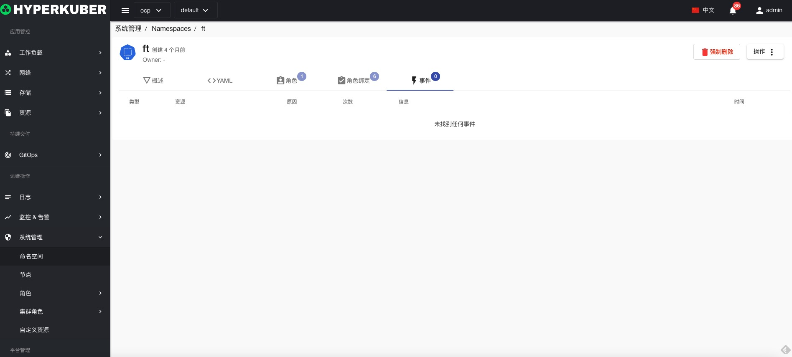

# 命名空间

## 命名空间
命名空间旨在用于许多用户分布在多个团队或命名空间中的环境

## 命名空间操作

### 创建
点击“创建命名空间”按钮，进入创建命名空间页面，填写必要参数，保存。

参数说明：
名称：集群中唯一标识
显示名称： 命名空间的显示名称

### 详情
点击“命名空间”名称链接，进入命名空间详情页面。

命名空间Yaml显示

命名空间Role角色信息

命名空间RoleBinding角色绑定信息

命名空间事件信息

### 删除
选择需要删除的命名空间，点击多选框选择，点击“删除”按钮，在确定输入框输入“yes”，即可完成删除操作，命名空间中可能还存在未被清理的资源，可能会出现删除失败。如果需要强制删除，请点击“强制删除”按钮。
### 强制删除
选择需要删除的命名空间，点击多选框选择，点击“删除”按钮，在确定输入框输入“yes”，即可完成强制删除操作。
### 刷新
点击“刷新”，即可完成命名空间列表的刷新。