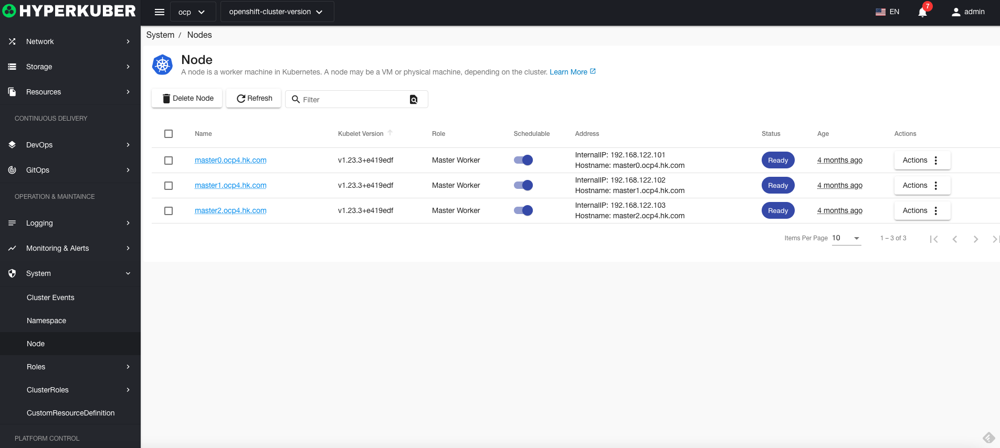
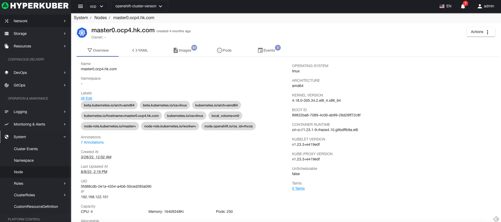
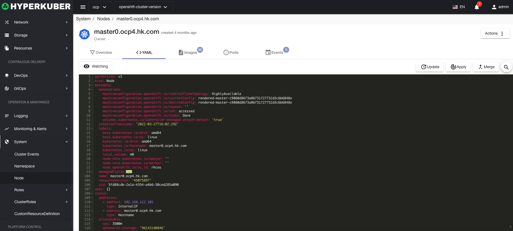
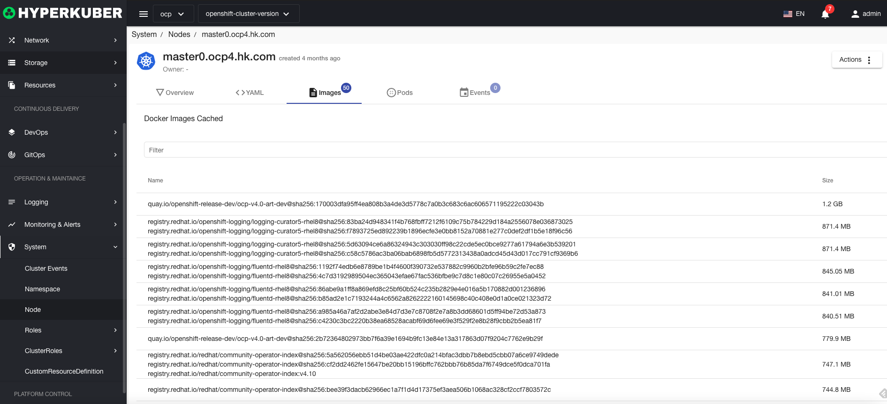
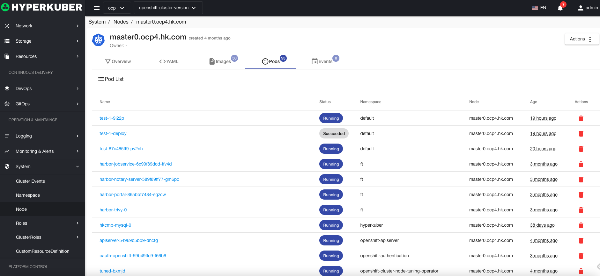
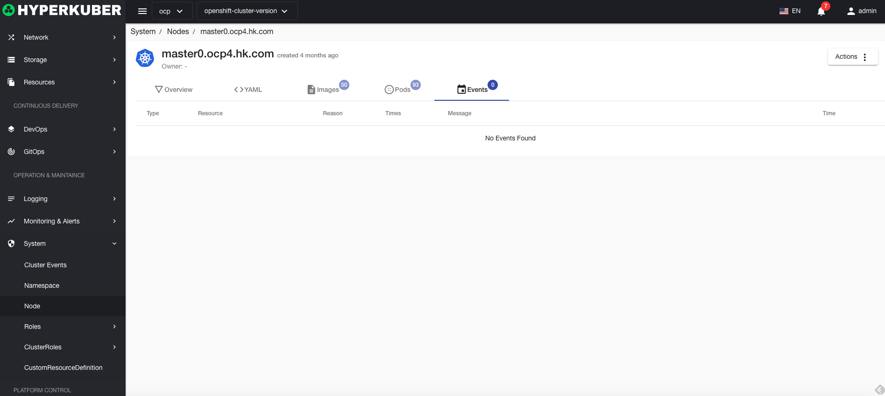

# node

## node
Nodes are worker machines in Kubernetes. Nodes may be virtual machines or physical machines.

## Node operations

### Node details
Node overview information

Yaml information of the node

Mirror information of the node

Pod information running on the node

Node's event information

### Terminal
Use cloudshell to connect to nodes remotely. For cloudshell images, see Platform Management - Global Configuration
### Stain

Add the taint information of the changed node

### Eviction

Evict Pods running on this node

### delete
Select the node to be deleted, click the multi-select box to select, click the "Delete" button, and enter "yes" in the confirmation input box to complete the deletion operation.
### refresh
Click "Refresh" to complete the refresh of the node list.