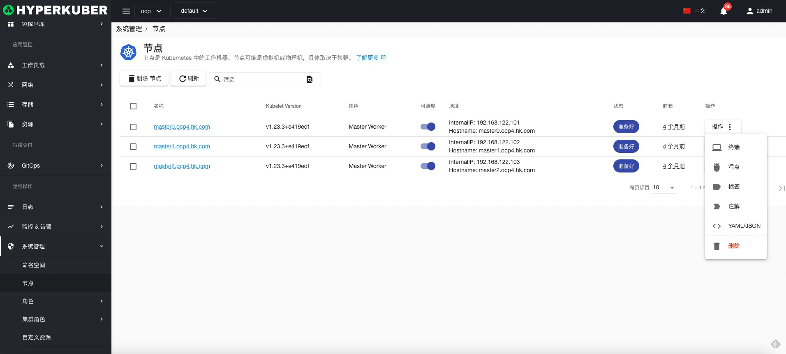
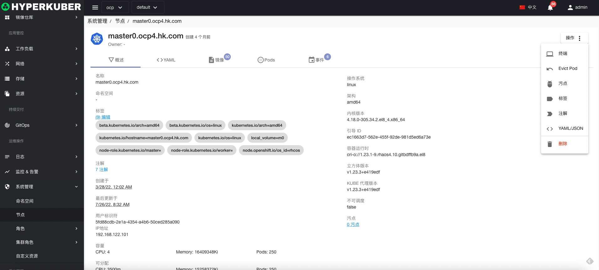
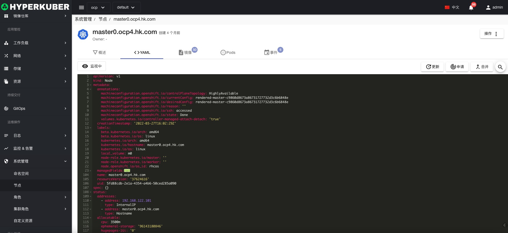
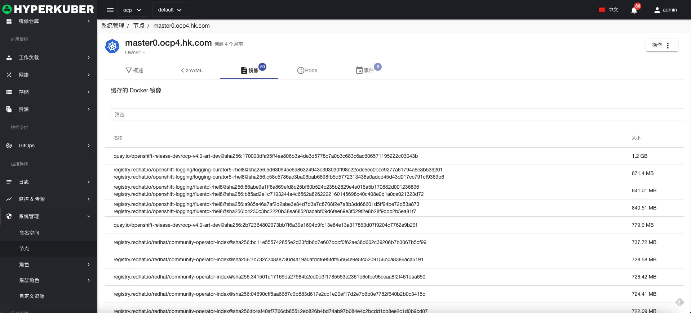
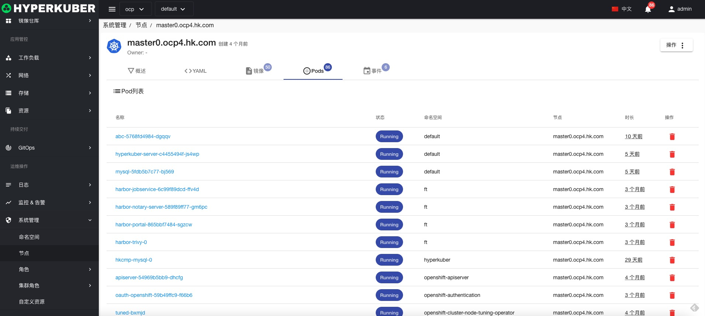
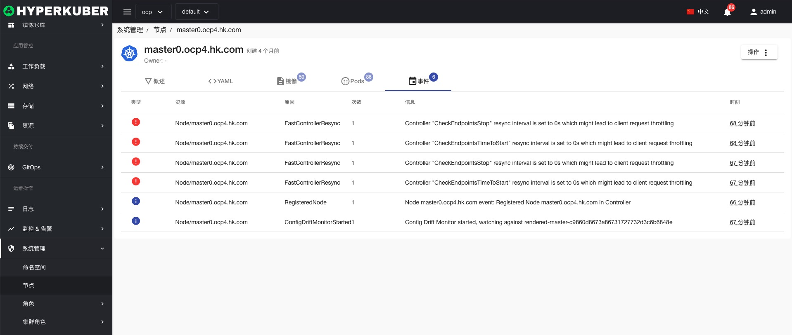
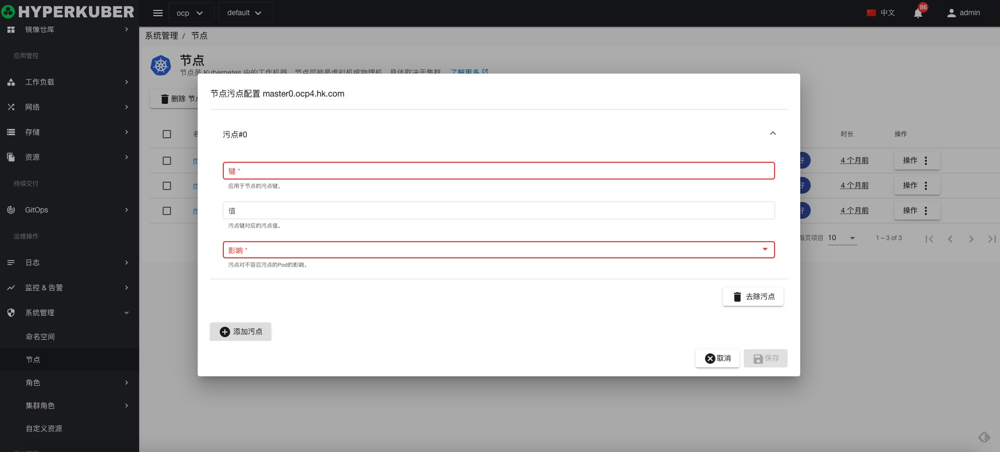
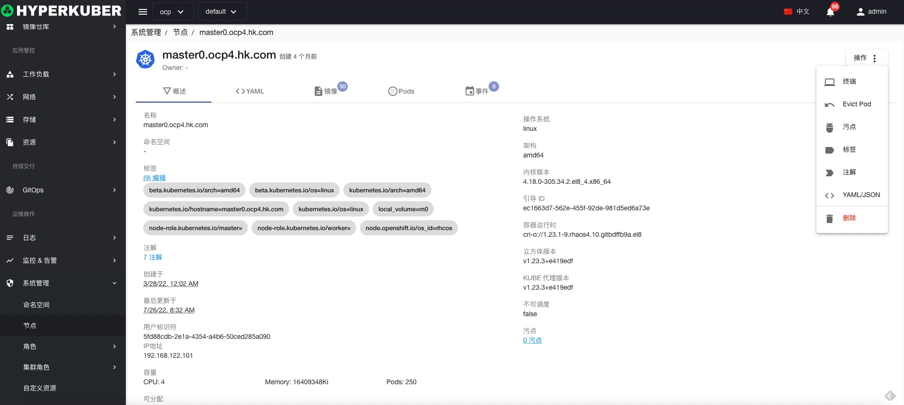

# 节点

## 节点
节点是 Kubernetes 中的工作机器。节点可能是虚拟机或物理机。

## 节点操作

### 节点详情
节点的概览信息

节点的Yaml信息

节点的镜像信息

节点上运行Pod信息

节点的事件信息

### 终端
使用cloudshell远程连接节点，cloudshell镜像请查看 平台管理-全局配置
### 污点

增加改节点的污点信息

### 驱逐

驱逐该节点上运行的Pod

### 删除
选择需要删除的节点，点击多选框选择，点击“删除”按钮，在确定输入框输入“yes”，即可完成删除操作。
### 刷新
点击“刷新”，即可完成节点列表的刷新。