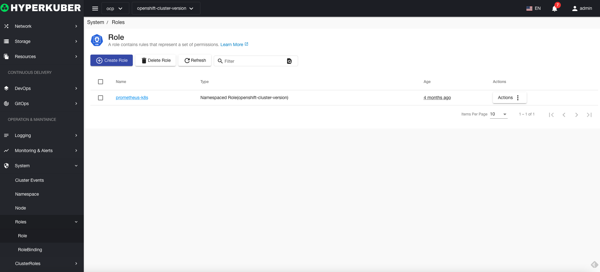
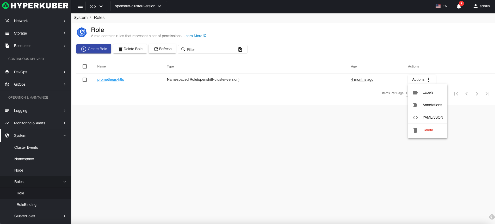
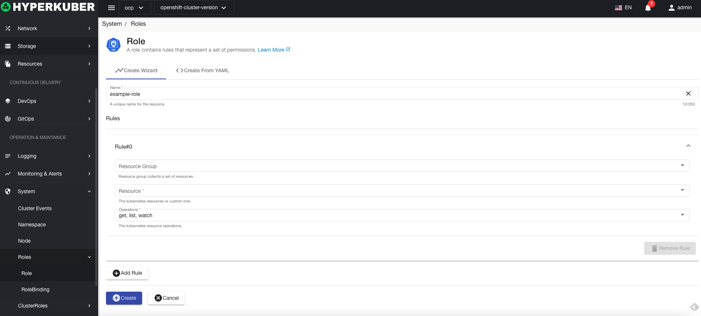
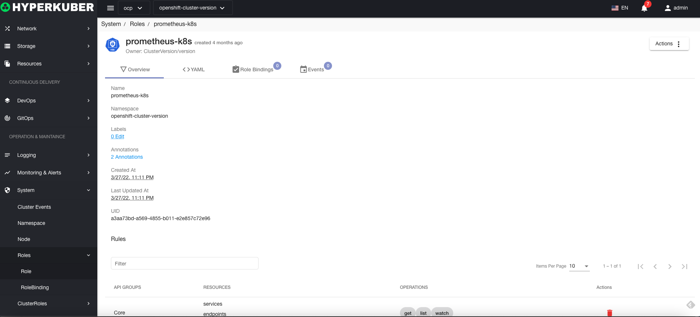
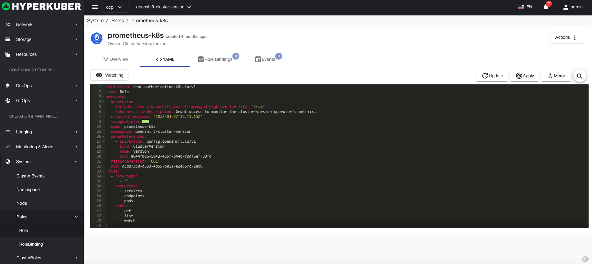
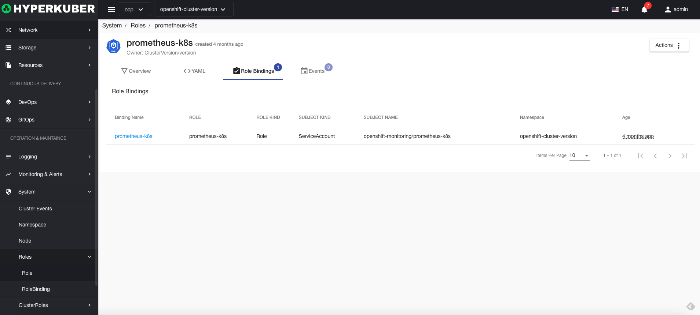
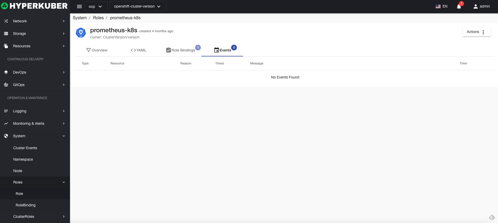

=# role

A role contains rules that represent a set of permissions.

## role operations

The following interface graphical operations are supported:

* Label
* Notes
* Yaml/Json editing

### Create
Create a role, click the "Create Role" button, enter the role creation page, and fill in the necessary parameters

parameter
name: role name
rule:
* resource
* Resource group
* Operation: list get create and other operations
### Character Details
Click the link of the role name to enter the role details page
Overview information

Yaml information

Character binding information

event information

### delete
Select the role to be deleted, click the multi-select box to select, click the "Delete button", and enter "yes" in the confirmation input box to complete the deletion operation.
### refresh
Click "Refresh" to refresh the role list.