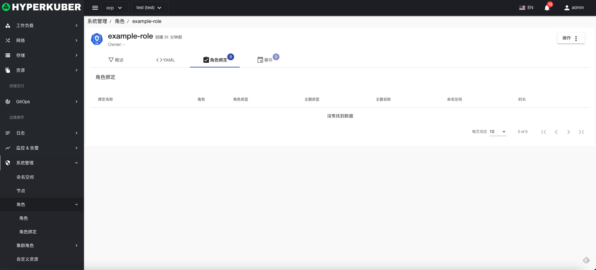

# 角色

角色包含表示一组权限的规则。

## 角色操作

支持以下界面图形化操作：

* 标签
* 注解
* Yaml/Json编辑

### 创建
创建角色，点击“创建角色”按钮，进入创建角色页面，填写必要参数

参数
名称：角色名称
规则：
* 资源
* 资源组
* 操作： list get create等操作
### 角色详情
点击角色名称的链接，即可进入角色的详情页面
概览信息

Yaml信息

角色绑定信息

事件信息

### 删除
选择需要删除的角色，点击多选框选择，点击“删除按钮”，在确定输入框输入“yes”，即可完成删除操作。
### 刷新
点击“刷新”，即可完成角色列表的刷新。

