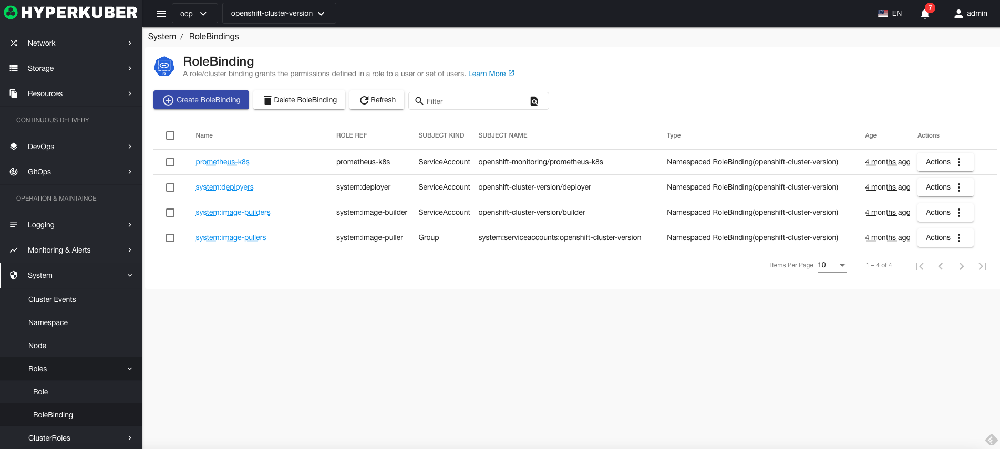
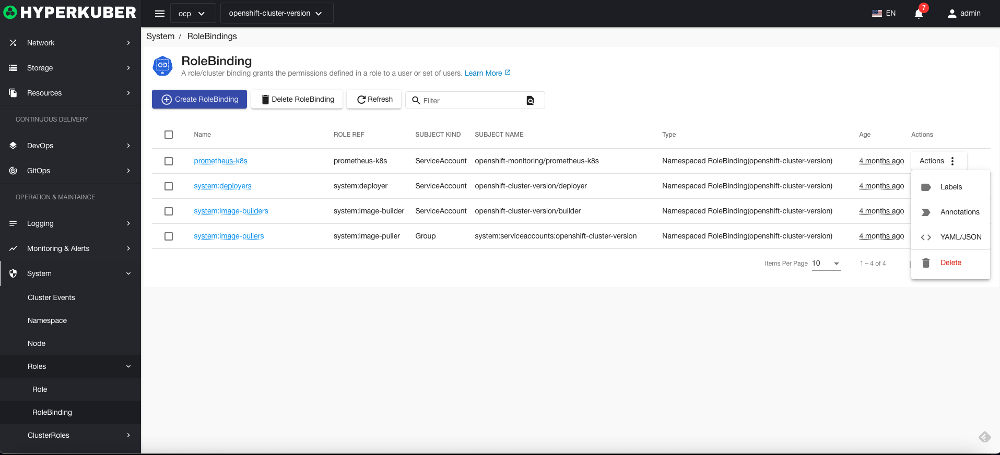
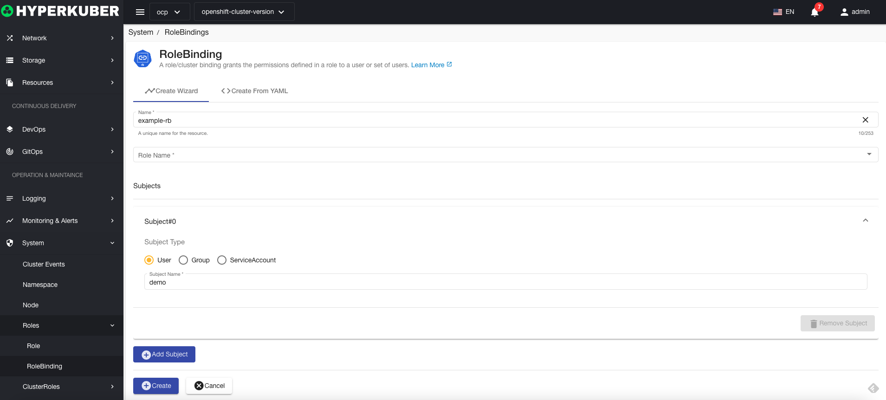
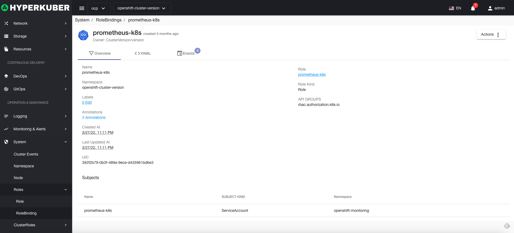
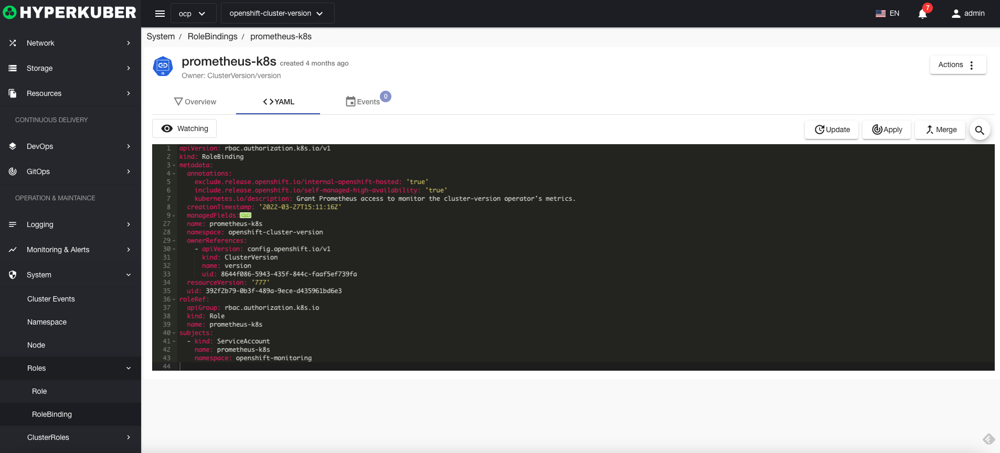
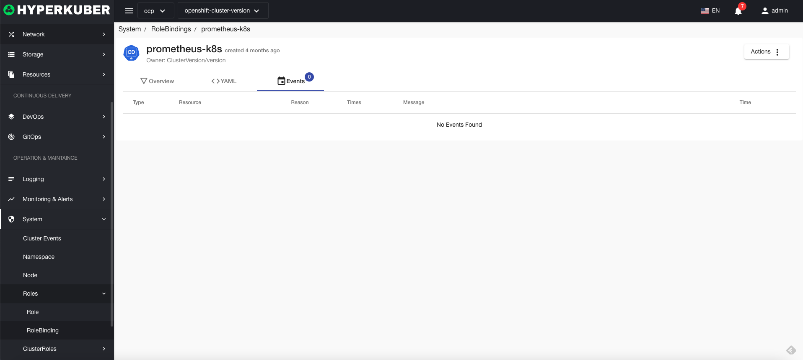

# Character binding

A role binding/cluster binding grants the permissions defined in the role binding to a user or a group of users

## role binding operation

The following interface graphical operations are supported:

* Label
* Notes
* Yaml/Json editing

### Create
Create a role binding, click the "Create Role Binding" button, enter the Create Role Binding page, and fill in the necessary parameters

parameter
name: role binding binding name
role binding name: the bound role binding name
Character binding binding theme:
* user
* Group
* Service Account
### Character binding details
Click the link of the role binding name to enter the role binding details page
Overview information

Yaml information

event information

### delete
Select the role binding to be deleted, click the multi-select box to select, click the "Delete button", and enter "yes" in the confirmation input box to complete the deletion operation.
### refresh
Click "Refresh" to refresh the character binding list.