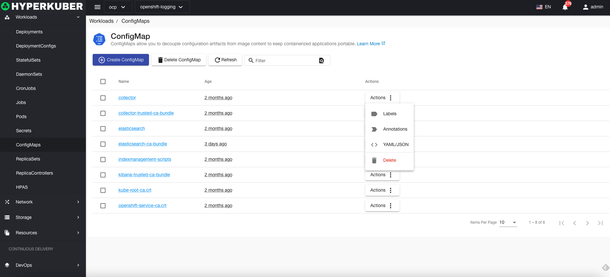
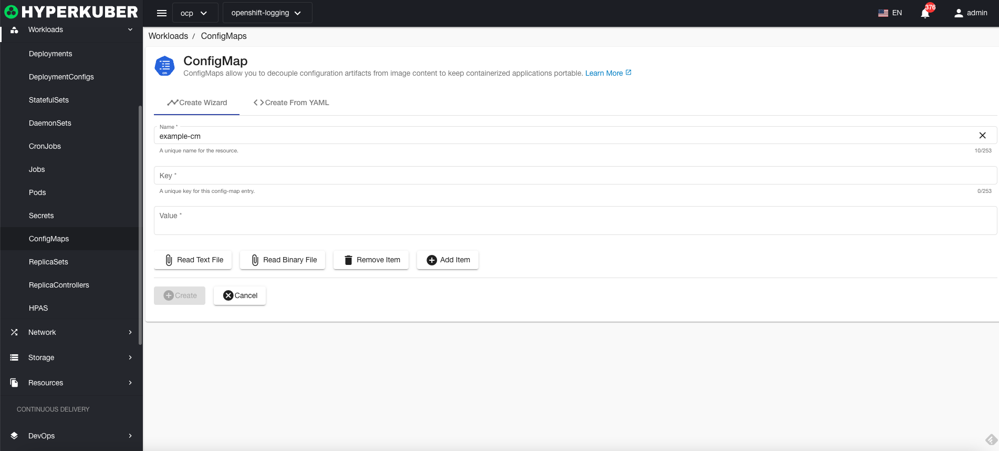
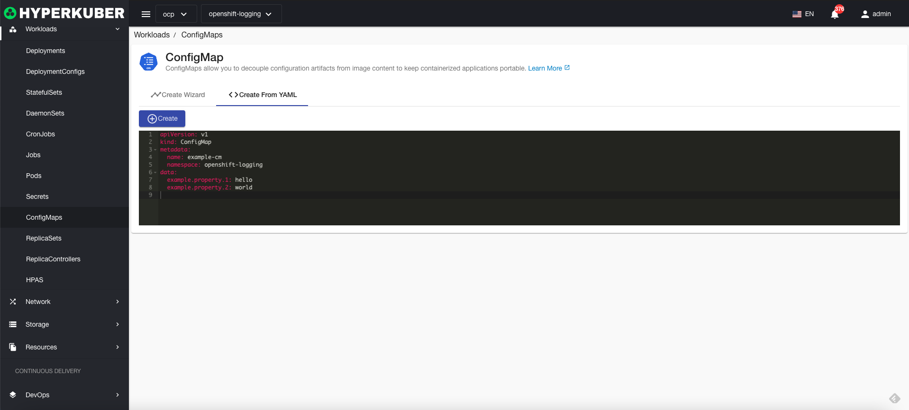
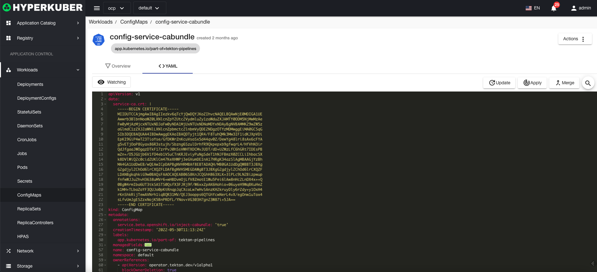

# configure mapping

Configuration maps allow you to separate configuration artifacts from image content to keep containerized applications portable

## Configure mapping operations

The following interface graphical operations are supported:

* Label
* Notes
* Yaml/Json editing

### Create
Create a configuration mapping, click the "Create Configuration Mapping" button, enter the Create Configuration Mapping page, and fill in the necessary parameters

parameter
name: Configuration map name
key: the key in the configuration map
Value: Value in the configuration map

### Yaml create
Configuration maps can be created directly from Yaml files

### Configuration mapping details
Click the link to configure the mapping name to enter the configuration mapping details page
Overview information

Yaml information

### delete
Select the configuration mapping to be deleted, click the multi-select box to select, click the "Delete button", and enter "yes" in the confirmation input box to complete the deletion operation.
### refresh
Click "Refresh" to complete the refresh of the configuration mapping list.