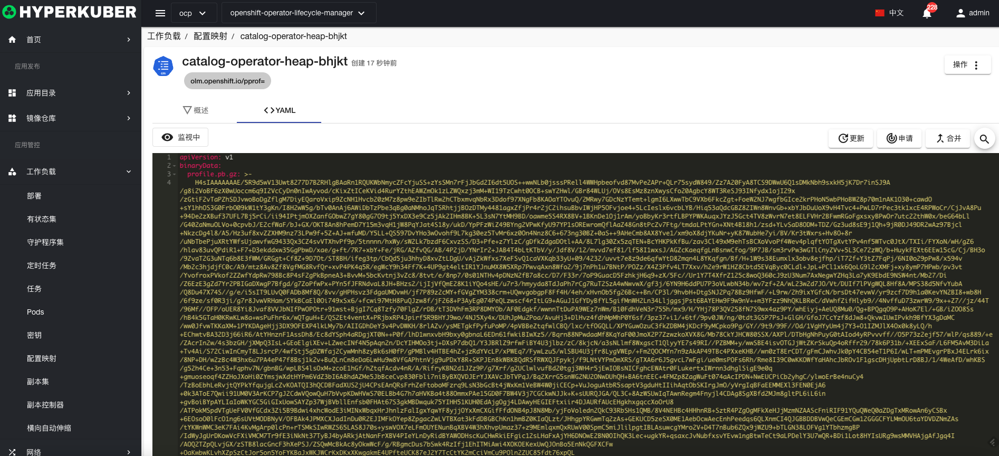

# 配置映射

配置映射允许您将配置工件与图像内容分离，以保持容器化应用程序的可移植性

## 配置映射操作

支持以下界面图形化操作：

* 标签
* 注解
* Yaml/Json编辑

### 创建
创建配置映射，点击“创建配置映射”按钮，进入创建配置映射页面，填写必要参数

参数
名称：配置映射名称
键：配置映射中的Key
值：配置映射中的Value

### Yaml创建
配置映射可通过Yaml文件直接创建

### 配置映射详情
点击配置映射名称的链接，即可进入配置映射的详情页面
概览信息

Yaml信息

### 删除
选择需要删除的配置映射，点击多选框选择，点击“删除按钮”，在确定输入框输入“yes”，即可完成删除操作。
### 刷新
点击“刷新”，即可完成配置映射列表的刷新。

