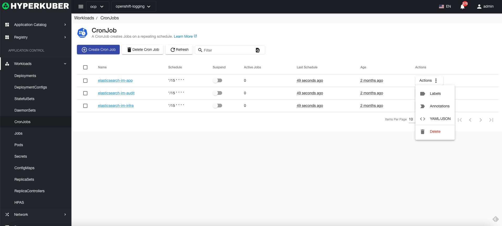
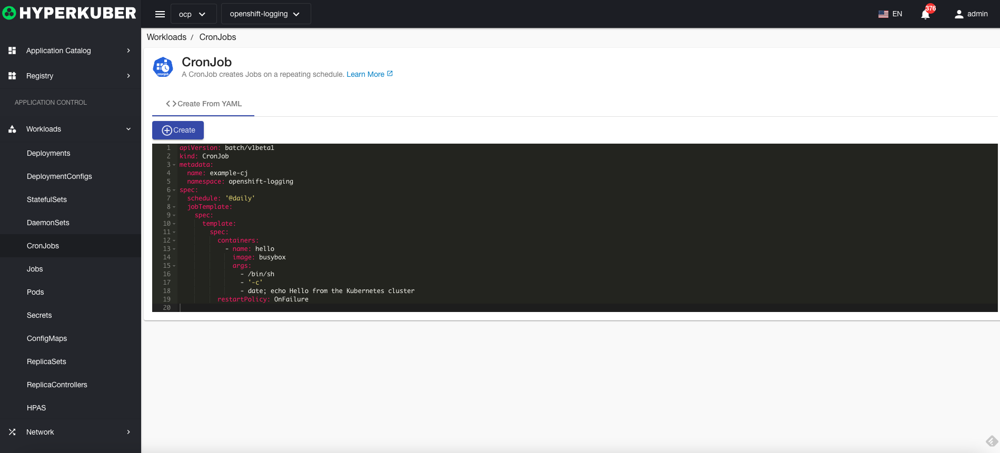
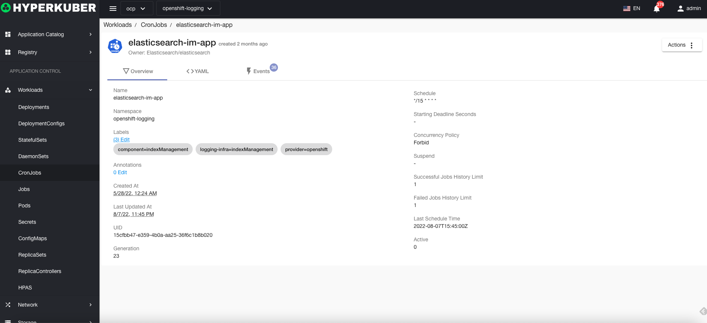
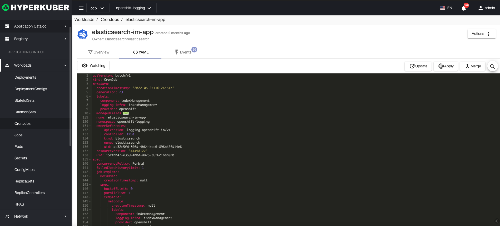
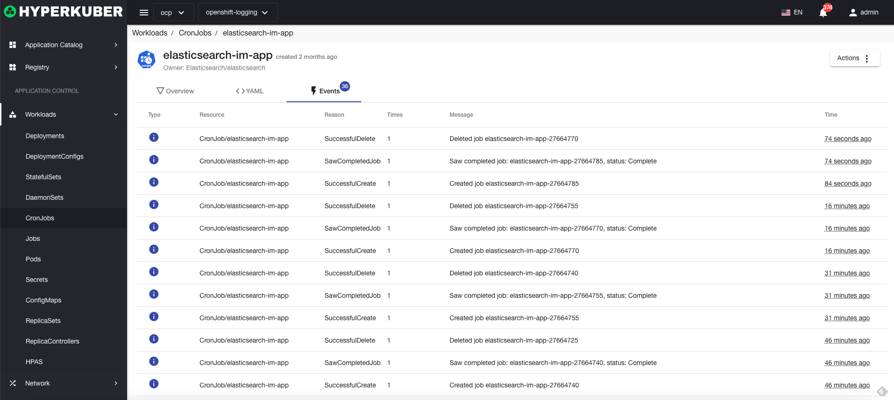

# Scheduled tasks

CronJob cron task creates jobs on a recurring schedule.

## Scheduled task operation

The following interface graphical operations are supported:

* Label
* Notes
* Yaml/Json editing

### Yaml create
Scheduled tasks can be created directly through Yaml files

### Scheduled task details
Click the link of the timed task name to enter the details page of the timed task
Overview information

Yaml information

event information

### delete
Select the scheduled task to be deleted, click the multi-select box to select, click the "Delete button", and enter "yes" in the confirmation input box to complete the deletion operation.
### refresh
Click "Refresh" to complete the refresh of the scheduled task list.