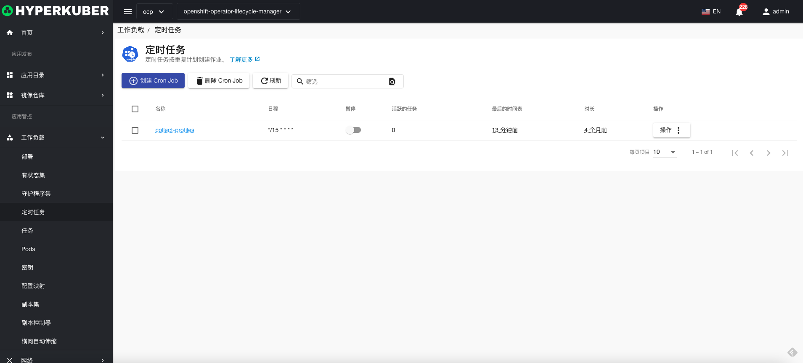
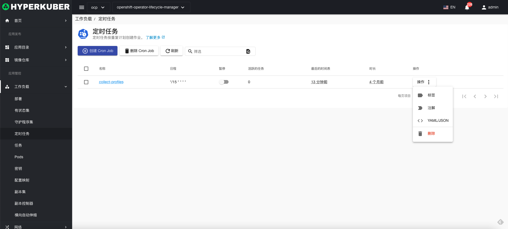
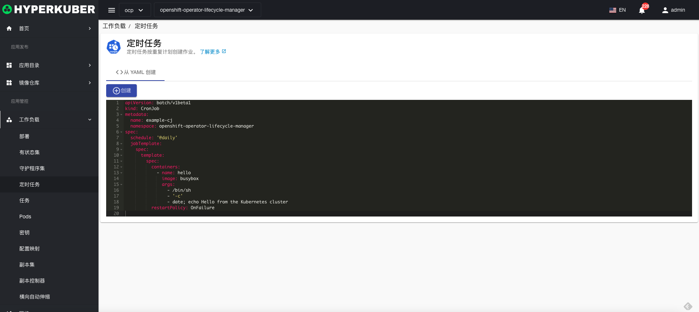
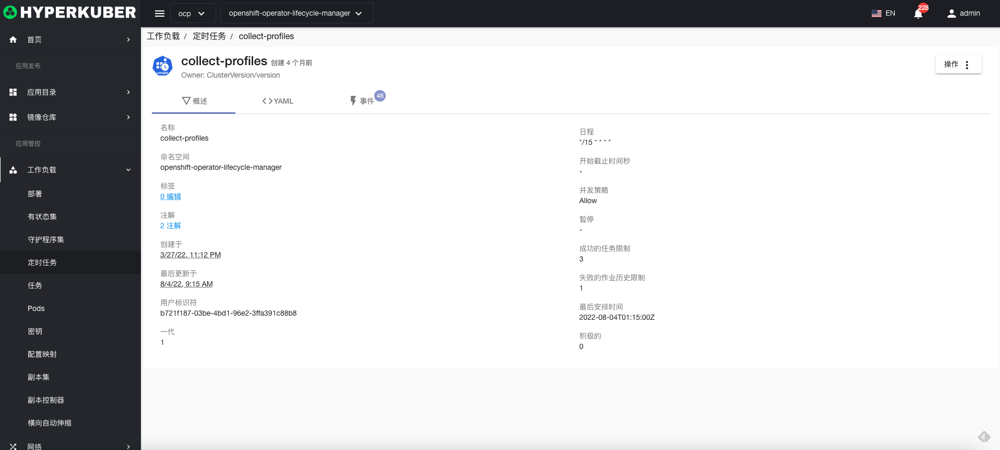
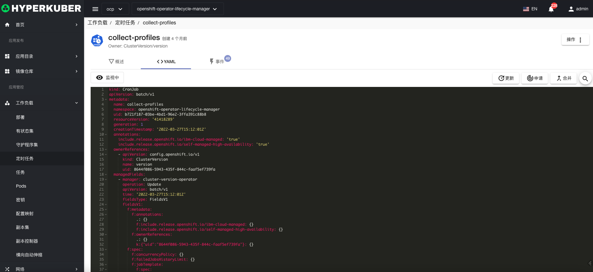
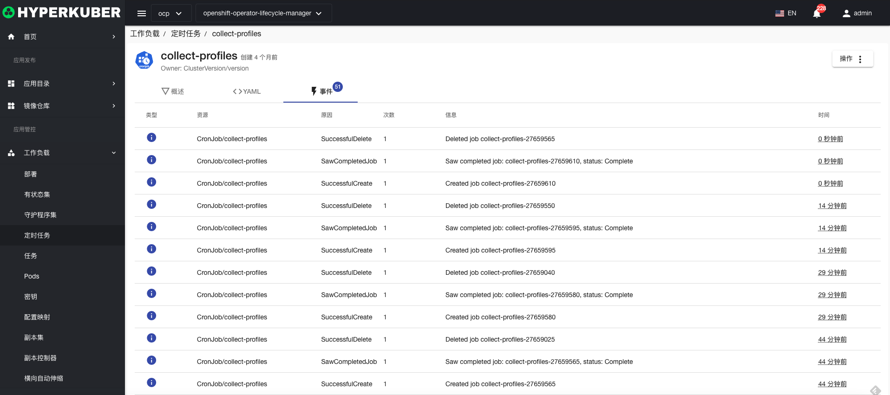

# 定时任务

CronJob定时任务按重复计划创建作业.

## 定时任务操作

支持以下界面图形化操作：

* 标签
* 注解
* Yaml/Json编辑

### Yaml创建
定时任务可通过Yaml文件直接创建

### 定时任务详情
点击定时任务名称的链接，即可进入定时任务的详情页面
概览信息

Yaml信息

事件信息

### 删除
选择需要删除的定时任务，点击多选框选择，点击“删除按钮”，在确定输入框输入“yes”，即可完成删除操作。
### 刷新
点击“刷新”，即可完成定时任务列表的刷新。

