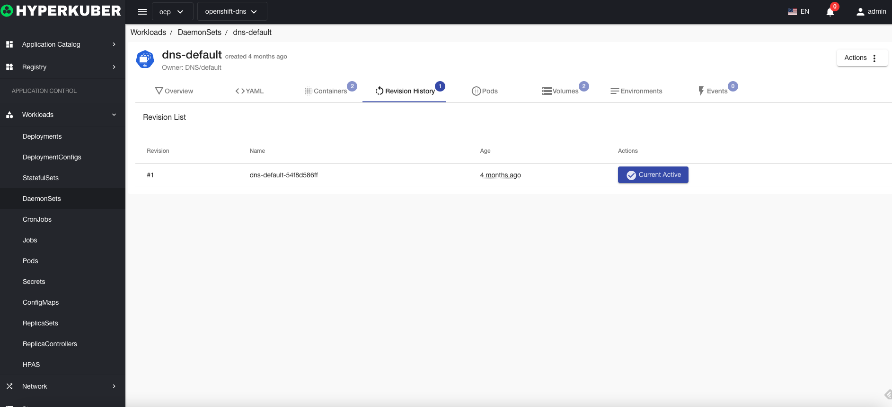

# daemon set

DaemonSet (daemon process set) is similar to the daemon process, it deploys a Pod on each node that meets the matching conditions

## Daemon set operations

The following interface graphical operations are supported:
* Service public
* rollback
* Image upgrade
* reboot
* other configuration
* pod network
* Affinity
* Tolerate
* Strategy
* Safety
* Label
* Notes
* Yaml/Json editing

### Create
Create a daemon process set, click the "Create daemon process set" button, enter the create daemon process set page, and fill in the necessary parameters

parameter
name: daemon set name

parameter
image name: daemon set image name
Mirror address: daemon set mirror warehouse address
exposed port: daemon set service exposed port

Optional parameters:
Pod Security
Pod network
other
Click "Create" to do so.

### Yaml create
Daemon sets can be created directly from Yaml files

### Daemon set details
Click the link of the daemon set name to enter the details page of the daemon set
Overview information

Yaml information

container information

Revision log information

Pod information

Storage volume information

Environmental information

event information

### delete
Select the daemon process set to be deleted, click the multi-select box to select, click the "Delete button", and enter "yes" in the confirmation input box to complete the deletion operation.
### refresh
Click "Refresh" to complete the refresh of the daemon set list.