# 守护进程集

DaemonSet（守护进程集）和守护进程类似，它在符合匹配条件的节点上均部署一个Pod
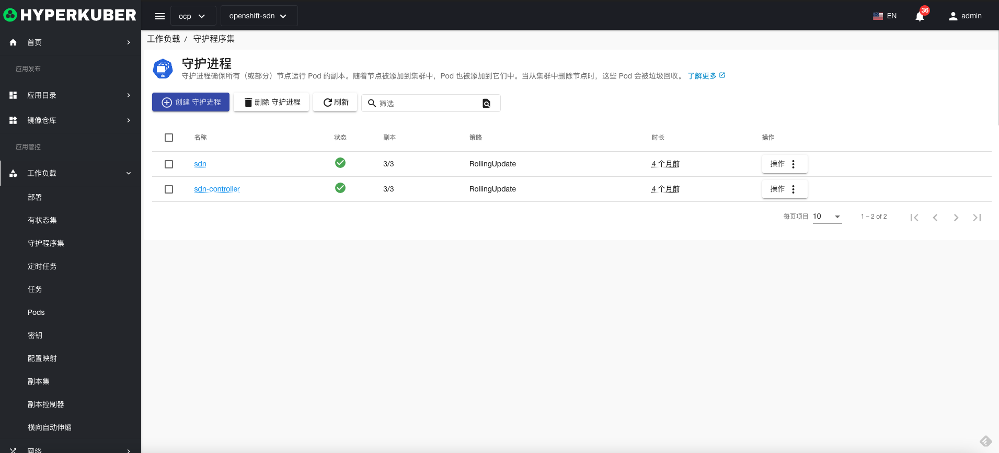
## 守护进程集操作

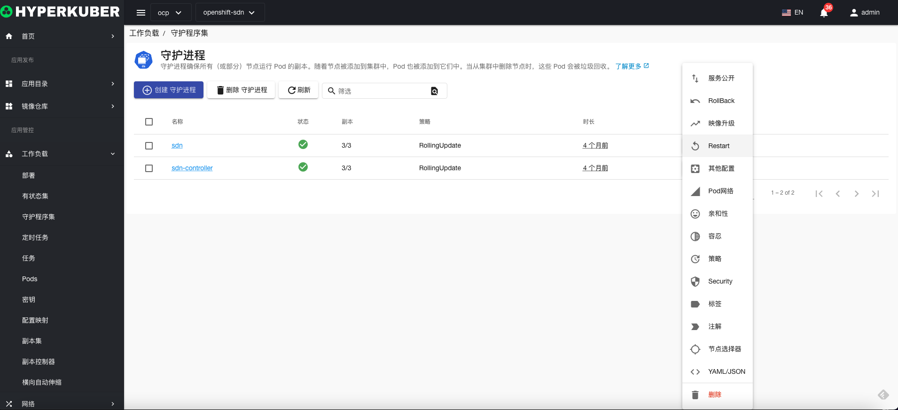
支持以下界面图形化操作：
* 服务公开
* 回滚
* 镜像升级
* 重启
* 其他配置
* pod网络
* 亲和性
* 容忍
* 策略
* 安全
* 标签
* 注解
* Yaml/Json编辑

### 创建
创建守护进程集，点击“创建守护进程集”按钮，进入创建守护进程集页面，填写必要参数
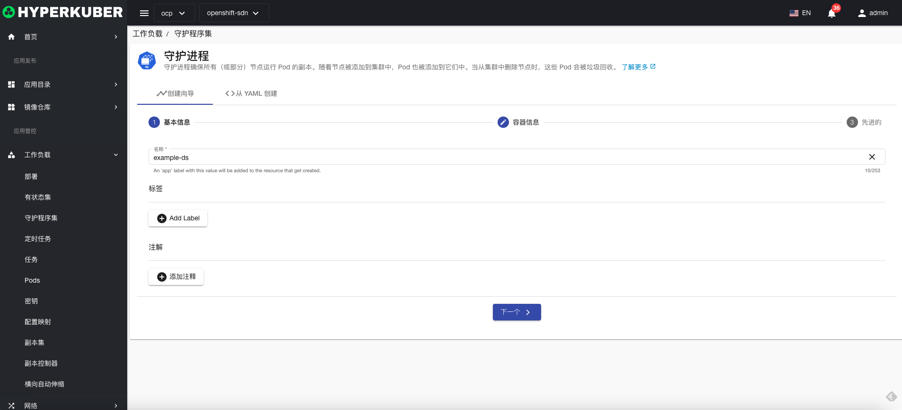
参数
名称：守护进程集名称

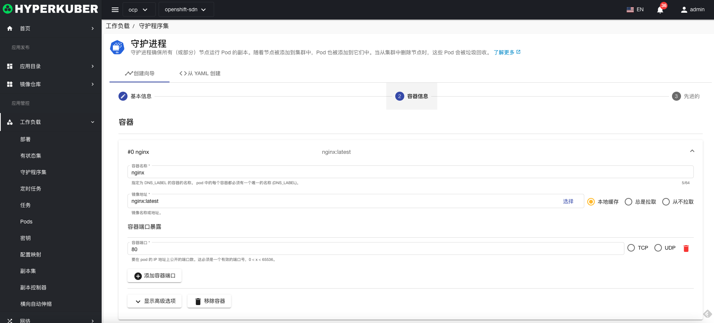
参数
镜像名称：守护进程集镜像名称
镜像地址：守护进程集镜像仓库地址
暴露端口：守护进程集服务暴露端口
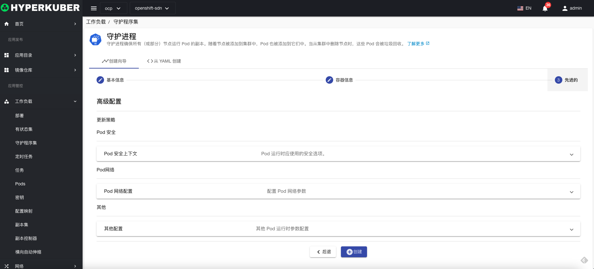
非必填参数：
Pod安全
Pod网络
其他
点击“创建”即可。

### Yaml创建
守护进程集可通过Yaml文件直接创建
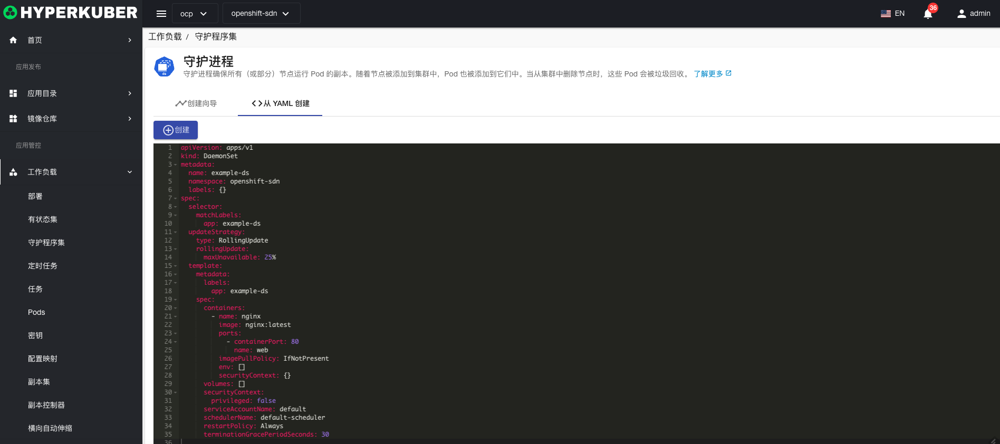
### 守护进程集详情
点击守护进程集名称的链接，即可进入守护进程集的详情页面
概览信息
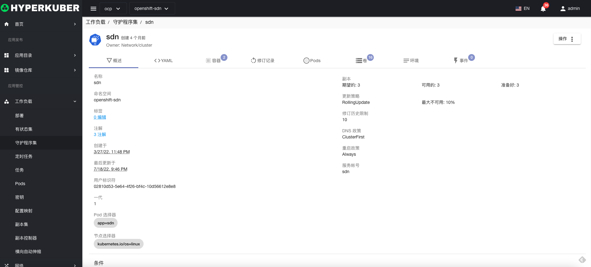

Yaml信息
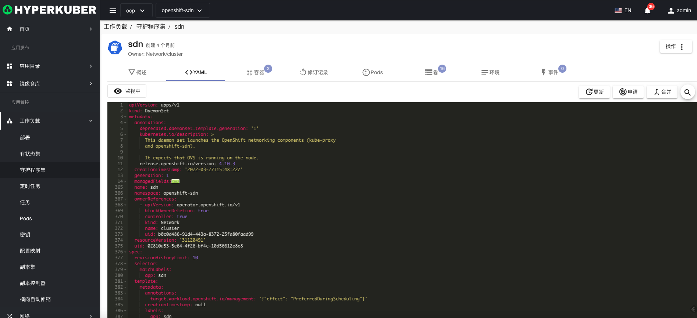
容器信息
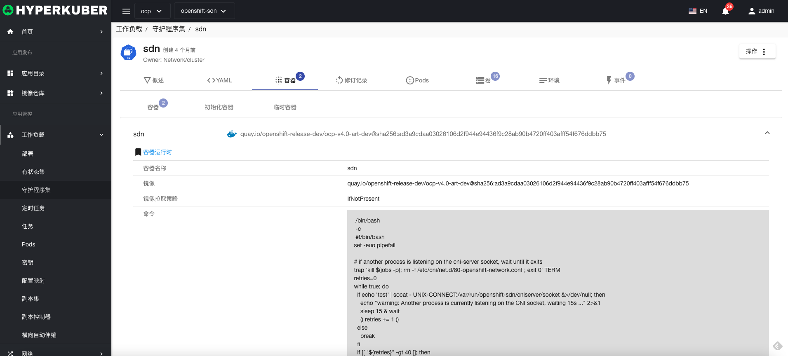
修订记录信息
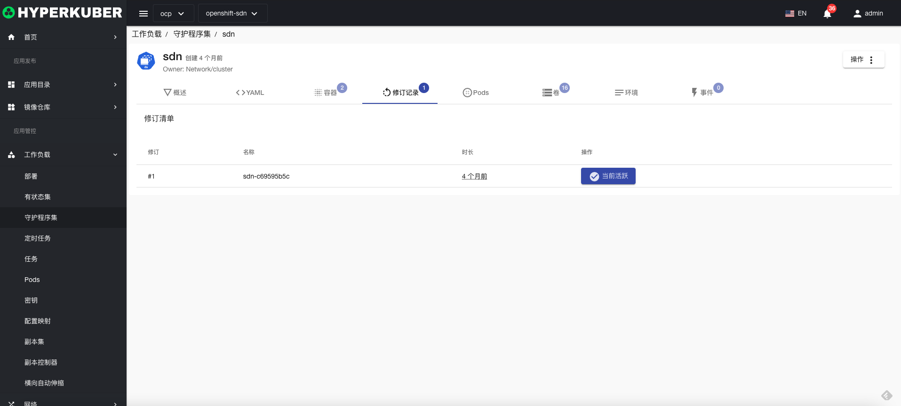
Pod信息
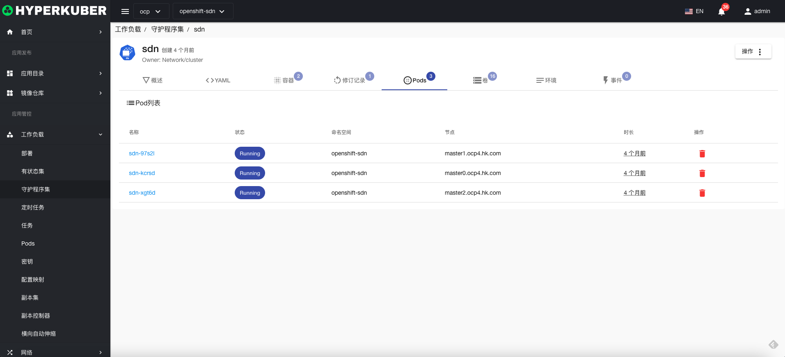
存储卷信息
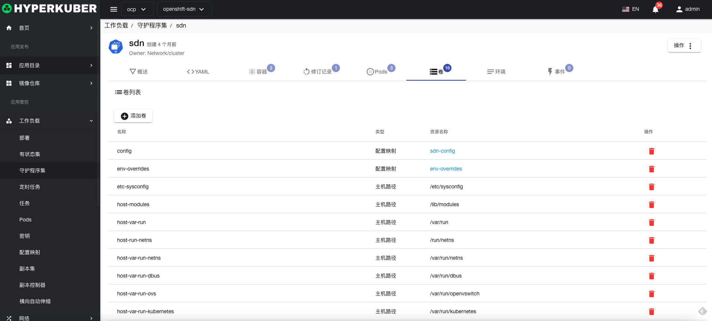
环境信息
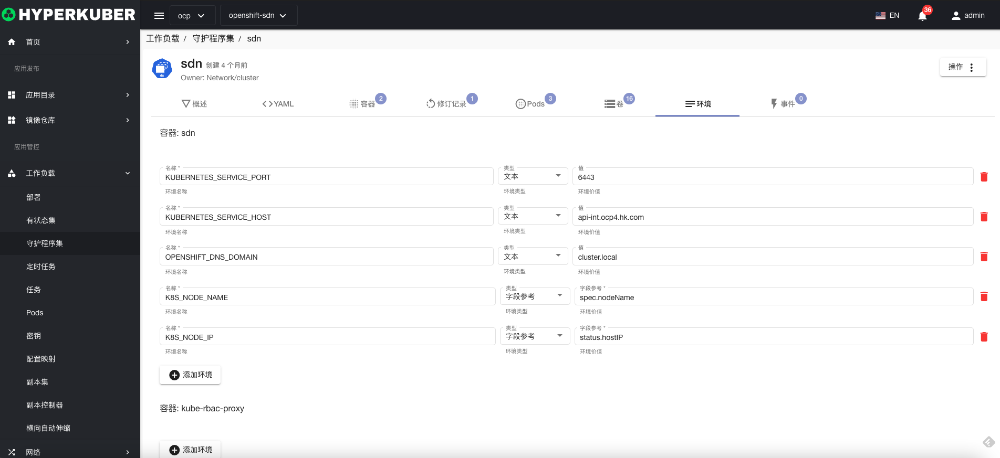
事件信息
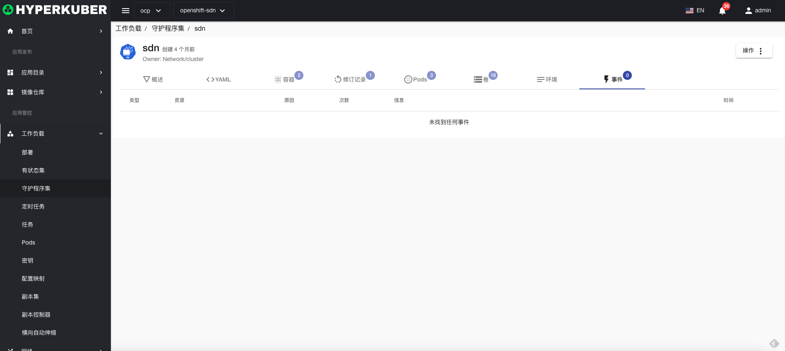

### 删除
选择需要删除的守护进程集，点击多选框选择，点击“删除按钮”，在确定输入框输入“yes”，即可完成删除操作。
### 刷新
点击“刷新”，即可完成守护进程集列表的刷新。

