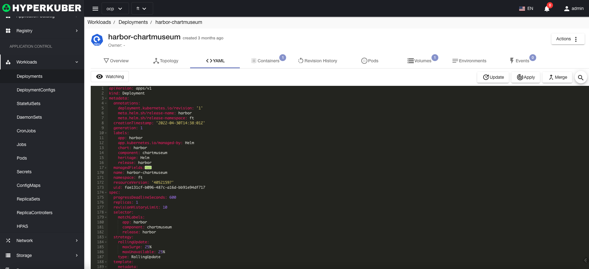

# deploy

Deployments provide declarative update capabilities for Pods and ReplicaSets.

## deploy operations

The following interface graphical operations are supported:
* Pause rolling updates
* Service public
* Expansion
* reboot
* Image upgrade
* rollback
* other configuration
* pod network
* Affinity
* Tolerate
* Strategy
* Safety
* Label
* Notes
* Yaml/Json editing

### Create
Create a deployment, click the "Create Deployment" button, enter the Create Deployment page, and fill in the necessary parameters

parameter
name: deployment name
Number of replicas: The number of replicas of the deployment control pod

parameter
Image name: Deployment image name
Mirror address: deployment mirror warehouse address

parameter
Update strategy: deploy image rolling upgrade strategy
Click "Create" to do so.
### Deployment Details
Click the link of the deployment name to enter the deployment details page
Overview information

topology information

Yaml information

container information

Revision log information

Pod information

Storage volume information

Environmental information

event information

### delete
Select the deployment to be deleted, click the multi-select box to select, click the "Delete button", and enter "yes" in the confirmation input box to complete the deletion operation.
### refresh
Click "Refresh" to complete the refresh of the deployment list.