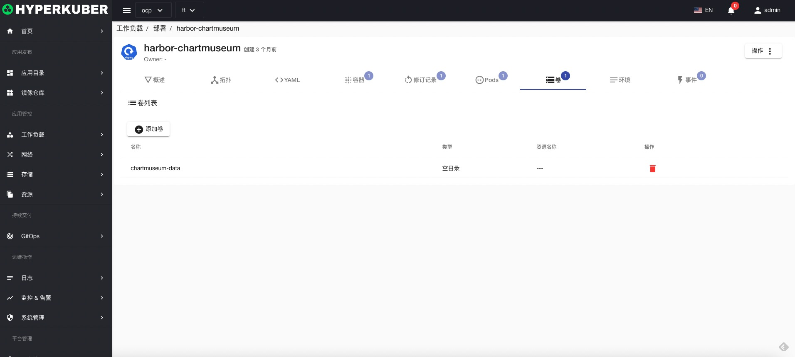

# 部署

Deployment 是常用Workload的一种，Deployment为Pod和ReplicaSet提供声明式的更新能力。

## 部署操作

支持以下界面图形化操作：
* 暂停滚动更新
* 服务公开
* 扩容
* 重启
* 镜像升级
* 回滚
* 其他配置
* pod网络
* 亲和性
* 容忍
* 策略
* 安全
* 标签
* 注解
* Yaml/Json编辑

### 创建
创建部署，点击“创建部署”按钮，进入创建部署页面，填写必要参数

参数
名称：部署名称
副本数：部署控制Pod的副本数量

参数
镜像名称：部署镜像名称
镜像地址：部署镜像仓库地址

参数
更新策略：部署镜像滚动升级策略
点击“创建”即可。
### 部署详情
点击部署名称的链接，即可进入部署的详情页面
概览信息

拓扑信息

Yaml信息

容器信息

修订记录信息

Pod信息

存储卷信息

环境信息

事件信息

### 删除
选择需要删除的部署，点击多选框选择，点击“删除按钮”，在确定输入框输入“yes”，即可完成删除操作。
### 刷新
点击“刷新”，即可完成部署列表的刷新。

