# 部署配置

DeploymentConfig是Openshift的部署配置，是Kubernetes部署的扩展，它提供对普通用户应用程序的细粒度管理。
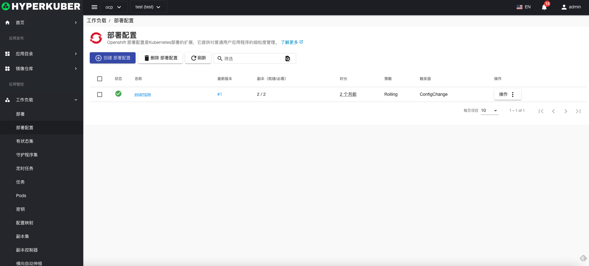
## 部署配置操作

支持以下界面图形化操作：
* 暂停滚动更新
* 服务公开
* 扩容
* 重启
* 镜像升级
* 回滚
* 其他配置
* pod网络
* 亲和性
* 容忍
* 策略
* 安全
* 标签
* 注解
* Yaml/Json编辑

### 创建
创建部署配置，点击“创建部署配置”按钮，进入创建部署配置页面，填写必要参数
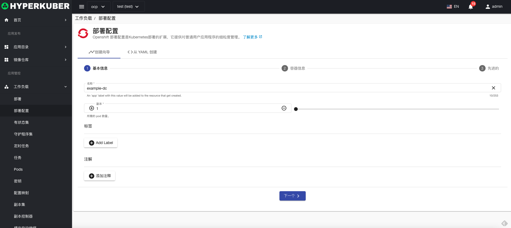
参数
名称：部署配置名称
副本数：部署配置控制Pod的副本数量
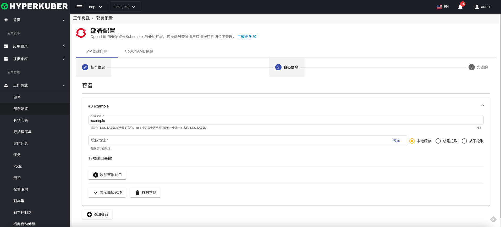
参数
镜像名称：部署配置镜像名称
镜像地址：部署配置镜像仓库地址
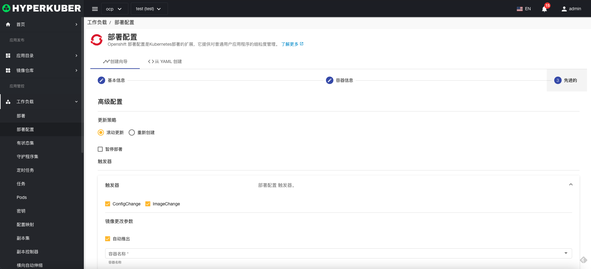
参数
更新策略：部署配置镜像滚动升级策略
触发器：
* imageChange：镜像发生改变时，触发滚动升级
* configChange：配置发生改变时，触发滚动升级

点击“创建”即可。
### 部署配置详情
点击部署配置名称的链接，即可进入部署配置的详情页面
概览信息
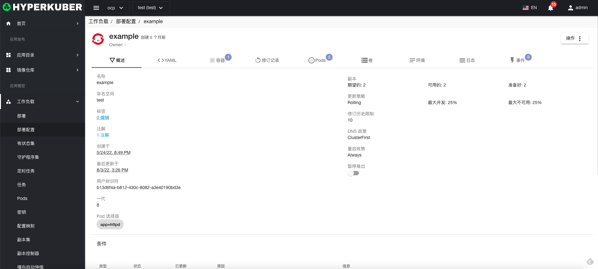
Yaml信息
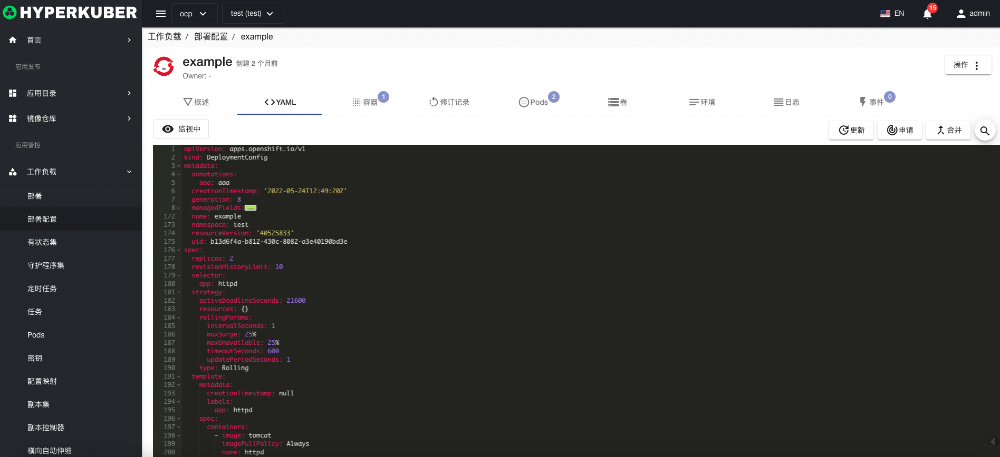
容器信息
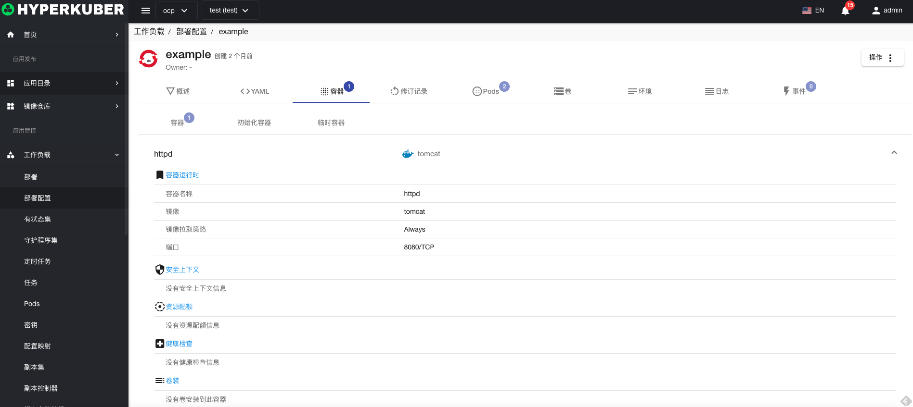
修订记录信息
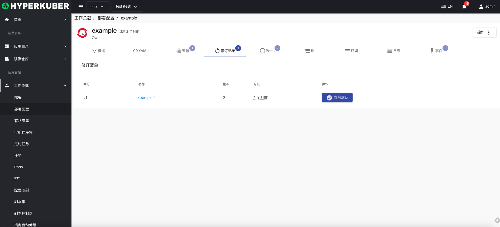
Pod信息
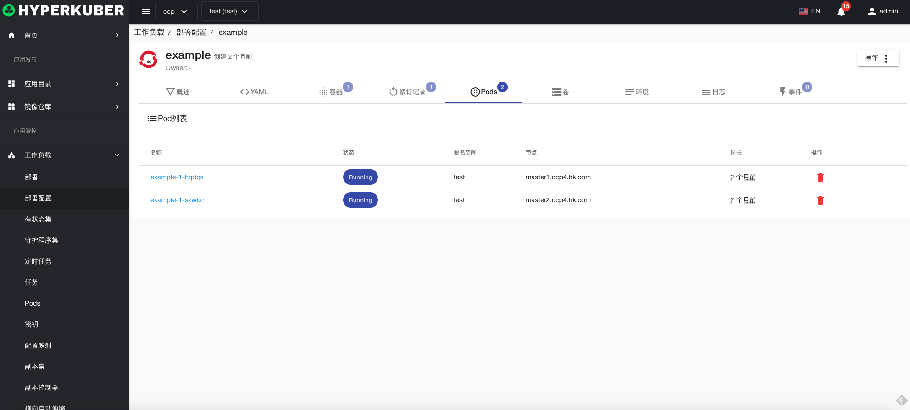
存储卷信息
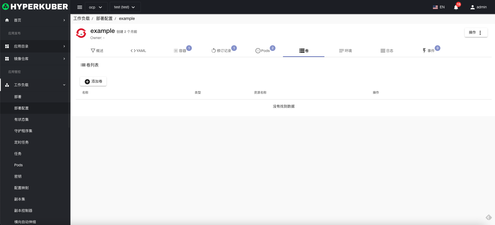
环境信息
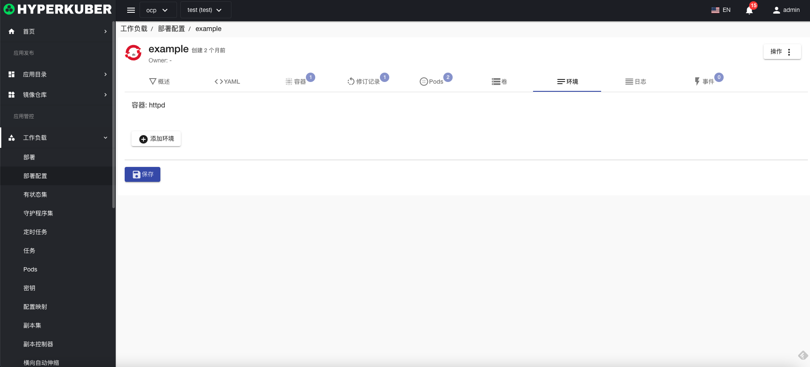
日志信息
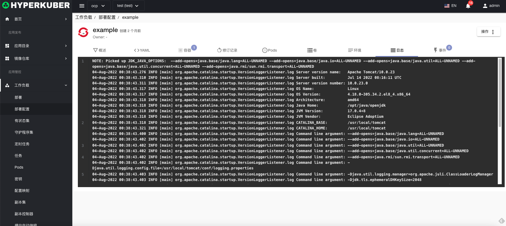
事件信息
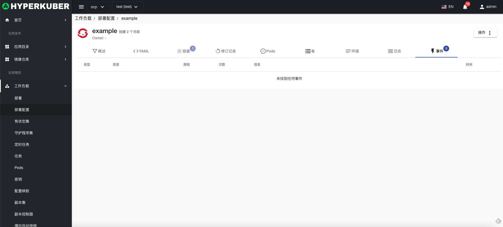

### 删除
选择需要删除的部署配置，点击多选框选择，点击“删除按钮”，在确定输入框输入“yes”，即可完成删除操作。
### 刷新
点击“刷新”，即可完成部署配置列表的刷新。

