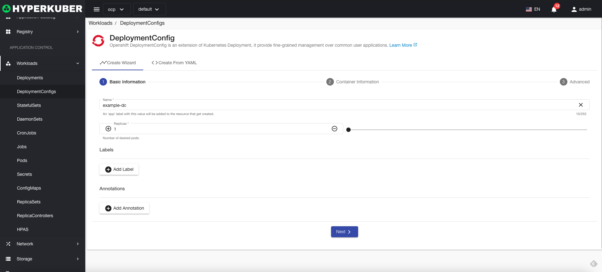

# deploy configuration

DeploymentConfig is Openshift's deployment configuration, an extension of Kubernetes deployment that provides fine-grained management of common user applications.

## deploy configuration operations

The following interface graphical operations are supported:
* Pause rolling updates
* Service public
* Expansion
* reboot
* Image upgrade
* rollback
* other configuration
* pod network
* Affinity
* Tolerate
* Strategy
* Safety
* Label
* Notes
* Yaml/Json editing

### Create
Create a deployment configuration, click the "Create Deployment Configuration" button, enter the Create Deployment Configuration page, and fill in the necessary parameters

parameter
name: Deployment configuration name
Number of replicas: The deployment configuration controls the number of replicas of the Pod

parameter
Image name: Deployment configuration image name
Mirror address: deployment configuration mirror warehouse address

parameter
Update strategy: Deployment configuration mirror rolling upgrade strategy
trigger:
* imageChange: When the image changes, trigger a rolling upgrade
* configChange: When the configuration changes, trigger a rolling upgrade

Click "Create" to do so.
### Deployment configuration details
Click the link of the deployment configuration name to enter the details page of the deployment configuration
Overview information

Yaml information

container information

Revision log information

Pod information

Storage volume information

Environmental information

log information

event information

### delete
Select the deployment configuration to be deleted, click the multi-select box to select, click the "Delete button", and enter "yes" in the confirmation input box to complete the deletion operation.
### refresh
Click "Refresh" to complete the refresh of the deployment configuration list.