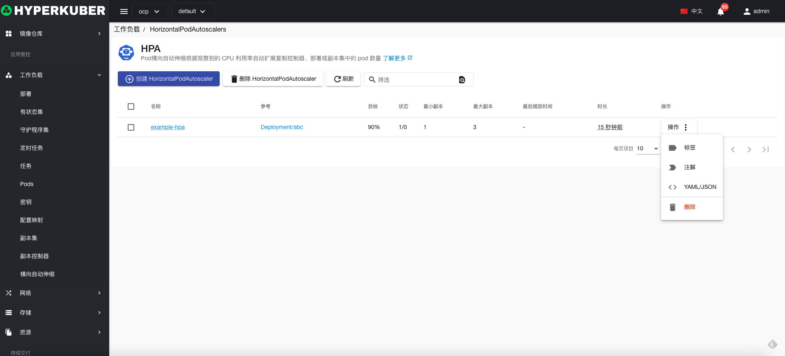
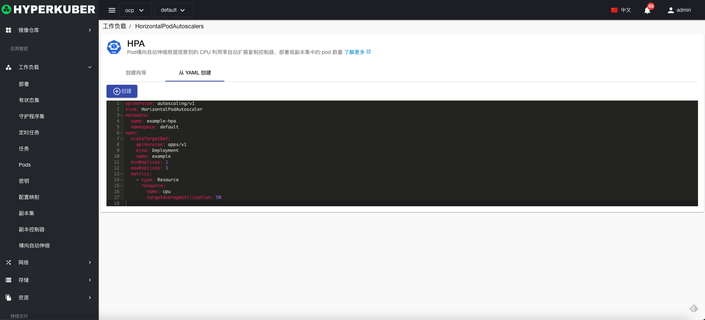
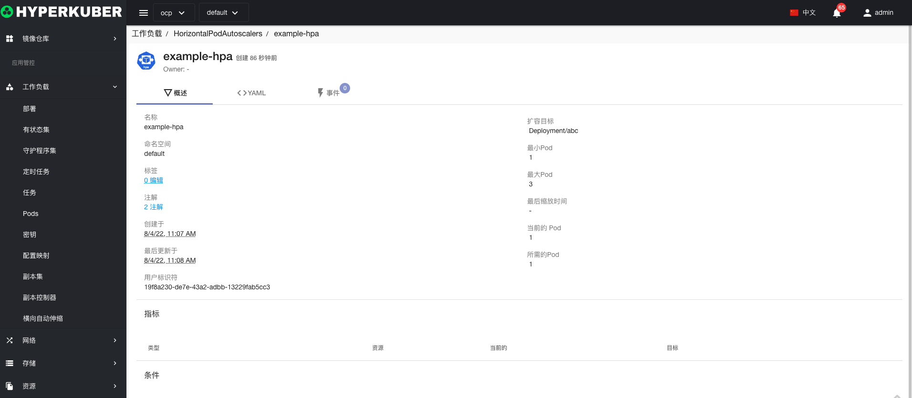
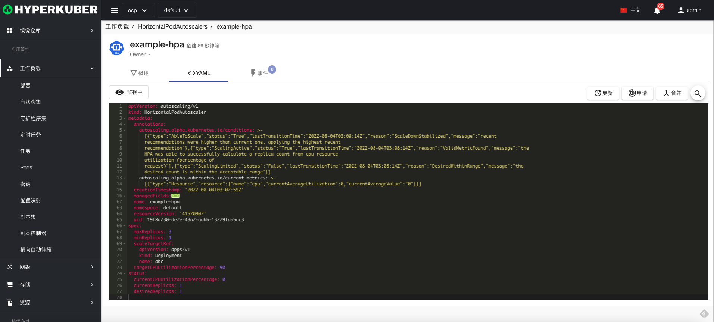
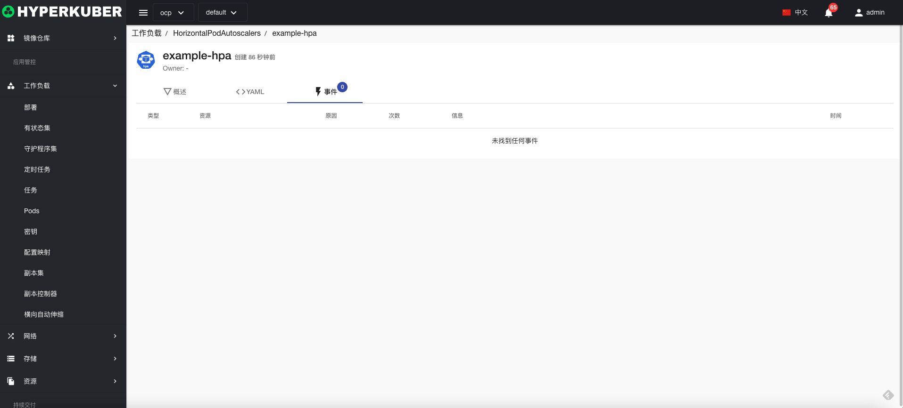

# HPA

Pod横向自动伸缩根据观察到的 CPU 利用率自动扩展复制控制器、部署或副本集中的 pod 数量

## HPA操作

支持以下界面图形化操作：

* 标签
* 注解
* Yaml/Json编辑

### 创建
创建HPA，点击“创建HPA”按钮，进入创建HPA页面，填写必要参数

参数
名称：HPA名称
资源类型：选择HPA的资源类型
资源名称：选择HPA的资源名称
最小副本：HPA最小副本数
最大副本：HPA最大副本数
Cpu使用率：设置Cpu使用率的阀值，超过阀值后，即可自动伸缩

### Yaml创建
HPA可通过Yaml文件直接创建

### HPA详情
点击HPA名称的链接，即可进入HPA的详情页面
概览信息

Yaml信息

事件信息

### 删除
选择需要删除的HPA，点击多选框选择，点击“删除按钮”，在确定输入框输入“yes”，即可完成删除操作。
### 刷新
点击“刷新”，即可完成HPA列表的刷新。

