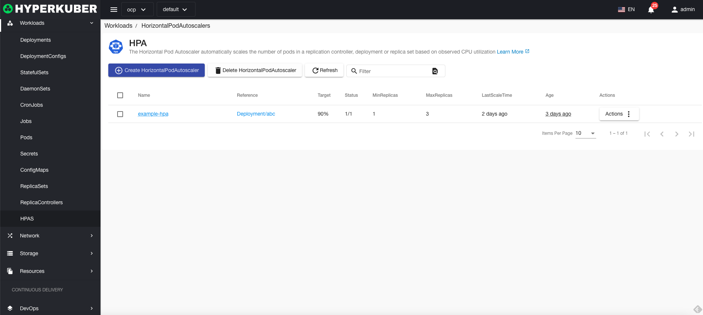
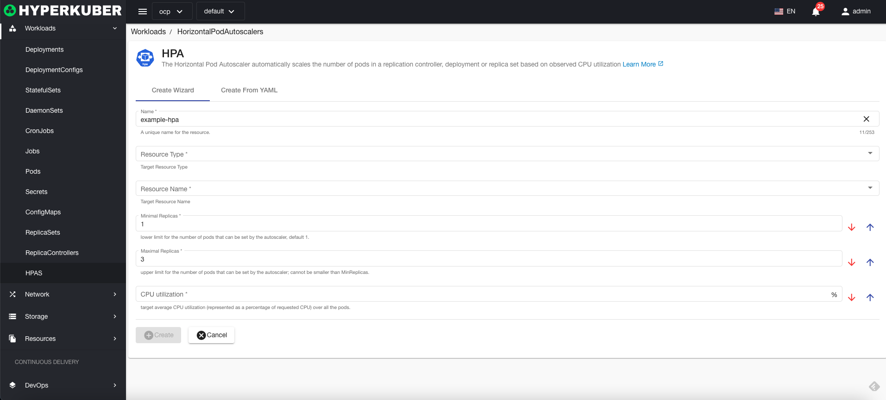
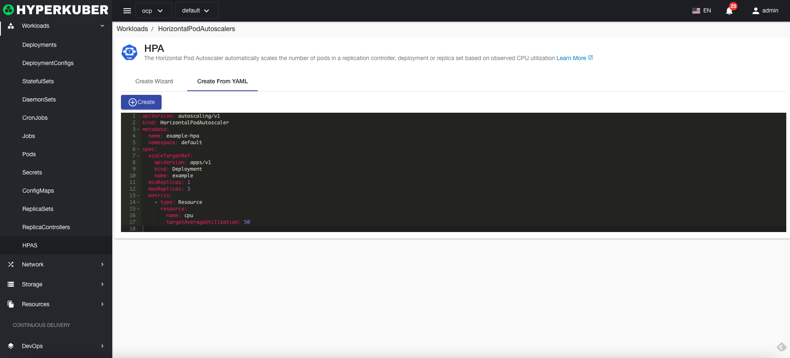
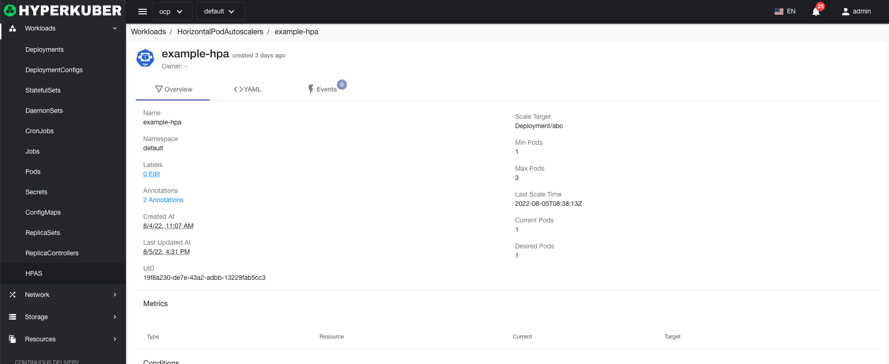
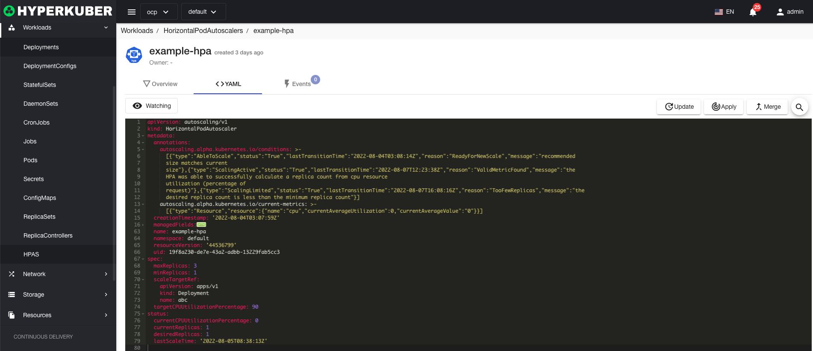
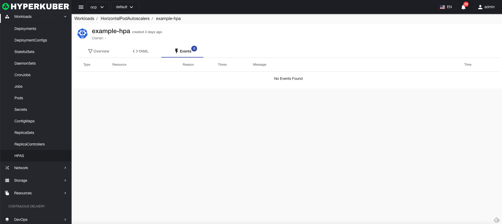

# HPA

Pod Autoscaling Automatically scales the number of pods in a replication controller, deployment, or replica set based on observed CPU utilization

## HPA operation

The following interface graphical operations are supported:

* Label
* Notes
* Yaml/Json editing

### Create
Create HPA, click the "Create HPA" button, enter the HPA creation page, and fill in the necessary parameters

parameter
Name: HPA name
Resource Type: Select the resource type for HPA
Resource Name: Select the resource name for HPA
Min Replicas: HPA Min Replicas
Max Replicas: HPA maximum number of replicas
Cpu usage: Set the threshold of Cpu usage. After the threshold is exceeded, it can be automatically scaled

### Yaml create
HPA can be created directly from Yaml files

### HPA Details
Click on the HPA name link to enter the HPA details page
Overview information

Yaml information

event information

### delete
Select the HPA to be deleted, click the multi-select box to select, click the "Delete button", and enter "yes" in the confirmation input box to complete the deletion operation.
### refresh
Click "Refresh" to complete the refresh of the HPA list.